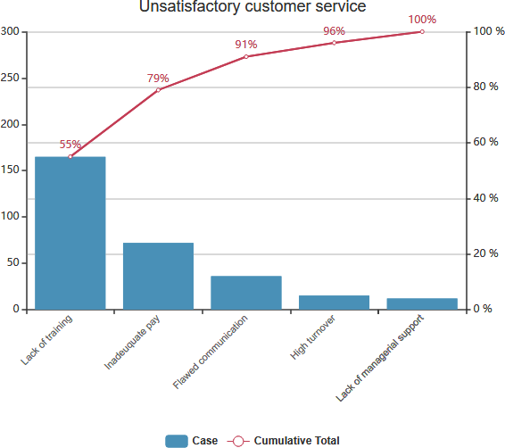

# 面向对象

面向对象的基本概念包括对象、类、抽象、封装、继承、多态、接口、消息、组件、复用和模式等。

1. 对象：由数据及其操作所构成的封装体，是系统中用来描述客观事物的一个模块，是构成系统的基本单位。用计算机语言来描述，对象是由一组属性和对这组属性进行的操作构成的。对象包含三个基本要素，分别是对象标识、对象状态和对象行为。例如，对于姓名（标识）为Joe的教师而言，其包含性别、年龄、职位等个人状态信息，同时还具有授课等行为特征，Joe就是封装后的一个典型对象。

2. 类：现实世界中实体的形式化描述，类将该实体的属性（数据）和操作（函数）封装在一起。例如，Joe是一名教师，也就拥有了教师的特征，这些特征就是教师这个类所具有的。类和对象的关系可理解为，对象是类的实例，类是对象的模板。如果将对象比作房子，那么类就是房子的设计图纸。

3. 抽象：通过特定的实例抽取共同特征以后形成概念的过程。抽象是一种单一化的描述，强调给出与应用相关的特性，抛弃不相关的特性。对象是现实世界中某个实体的抽象，类是一组对象的抽象。

4. 封装：将相关的概念组成一个单元模块，并通过一个名称来引用它。面向对象封装是将数据和基于数据的操作封装成一个整体对象，对数据的访问或修改只能通过对象对外提供的接口进行。

5. 继承：表示类之间的层次关系（父类与子类），这种关系使得某类对象可以继承另外一类对象的特征，继承又可分为单继承和多继承。

6. 多态：使得在多个类中可以定义同一个操作或属性名，并在每个类中可以有不同的实现。多态使得某个属性或操作在不同的时期可以表示不同类的对象特性。

7. 接口：描述对操作规范的说明，其只说明操作应该做什么，并没有定义操作如何做。可以将接口理解成为类的一个特例，它规定了实现此接口的类的操作方法，把真正的实现细节交由实现该接口的类去完成。

8. 消息：体现对象间的交互，通过它向目标对象发送操作请求。

9. 组件：表示软件系统可替换的、物理的组成部分，封装了模块功能的实现。组件应当是内聚的，并具有相对稳定的公开接口。

10. 复用：指将已有的软件及其有效成分用于构造新的软件或系统。组件技术是软件复用实现的关键。

11. 模式：描述了一个不断重复发生的问题，以及该问题的解决方案。其包括特定环境、问题和解决方案三个组成部分。应用设计模式可以更加简单和方便地去复用成功的软件设计和架构，从而帮助设计者更快更好地完成系统设计。

> [面向对象的基本概念 - 综合知识 - 信管网](https://www.cnitpm.com/pm1/71269.html)

# 用例执行者之间关系

1. 关联关系：关联关系是指执行者与用例之间的关系，又称为通信关系，如果某个执行者可以对某个用例进行操作，它们之间就具有关联关系，如下图所示，“经理”有一个功能为“查看库存报表”，因此可以在执行者“经理”和用例“查看库存报表”之间建立一个关联关系，关联关系用实线表示。

2. 泛化关系：执行者之间的关系只有一种，即泛化关系，用一个带有空心三角形的实线表示，如下图所示，在该图中，仓库管理员、系统管理员、经理都是员工的一种，因此员工拥有的功能这三者都拥有，如登录、修改个人信息等，为了减少用例的个数并且使系统更加符合面向对象设计规范，可以对执行者进行泛化，将各类执行者都具有相同的功能移至父执行者，而将每类执行者特有的功能保留在子执行者中。

常见的用例之间的关系有两种，分别是包含关系和扩展关系，下面介绍这两种关系的含义以及在用例图中如何表示。

3. 包含关系：如果多个用例都具有一部分相同的行为，可以将这部分相同的行为作为一个单独的用例抽取出来，与原来的用例形成一个包含关系。如仓库管理员在进行入库、出库等操作之前需要先登录，登录是入库、出库流程的基本组成部分，因此用例“入库”和“出库”包含用例“登录”。为了更加清晰地描述多个用例的相同行为，在用例图中提供了用例与用例之间的包含关系。在uml中，包含关系用依赖线（虚线）加一个<<include>>表示，由原始用例指向包含用例。

4. 扩展关系：扩展关系又称为延伸关系，如果一个用例在执行时可能会使用到另一个用例，或者使用一个新的用例对原有用例的行为进行扩展时可以使用扩展关系，如仓库管理员在入库时发现某种商品在系统中暂不存在，则可以增加新的商品信息；如果入库商品均已存在，则无需增加商品信息，此时用例“增加商品信息”可以作为用例“入库”的扩展用例。在需要扩展的用例（原始用例）中需指定一个扩展点（即需扩展的位置），在下一节编写用例文档中将学习如何设置扩展点。在uml中，包含关系用依赖线（虚线）加一个<<extend>>表示，由扩展用例指向原始用例，如下图所示：

关于包含关系和扩展关系箭头的指向，可以记住两句口诀：包含进来，箭头向外；扩展出去，箭头向里。

除了上述的包含关系和扩展关系外，用例之间还存在一种与执行者泛化类似的泛化关系，但不太常见，在这里不予以详细介绍。

> [UML知识：用例执行者之间关系 - 综合知识 - 信管网](http://www.cnitpm.com/pm1/73046.html)

# 大数据

数据是国家基础性战略资源，是21世纪的“钻石矿”。“十三五”时期是我国全面建成小康社会的决胜阶段，是新旧动能接续转换的关键时期，全球新一代信息产业处于加速变革期，犬数据技术和应用处于创新突破期，国内市场需求处于爆发期，我国大数据产业面临重要的发展机遇。抢抓机遇，推动大数据产业发展，对提升政府治理能力、优化民生公共服务、促进经济转型和创新发展有重大意义。

大数据(big data)，指无法在一定时间范围内用常规软件工具进行捕捉、管理和处理的数据集合，是需要新处理模式才能具有更强的决策力、洞察发现力和流程优化能力的海量、高增长率和多样化的信息资产。

## 大数据的特点

业界通常用5个V-Volume（大量）、Variety（多样）、Value（价值）、Velocity（高速）和Veracity（真实性）来概括大数据的特征。

1. Volume:指的是数据体量巨大，从TB级别跃升到PB级别(1PB=1024TB)、EB级别(1EB=1024PB)，甚至于达到ZB级别(1ZB=1024EB)
。截至目前，人类生产的所有印刷材料的数据量是200PB，而历史上全人类说过的所有的话的数据量大约是5EB。当前，典型个人计算机硬盘的容量为TB量级，而一些大企业的数据量已经接近EB量级。例如，在交通领域，某市交通智能化分析平台数据来自路网摄像头／传感器、公交、轨道交通、出租车以及省际客运、旅游、化危运输、停车、租车等运输行业，还有问卷调查和地理信息系统数据。4万辆车每天产生2000万条记录，交通卡刷卡记录每天1900万条，手机定位数据每天1800万条，出租车运营数据每天100万条，电子停车收费系统数据每天50万条，定期调查覆盖8万户家庭等，这些数据在体量上就达到了大数据的规模。

2. Variety:指的是数据类型繁多。这种类型的多样性也让数据被分为结构化数据和非结构化数据。相对于以往便于存储的以文本为主的结构化数据，非结构化数据越来越多，包括网络日志、音频、视频、图片、地理位鼹信息等，这些多类型的数据对数据的处理能力提出了更高要求。

3. Value:指的是价值密度低。价值密度的高低与数据总量的大小成反比。以视频为例，一部1小时的视频，在连续不间断的监控中，有用数据可能仅有一二秒。如何通过强大的机器算法更迅速地完成数据的价值“提纯”成为目前大数据背景下亟待解决的难题。当然把数据集成在一起，并完成“提纯”是能达到1+1大于2的效果，这也正是大数据技术的核心价值之一。

4. Velocity:指的是处理速度快。这是大数据区分于传统数据挖掘的最显著特征。根据IDC的“数字宇宙”的报告，预计到2020年，全球数据使用量将达到35.2ZB。在如此海量的数据面前，处理数据的效率就是企业的生命。

5. Veracity:指的是数据来自于各种、各类信息系统网络以及网络终端的行为或痕迹。

大数据是具有体量大、结构多样、时效性强等特征的数据，处埋大数据需要采用新型计算架构和智能算法等新技术。大数据从数据源经过分析挖掘到最终获得价值一般需要经过5个主要环节，包括数据准备、数据存储与管理、计算处理、数据分析和知识展现。大数据技术涉及到的数据模型、处理模型、计算理论，与之相关的分布计算、分布存储平台技术、数据清洗和挖掘技术，流式计算、增量处理技术，数据质量控制等方面的研究和开发成果丰硕，大数据技术产品也已经进入商用阶段。

## 大数据的价值与应用

大数据像水、矿石、石油一样，正在成为新的自然资源，能不能挖掘资源中潜在的价值，成为这个时代能不能走向创富的重要条件。

大数据是以容量大、类型多、存取速度快、应用价值高为主要特征的数据集合，正快速发展为对数量巨大、来源分散、格式多样的数据进行采集、存储和关联分析，从中发现新知识、创造新价值、提升新能力的新一代信息技术和服务业态。坚持创新驱动发展，加快大数据部署，深化大数据应用，已成为稳增长、促改革、调结构、惠民生和推动政府治理能力现代化的内在需要和必然选择。

大数据产业指以数据生产、采集、存储、加工、分析、服务为主的相关经济活动，包括数据资源建设、大数据软硬件产品的开发、销售和租赁活动，以及相关信息投术服务。

前文提到，预计到2020年，全球拥有的数据量是35.2ZB，在如此庞大的数据量面前，它所带来的信息以及反馈出来的事实，对于人们来说具有巨大的潜在价值。所以目前大数据的应用已一步步广泛深入我们生活的方方面面，涵盖电商、社交、金融、医疗、交通、教育、体育等各行备业。基于现有电子信息产业统计数据及行业抽样估计，2015年我国大数据产业业务收入2800亿元左右。

下面将列举一些数据应用实例。

- 大数据征信：个人信用数据的缺失目前是金融行业面临的最大问题之一。基于用户在互联网上的消费行为、社交行为、搜索行为等产生的海量数据，利用大数据技术进行分析与挖掘能得到个人信用数据，为金融业务提供有效支撑。在这个方面，阿里的芝麻信用是做得最好的。芝麻信用几乎打通了用户的身份特质，行为偏好，人脉关系，信用历史，履约能力等各类信息。这使得阿里在金融方面审批小额贷款的成本变得极低，据统计，传统银行平均审批一笔贷款的费用高达2000元，而阿里金融的蚂蚁微贷仅为0.3元。

- 大数据风控：大数据风控目前应该是前沿技术在金融领域的最成熟应用，相对于智能投顾、区块链等还在初期的金融科技应用，大数据风控目前已经在业界逐步普及。目前，美国基本上都用三大征信局的信息，最传统的评分基本上都是用FICO来做的。各家平台会尝试着用机器学习、神经网络等大数据处理方法。国内市场对于大数据风控的尝试还是比较积极。特别是大公司，可以将移动互联网的行为和贷款申请人联系到一起展开大数据风控。百度在风控层面上的进展还是比较突出，百度安全每天要处理数十亿网民搜索请求，保护数亿用户的终端安全，保护十万网站的安全，因此积累了大量的数据。一个很具体的案例就是，通过海量互联网行为数据，比如监测相关设各ID在哪些借贷网站上进行注册、同一设备是否下载多个借贷App，可以实时发现多头贷款的征兆，把风险控制到最低。

- 大数据消费金融：消费金融对大数据的依赖是天然形成的。比如说消费贷、工薪贷、学生贷，这些消费型的金融贷款很依赖对用户的了解。所以必须对用户画像进行分析提炼，通过相关模型展开风险评估，并根据模型及数据从多维度为用户描绘一个立体化的画像。百度金融通过基于大数据和人工智能技术为基础的合作商户管理平台，为合作商户提供涵盖营销和金融服务的全面管理方案，降低获客成本，解决细分行业的微小需求。一方面可以降低风险，另一方面也能提升金融的安全度。腾讯和阿里的优势很大程度上是在渠道层面上的。阿里以电商-支付-信用为三级跳板，针对性很强。而支付宝接入消费金融产品之后有较强的渠道作用。腾讯的“微粒贷”已经接入到了微信支付当中。在消费金融的发屣速度上，腾讯速度也不差。

- 大数据财富管理：财富管理是近些年来在我国金融服务业中出现的一个新业务。主要为客户提供长期的投顾服务，实现客户资产的优化配置。这方面业务在传统金融机构中存在的比较多。不过因为技术能力不足，大数据财富管理在传统金融机构中相对弱势。

> [大数据 - 综合知识 - 信管网](https://www.cnitpm.com/pm1/71112.html)

# 云计算

## 云计算服务的类型

按照云计算服务提供的资源层次，可以分为IaaS、PaaS和SaaS等三种服务类型。

1. IaaS（基础设施即服务），向用户提供计算机能力、存储空间等基础设施方面的服务。这种服务模式需要较大的基础设施投入和长期运营管理经验，但IaaS服务单纯出租资源，盈利能力有限。
2. PaaS（平台即服务），向用户提供虚拟的操作系统、数据库管理系统、Web应用等平台化的服务。PaaS服务的重点不在于直接的经济效益，而更注重构建和形成紧密的产业生态。
3. SaaS（软件即服务），向用户提供应用软件（如CRM、办公软件等）、组件、工作流等虚拟化软件的服务，SaaS一般采用Web技术和SOA架构，通过Internet向用户提供多租户、可定制的应用能力，大火缩短了软件产业的渠道链条，减少了软件升级、定制和运行维护的复杂程度，著使软件提供商从软件产品的生产者转变为应用服务的运营者。

> [云计算服务的类型 - 综合知识 - 信管网](https://www.cnitpm.com/pm1/71252.html)

# 人工智能

人工智能（Artificial Intelligence），英文缩写为AI。它是研究、开发用于模拟、延伸和扩展人的智能的理论、方法、技术及应用系统的一门新的技术科学。

人工智能是计算机科学的一个分支，它企图了解智能的实质，并生产出一种新的能以人类智能相似的方式做出反应的智能机器，该领域的研究包括机器人、语言识别、图像识别、自然语言处理和专家系统等。人工智能从诞生以来，理论和技术日益成熟，应用领域也不断扩大，可以设想，未来人工智能带来的科技产品，将会是人类智慧的“容器”。人工智能可以对人的意识、思维的信息过程的模拟。人工智能不是人的智能，但能像人那样思考、也可能超过人的智能。

人工智能是一门极富挑战性的科学，从事这项工作的人必须懂得计算机知识，心理学和哲学。人工智能是包括十分广泛的科学，它由不同的领域组成，如机器学习，计算机视觉等等，总的说来，人工智能研究的一个主要目标是使机器能够胜任一些通常需要人类智能才能完成的复杂工作。但不同的时代、不同的人对这种“复杂工作”的理解是不同的。2017年12月，人工智能入选“2017年度中国媒体十大流行语”。

> [人工智能是什么？ - 综合知识 - 信管网](https://www.cnitpm.com/pm1/75462.html)

# 互联网+

互联网+有六大特征：

- 跨界融合。+就是跨界，就是变革，就是开放，就是重塑融合。敢于跨界了，创新的基础就更坚实；融合协同了，群体智能才会实现，从研发到产业化的路径才会更垂直。融合本身也指代身份的融合，客户消费转化为投资，伙伴参与创新，等等，不一而足。
- 创新驱动。中国粗放的资源驱动型增长方式早就难以为继，必须转变到创新驱动发展这条正确的道路上来。这正是互联网的特质，用所谓的互联网思维来求变、自我革命，也更能发挥创新的力量。
- 重塑结构。信息革命、全球化、互联网业已打破了原有的社会结构、经济结构、地缘结构、文化结构。权力、议事规则、话语权不断在发生变化。互联网+社会治理、虚拟社会治理会是很大的不同。
- 尊重人性。人性的光辉是推动科技进步、经济增长、社会进步、文化繁荣的最根本的力量，互联网的力量之强大最根本地也来源于对人性的最大限度的尊重、对人体验的敬畏、对人的创造性发挥的重视。例如UGC，例如卷入式营销，例如分享经济。
- 开放生态。关于互联网+，生态是非常重要的特征，而生态的本身就是开放的。我们推进互联网+，其中一个重要的方向就是要把过去制约创新的环节化解掉，把孤岛式创新连接起来，让研发由人性决定的市场驱动，让创业并努力者有机会实现价值。
- 连接一切。连接是有层次的，可连接性是有差异的，连接的价值是相差很大的，但是连接一切是互联网+的目标。

> [互联网+_百度百科](https://baike.baidu.com/item/%E4%BA%92%E8%81%94%E7%BD%91+/12277003)

# 区块链

区块链就是一台创造信任的机器、一个安全可信的保险箱，可以让互不信任的人，在没有权威中间机构的统筹下，还能愉快地进行信息互换与价值互换。区块链是分布式数据储存，点对点传输，共识机制，加密算法等计算机技术在互联网时代的创新应用模式。其主要包含以下六大特征:

1. 去中心化：由于使用分布式核算和存储，不存在中心化的硬件或管理机构，任意节点的权利和义务都是均等的，系统中的数据块由整个系统中具有维护功能的节点来共同维护。任一节点停止工作都会不影响系统整体的运作。
2. 去信任：系统中所有节点之间无需信任也可以进行交易，因为数据库和整个系统的运作是公开透明的，在系统的规则和时间范围内，节点之间无法欺骗彼此。
3. 开放性：系统是开放的，除了交易各方的私有信息被加密外，区块链的数据对所有人公开，任何人都可以通过公开的接口查询区块链数据和开发相关应用，因此整个系统信息高度透明。
4.自治性：区块链采用基于协商一致的规范和协议,使得整个系统中的所有节点能够在去信任的环境自由安全的交换数据，使得对“人”的信任改成了对机器的信任，任何人为的干预不起作用。
5. 信息不可篡改：一旦信息经过验证并添加至区块链，就会永久的存储起来，除非能够同时控制住系统中超过51%的节点，否则单个节点上对数据库的修改是无效的，因此区块链的数据稳定性和可靠性极高。
6. 匿名性：由于节点之间的交换遵循固定的算法，其数据交互是无需信任的(区块链中的程序规则会自行判断活动是否有效)，因此交易对手无须通过公开身份的方式让对方自己产生信任，对信用的累积非常有帮助。

> [区块链的特征 - 综合知识 - 信管网](https://www.cnitpm.com/pm1/71099.html)

# 物联网

物联网(Internet of Things)是指通过信息传感设备，按约定的协议，将任何物品与互联网相连接，进行信息交换和通信，以实现智能化识别、定位、跟踪、监控和管理的一种网络。物联网主要解决物品与物品(Thing to Thing，T2T)、人与物品(Humanto Thing，H2T)、人与人(Human to Human，H2H)之间的互连。与传统互联网不同的是，H2T是指人利用通用装置与物品之间的连接，从而使得物品连接更加简化，而H2H是指人之间不依赖于PC而进行的互连。另外，许多学者在讨论物联网时，经常会引入M2M的概念，可以解释为人与人(Man to Man)、人与机器(Man to Machine)，或机器与机器(Machine to Machine)。在物联网应用中有两项关键技术，分别是传感器技术和嵌入式技术。

传感器(Sensor)是一种检测装置，能感受到被测量的信息，并能将检测感受到的信息，按一定规律变换成为电信号或其他所需形式的信息输出，以满足信息的传输、处理、存储、显示、记录和控制等要求。在计算机系统中，传感器的主要作用是将模拟信号转抉成数字信号。RFID（Radio Frequency IDentification，射频识别）是物联网中使用的一种传感器技术，可通过无线电信号识别特定目标并读写相关数据，而无需识别系统与特定目标之间建立机械或光学接触。

嵌入式技术是综合了计算机软硬件、传感器技术、集成电路技术、电子应用技术为一体的复杂技术。经过几十年的演变，以嵌入式系统为特征的智能终端产品随处可见；小到人们身边的MP3，大到航天航空的卫星系统。如果将物联网用人体做一个简单比喻，传感器相当于人的眼睛、鼻子、皮肤等感官；网络就是神经系统，用来传递信息；嵌入式系统则是人的大脑，在接收到信息后要进行分类处理。

物联网架构可分为三层，分别是感知层、网络层和应用层。感知层由各种传感器构成，包括温湿度传感器、二维码标签、RFID标签和读写器、摄像头、GPS等感知终端。感知层是物联网识别物体、采集信息的来源；网络层由各种网络，包括互联网、广电网、网络管理系统和云计算平台等组成，是整个物联网的中枢，负责传递和处理感知层获取的信息：应用层是物联网和用户的接口，它与行业需求结合，实现物联网的智能应用。

> [物联网 - 综合知识 - 信管网](https://www.cnitpm.com/pm1/71095.html)

# 智慧城市

1. 物联感知层：提供对城市环境的智能感知能力，通过各种信息采集设备、各类传感器、监控摄像机、GPS终端等实现对城市范围内的基础设施、大气环境、交通、公共安全等方面信息采集、识别和监测。
2. 通信网络层：广泛互联，以互联网、电信网、广播电视网以及传输介质为光纤的城市专用网作为骨干传输网络，以覆盖全城的无线网络(如WiFi)、移动4G为主要接入网，组成网络通信基础设施。
3. 计算与存储层：包括软件资源、计算资源和存储资源，为智慧城市提供数据存储和计算，保障上层对于数据汇聚的相关需求。
4. 数据及服务支撑层：利用SOA（面向服务的体系架构）、云计算、大数据等技术，通过数据和服务的融合，支撑承载智慧应用层中的相关应用，提供应用所需的各种服务和共享资源。
5. 智慧应用层：各种基于行业或领域的智慧应用及应用整合，如智慧交通、智慧家政、智慧园区、智慧社区、智慧政务、智慧旅游、智慧环保等，为社会公众、企业、城市管理者等提供整体的信息化应用和服务。

> [数据及服务支撑层 - 综合知识 - 信管网](https://www.cnitpm.com/pm1/71096.html)

# 沟通方法

可以使用多种沟通方法在项目干系人之间共享信息。这些方法可以大致分为：

- 交互式沟通。在两方或多方之间进行多向信息交换。这是确保全体参与者对特定话题达成共识的最有效的方法，包括会议、电话、即时通信、视频会议等。
- 推式沟通。把信息发送给需要接收这些信息的特定接收方。这种方法可以确保信息的发送，但不能确保信息送达受众或被目标受众理解。推式沟通包括信件、备忘录、报告、电子邮件、传真、语音邮件、日志、新闻稿等。
- 拉式沟通。用于信息量很大或受众很多的情况。要求接收者自主自行地访问信息内容。这种方法包括企业内网、电子在线课程、经验教训数据库、知识库等。

项目干系人可能需要对沟通方法的选择展开讨论并取得一致意见。应该基于下列因素来选择沟通方法：沟通需求、成本和时间限制、相关工具和资源的可用性，以及对相关工具和资源的熟悉程度。

> [沟通方法-信息系统项目管理师知识点 - 综合知识 - 信管网](https://www.cnitpm.com/pm1/69500.html)

# 帕累托原理

帕累托分析（称为帕累托图或图表）是由意大利工程师Vilfredo Pareto设计的，他对经济理论做出了重要贡献。帕累托分析可帮助企业改善质量控制，突出显示数据集中最重要的因素。因此，它通过识别问题中最重要的元素来帮助降低项目的复杂性。因此，它还有助于管理层为业务改进计划确定任务和活动的优先级。

帕累托分析是具有垂直条和折线图的可视图表。作为条形图和折线图的组合，绘制，使用问题并与利益相关者交流仍然非常简单。条形图代表问题的各个值（按降序排列），线形曲线代表累积总和，条形图按降序从左到右分为几类。

## 帕累托原理（80/20条规则）

帕累托原理（也称为80/20规则）的思想是，通过完成20％的工作，您可以从完成整个工作中获得80％的收益。进行质量改进。例如，绝大多数问题（80％）是由一些关键原因（20％）引起的。此技术也称为“重要的少数”和“琐碎的许多”。

我们可以将80/20规则应用于几乎所有事物：

- 80％的客户投诉来自您20％的产品和服务。
- 计划中的80％的延迟是由20％的延迟原因造成的。
- 您20％的产品和服务占您利润的80％。
- 您20％的销售人员将产生80％的公司收入。
- 20％的系统缺陷会导致80％的问题。

## 帕累托分析的好处

帕累托分析（Pareto Analysis）有助于快速可视化问题，因此这也是一个出色的可视化交流工具。以下是帕累托分析的一些好处：

绘制帕累托图很容易。
此图可帮助您隔离问题及其原因。
它可以帮助您专注于解决产生最大数量问题的少数原因。
它向您展示了需要重点关注并获得最大改进的问题。

## 进行帕累托分析的六个步骤

使用帕累托分析，这里有6个步骤来确定您应关注的主要原因：

1. 创建一个垂直条形图，在x轴上显示原因，在y轴上计数（出现次数），然后按原因重要性的降序排列条形图，即，计数最高的原因排在第一位。
2. 以降序计算每个原因的累积计数，并以降序计算每个原因的累积计数百分比。百分比计算：{个人原因计数}/{总原因计数}*100
3. 创建第二个y轴，其百分比从100％到0％以10的增量递减。
4. 在x轴上绘制每个原因的累积计数百分比。
5. 连接点以形成曲线。
6. 在与x轴平行的y轴上以80％的比例绘制一条线。然后将线放在与x轴上的曲线的交点处。x轴上的此点将左侧的重要原因（很少）与右侧的次要原因（琐碎）分开。

## 帕累托分析示例–客户服务

下面是一个Pareto图表示例，其中绘制了IT服务台客户服务绩效不理想的原因。从图中可以清楚地看出，79％的绩效不佳是由两个因素造成的：缺乏培训和薪酬不足。前者似乎占表现不佳的55％，而后者则占24％。其他三个因素仅占问题的21％。鉴于帕累托80/20原则，最审慎的行动方针是为工作人员提供有意义的培训并修订薪酬结构。攻击这两个因素将提供最大的收益。

> [使用帕累托原理 (20 / 80规则)_Warren Lynch 的博客-CSDN博客_帕累托分析原理](https://blog.csdn.net/chktsang/article/details/113848935)

# 马斯洛需求层次理论

1. 生理需要应用

生理需要（physiological needs），低级需要，食物、水分、空气、睡眠、性的需要等。它们在人的需要中最重要，最有力量。

例如：当一个人很饥饿时，那么他极需要食物。假设人需要工作的薪酬来生存，以生理需求来激励下属。

激励措施：增加工资、改善劳动条件、给予更多的业余时间和工间休息、提高福利待遇。

2. 安全需要应用

安全需要（safety needs），低级需要，人们需要稳定、安全、受到保护、有秩序、能免除恐惧和焦虑等。

例如：一个工作者居无定所，四处漂泊。

激励措施：强调规章制度、职业保障、福利待遇，并保护员工不致失业，提供医疗保险、失业保险和退休福利、避免员工受到双重的指令而混乱。

3. 归属和爱的需要的应用

归属和爱的需要（belongingness and love need）：一个人要求与其他人建立感情的联系或关系。

例如：人们积极社交，结交朋友，追求爱情

激励措施：提供同事间社交往来机会，支持与赞许员工寻找及建立和谐温馨的人际关系，开展有组织的体育比赛和集体聚会。

4. 尊重需要应用

尊重需要（Esteem needs），自尊和希望受到别人的尊重。自尊的需要使人相信自己的力量和价值，使得自己更有能力，更有创造力。缺乏自尊，使人自卑，没有足够信心去处理问题。

例如：努力读书让自己成为医生、律师来证明自己在这社会的存在和价值

激励措施：公开奖励和表扬，强调工作任务的艰巨性以及成功所需要的高超技巧，颁发荣誉奖章、在公司刊物发表文章表扬、优秀员工光荣榜。

5. 自我实现需要应用

自我实现的需要（self -actualization need）:人们追求实现自己的能力或者潜能，并使之完善化。

在人生道路上自我实现的形式是不一样的，每个人都有机会去完善自己的能力，满足自我实现的需要。

例如：运动员把自己的体能练到极致，让自己成为世界或是单纯只为了超越自己；一位企业家，真心认为自己所经营的事业能为这社会带来价值，而为了比更好而工作。

激励措施：设计工作时运用复杂情况的适应策略，给有特长的人委派特别任务，在设计工作和执行计划时为下级留有余地。

> [马斯洛需求层次理论_百度百科](https://baike.baidu.com/item/%E9%A9%AC%E6%96%AF%E6%B4%9B%E9%9C%80%E6%B1%82%E5%B1%82%E6%AC%A1%E7%90%86%E8%AE%BA/11036498?fr=aladdin)
>
> [Maslow's Hierarchy of Needs | Simply Psychology](https://www.simplypsychology.org/maslow.html)
