# 组织

## 组织结构

先谈职能型组织与项目型组织，什么叫职能型项目组织呢，就是完全按照职能型组织的模式去运行的项目组织模式，即项目信息与任务流要在职能经理层面沟通，再在职能部门内传递。

这在早期的项目管理模式中是普遍存在的，而项目型组织与职能型组织是完全颠覆的，没有实体组织机构，只有虚拟的项目组织。这在工程项目、咨询项目中是常见的。比如咨询项目，有一个项目负责人（项目经理），聘请几个咨询老师参与项目工作，项目结束后各位咨询老师回到各自的实体或当自由人，这种组织没有实体组织机构，是完全项目型组织形式的。

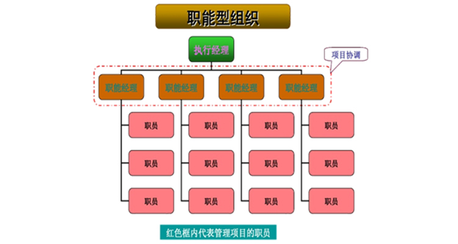
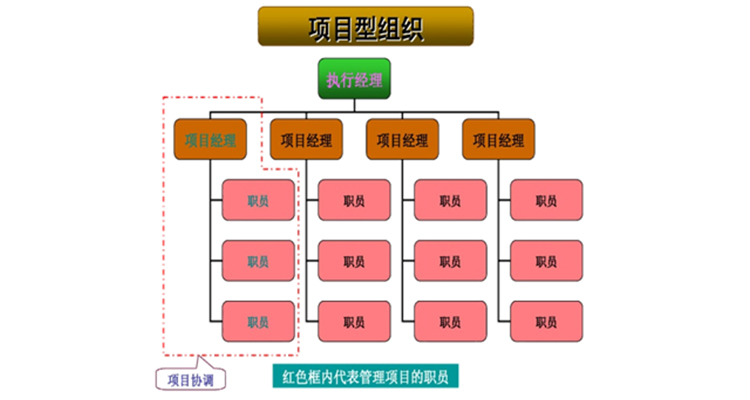

强矩阵模式在现在的企业组织模式中最为常见，即在职能部门的基础上有项目管理部门，任命项目经理，由项目经理对项目内的资源进行统一协调。这里要说明一点，要谨防虚假的强矩阵模式，很多企业的项目组织按照这个形式构建，实际上并不能调动项目内的资源，也就是说项目咨询受职能部门约束大于项目约束，这种就是虚假的强矩阵。

弱矩阵是与职能型组织基本一样，只是项目组内人员之间互相沟通与协调，没有项目经理，也没有项目管理部门，项目组成员还是向上职能经理负责，因为项目成员中没有决策权，所以这种模式基本上是会回到职能型组织上去。

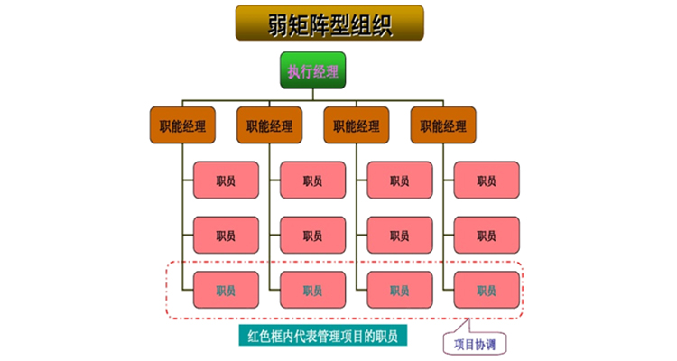

平衡矩阵比弱矩阵好很多，因为有项目经理统一负责协调与决策，虽然没有项目管理部门，但这基本上不太会影响项目经理开展工作，所以平衡矩阵是接近于强矩阵的一种管理模式。

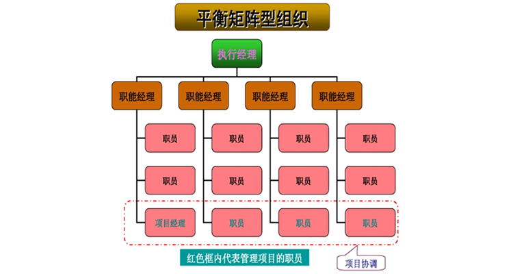

混合型矩阵是项目型组织+职能型组织的模式，表面上有项目管理部门，有项目经理，但是项目经理只能协调职能部门中的一个资源，二次协调由职能部门中的这个项目代表进行二次协调，这种管理模式会大大降低效率。从项目管理的角度我并不提倡。

> [QualityIn质量学院-PM24 | 项目团队组织构建及优劣势分析（附量化标准）-QualityIn质量学院-质量管理-质量管理](http://www.quality-in.com/front/toArticle/111)

## 战略组织类型

在组织战略实践过程中，组织战略实施可以大致概括为如下五种不同的类型，分别为：指挥型、变革型、合作型、文化型、增长型。这种分类既反映了不同行业、不同组织的战略特点，同时也为不同组织战略思路的变革提供了新的、更大的空间。促使不同的组织反思自身的战略特点，找到适合自身当前特点的战略类型。

1. 指挥型战略组织模式。这种模式的特点是组织高层考虑如何制定一个最佳战略，然后按照该战略进行实施，相关战略执行人员要向组织高层提交战略实施的详细报告，组织高层根据报告情况，再对战略进行必要的调整，并对具体的管理和执行人员实施。

这种组织战略模式的运用一般需要具有以下约束条件：首先组织高层，尤其是组织“一把手”要有较高的权威，靠其权威通过发布各种指令来推动战略实施；其次，组织战略比较简单，较容易实施的条件下使用，要求战略制定者与战略执行者的目标相对一致，战略对组织现行运作系统不会构成严重的威胁；三是适合于组织结构一般都是高度集权式的组织体制，组织环境相对稳定；四是组织业务相对比较单一，并且已经集中了大量的行业信息；组织处于较强竞争地位，而且组织资源较为宽松；五是组织内外部信息相对集中，能够准确、有效地收集信息，并能有顺畅的信息流通渠道；六是要有较为客观的规划和监督机制的支持。

这种组织战略模式的缺点是把战略制定者与执行者分开，即组织高层管理者制定战略，组织的一般管理者和员工只是执行战略，因此，一般管理者缺少了执行战略的动力和创造精神，甚至会拒绝执行战略。

2. 变革型战略组织模式。这种战略模式的特点是组织是以如何实施组织战略这一主题展开的。在战略实施中，组织高层决策者或在其他方面的帮助下需要对组织进行一系列的变革，如建立新的组织机构，新的信息系统，变更人事，甚至是兼并或合并经营范围，采用激励手段和控制系统以促进战略的实施。在具体的战略实施过程中，组织领导者往往会利用新的组织机构和参谋人员向全体成员传递新战略的战略重点；并建立战略规划系统、效益评价系统，以及多项激励政策以支持战略实施；以达到充分调动组织内部人员的积极性，保证组织战略的顺利实施。

这种模式一般会比指挥型组织战略模式更加有效，但这种模式并没有解决指挥型组织模式存在的如何获得准确信息的问题，各事业单位及个人利益对战略计划的影响以及战略实施动力等方面的问题：而且还有可能产生新的问题，即组织通过建立新的组织机构及控制系统来支持战略实施的同时，可能会丧失战略的灵活性，在外界环境变化时使战略的变化更为困难。

3. 合作型战略组织模式。这种组织战略模式是要求组织的最高层要与其他高层管理人员分担相关的战略资任，以发挥集体的智慧。具体过程是组织高层管理人员要对组织战略进行充分的讨论，形成较为一致的意见，然后制定并贯彻新的战略，使每个高层管理者都能够在战略制定及实施的过程中做出各自的贡献。

合作型组织战略模式克服了指挥型模式和变革型模式存在的局限性，使组织高层能够接近一线管理人员，获得比较准确的信息。同时，由于战略的制订是建立在集体参与基础之上，提高了战略实施成功的概率。该模式的缺点是由于战略是不同观点、不同目的的参与者相互协商折衷的结果，有可能会使战略的经济合理性有所降低，同时仍然存在着计划者与执行者之间的区别，仍未能充分调动全体管理人员的积极性。

4. 文化型战略组织模式。这种组织战略模式的特点是组织高层是从如何动员全体成员都参与战略实施活动的角度来考虑战略的制定和执行。主要是运用组织文化手段，不断向全体成员传播战略思想，以便在组织内部建立起共同的价值观和行为准则，使所有成员在共同的文化基础上参与战略的实施活动。由于这种模式打破了战略制定者与执行者的界限，力图使每一个员工都参与制定实施组织战略，因此使组织各部分人员都在 共同的战略目标下工作，组织战略实施迅速，风险较小。

文化型组织战略模式的局限性主要体现在该模式是建立在全体组织成员都具有共同的价值观和行为倾向假设基础之上的，在实践中职工很难达到这种价值观和行为层面的一致性，使得该战略的使用受到了多方面的限制；同时强烈的组织文化，可能会掩饰组织中可能会存在的某些问题；以及采用该模式要耗费较多的人力和时间，而且还可能因为组织的高层不愿意放弃控制权，使这样的战略组织模式流于形式。

5. 增长型战略组织模式。该模式的特点是组织高层从如何激励一般管理人员制定实施战略的积极性及主动性来着眼战略的制定和实施。组织高层要认真对待一般管理人员提出的一切有利组织发展的方案，只要方案基本可行，符合组织战略发展方向，就解决方案中的具体问题进行探讨后，应及时批准该方案，以鼓励成员的首创精神。该战略组织模式不是自上而下推行，而是自下而上产生的。

该模式的局限主要体现在以下几个方面，首先是公司高层不可能控制所有的重大机会和威肪，有必要给基层管理人员以宽松的环境，但可能存在相关的风险；同时只有在充分调动基层管理者的积极性，才能正确制定和实施战略，某个可能逊色的但能够得到人们广泛支持的战略，要比那种“最佳”的却得不到多数人支持的战略有价值。

战略的实施充满了矛盾和问题，在战略实施过程中只有调动各种积极因素，才能使战略获得成功。上述五种战略实施模式在制定和实施战略上的侧重点不同，指挥型和合作型更侧重于战略的制定，而把战略实施作为事后行为，而文化型及增长型则更多的考虑战略实施问题。实际上，组织中上述五种模式往往是交叉或交错使用，以达到预期的目标。

> [战略组织类型及历年真题 - 综合知识 - 信管网](http://www.cnitpm.com/pm1/73048.html)

# 新七工具

新七工具包含亲和图、过程决策程序图、关联图、树形图、优先矩阵、活动网络图和矩阵图。

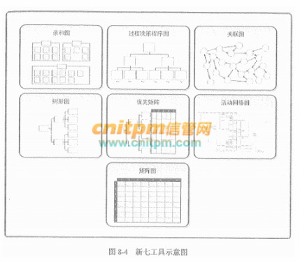

1. 亲和图。亲和图与心智图相似。针对某个问题，产生出可联成有组织的想法模式的各种创意。在项目管理中，使用亲和图确定范围分解的结构，有助于WBS的制订。
2. 过程决策程序图(PDPC)。用于理解一个目标与达成此目标的步骤之间的关系。PDPC有助予制订应急计划，因为它能帮助团队预测那些可能破坏目标实现的中间环节。
3. 关联图。关系图的变种，有助于在包含相互交叉逻辑关系（可有多达50个相关项）的中等复杂情形中创新性地解决问题。可以使用其他工具（诸如亲和图、树形图或鱼骨图）产生的数据，来绘制关联图。
4. 树形图。也称系统图，可用于表现诸如WBS、RBS（风险分解结构）和OBS（组织分解结构）的层次分解结构。在项目管理中，树形图依据定义嵌套关系的一套系统
5. 优先矩阵。用来识别关键事项和合适的备选方案，并通过一系列决策，排列出备选方案的优先顺序。先对标准排序和加权，再应用于所有备选方案，计算出数学得分，对备选方案排序。
6. 活动网络图。过去称为箭头图，包括两种格式的网络图：AOA（活动箭线图）和最常用的AON（活动节点图）。活动网络图连同项目进度计划编制方法一起使用，如计划评审技术(PERT)、关键路径法(CPM)和紧前关系绘图法(PDM)。
7. 矩阵图。一种质量管理和控制工具，使用矩阵结构对数据进行分析。在行列交叉的位置展示因素、原因和目标之间的关系强弱。

> [新七工具-信息系统项目管理师知识点 - 综合知识 - 信管网](https://www.cnitpm.com/pm1/65805.html)

# 领导者和管理者

领导者(Leader)的工作主要涉及三方面：

1. 确定方向(Establishing direction)，为团队设定目标，描绘愿景，制定战略。
2. 统一思想(Aligning people)，协调人员，团结尽可能多的力量来实现愿景。
3. 激励和鼓舞(Motivating and inspiring)，在向目标进军的过程中不可避免要遇到艰难险阻，领导者要激励和鼓舞大家克服困难奋勇前进。

管理者(Manager)被组织赋予职位和权力，负责某件事情的管理或实现某个目标。管理者主要关心持续不断地为干系人创造他们所期望的成果。

通俗地说，领导者设定目标，管理者率众实现目标。管理者的思路通常是：要造一艘船，要召集人员，要分配任务，要规划工期和预算，要派人去砍伐木头……领导者的思路则是去激发大家对海洋的渴望。

领导力(Leadership)，让一个群体为了一个共同的目标而努力的能力。尊重和信任，而非畏惧和顺从，是有效领导力的关键要素。领导力是一种影响力，是对人们施加影响，从而使人们心甘情愿地为实现组织目标而努力的艺术过程。

尽管在项目的每个阶段部需要有效的领导力，但在项目的开始阶段特别需要，因为这个阶段的工作重点是与项目参与者沟通愿景，并激励和鼓舞他们取得优秀业绩。在整个项目中，项目团队的领导者要负责建立和维持愿景、战略与沟通，培育信任和开展团队建设，影响、指导和监督团队工作，以及评估团队和项目的绩效。

项目经理具有领导者和管理者的双重身份。对项目经理而言，管理能力和领导能力二者均不可或缺。对于大型复杂项目，领导能力尤为重要。

> [领导和管理 - 综合知识 - 信管网](https://www.cnitpm.com/pm1/71166.html)

# 权力/利益方格

权力/利益矩阵是根据干系人权力的大小，以及利益对其分类。这个矩阵指明了项目需要建立的与各干系人之间的关系的种类。

首先关注处于B区的干系人，他们对项目有很高的权力，也很关注项目的结果，项目经理应该“重点管理，及时报告”，应采取有力的行动让B区干系人满意。项目的客户和项目经理的主管领导，就是这样的项目干系人。

尽管C区干系人权力低，但关注项目的结果，因此项目经理要“随时告知”项目状况，以维持C区的干系人的满意程度。如果低估了C区干系人的利益，可能产生危险的后果，可能会引起C区干系人的反对。大多数情况下，要全面考虑到C区干系人对项目可能的、长期的以及特定事件的反应。

处于C区的干系人，项目经理应该“随时告知他们项目的状态，保持及时的沟通”，像杭州中泰乡九峰村群民及附近城区居民，就是这样的项目干系人。

方格区域A的关键干系人具有“权力大、对项目结果关注度低”的特点，因此争取A区于系人的支持，对项目的成功至关重要，项目经理对A区干系人的管理策略应该是“令其满意”。

最后，还需要正确地对待D区中的干系人的需要，D区干系人的特点是“权力低、对项目结果的关注度低”，因此项目经理主要是通过“花最少的精力来监督他们”即可。但有些D区的干系人可以影响更有权力的干系人，他们对项目发挥的是间接作用，因此对他们的态度也应该“要好一些”，以争取他们的支持、降低他们的敌意。

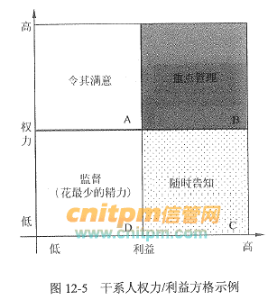

> [权力/利益方格 - 综合知识 - 信管网](http://www.cnitpm.com/pm1/45928.html)

# 五种权力类别的模型

社会心理学家约翰.弗伦奇（John.French）和伯特伦.雷文（Bertram.Raven）在他们1959年发表的一篇论文中，提出了五种权力类别的模型。参照性权力就是其中的一种。这五种权力类型分别是：

1. 强制性权力，它建立在惧怕基础上。一个人如果不服从就可能产生消极的后果，出于对这种后果的惧怕，这个人就对强制性权力做出反应。这种权力取决于使用或威胁使用生理上的处罚、精神上的打击甚至是某种其它形式利益的直接的强制性剥夺。在人们可利用的所有的权力中，伤害他人的权力也许是最常用的，也是最受谴责和最难以控制的，这是由权力关系的不对称性决定的。
2. 奖赏性权力，它与强制性权力在形式上相反。人们服从于一个人的愿望或指示是因为这种服从能给他们带来益处。因此，能给人们带来他们所期望的报酬的人就拥有了权力。这些报偿可以是人们认为有价值的任何东西。
3. 第三种是法定性权力。在正式的群体或组织中，获取一种或多种权力基础的最经常的途径大概要算一个人在组织结构中的职位了。由此获得的权力就是法定的权力。它代表一个人通过组织中正式层级结构中的职位所获得的权力。职位的权威包括强制性和奖赏性权力，而且还更宽泛。特别值得一提的是，这种权力包括组织成员对职位权威的接受和认可。当学校的校长、银行总裁和军队里的军官发话时，教师、出纳员和士兵只能洗耳恭听。
4. 专家性权力。这种权力基于专长、技能和知识。由于世界的发展日益取决于技术的发展，专门的知识技能由此成为权力主要来源之一。工作分工越细，专业化越强，目标的实现就越依赖专家。
5. 参照性权力。参照性权力的形成是由于对他人的崇拜以及希望自己成为那样的人。如果有人崇拜并认同你，那么，你就可以对他们拥有权力，因为别人想取悦于你。

> [参照性权力_百度百科](https://baike.baidu.com/item/%E5%8F%82%E7%85%A7%E6%80%A7%E6%9D%83%E5%8A%9B/8536536?fr=aladdin)

权力(Power)是影响行为、改变事情的过程和方向、克服阻力、使人们进行原本并不愿意进行的事情的潜在能力。一个人要行使权力，首先要清楚权力的来源。项目经理的权力有5种来源。

1. 职位权力(Legitimate Power)，来源于管理者在组织中的职位和职权。在高级管理层对项目经理的正式授权的基础上，项目经理让员工进行工作的权力。
2. 惩罚权力(Coercive Power)，使用降职、扣薪、惩罚、批评、威胁等负面手段的能力。惩罚权力很有力，但会对团队气氛造成破坏。滥用惩罚权力会导致项目失败，应谨慎使用。
3. 奖励权力(Reward Power)，给予下属奖励的能力。奖励包括加薪、升职、福利、休假、礼物、口头表扬、认可度、特殊的任务以及其他的奖励员工满意行为的手段。优秀的管理者擅长使用奖励权力激励员工高水平完成工作。
4. 专家权力(Expert Power)，来源于个人的专业技能。如果项目经理让员工感到他是某些领域的专业权威，那么员工就会在这些领域内遵从项目经理的意见。来自一线的中层管理者经常具有很大的专家权力。
5. 参照权力(Referent Power)，由于成为别人学习参照榜样所拥有的力量。参照权力是由于他人对你的认可和敬佩从而愿意模仿和服从你以及希望自己成为你那样的人而产生的，这是一种个人魅力。具有优秀品质的领导者的参照权力会很大。这些优秀品质包括诚实、正直、自信、自律、坚毅、刚强、宽容和专注等。领导者要想拥有参照权力，就要加强这些品质的修炼。

职位权力、惩罚权力、奖励权力来自于组织的授权，专家权力和参照权力来自于管理者自身。项目经理应不断拓展自己的权力，获取各方支持，以确保项目成功。尤其在矩阵环境中，项目经理对团队成员通常没有或仅有很小的命令职权，所以他们适时影响干系人的能力，对保证项目成功非常关键。

项目经理仅靠组织给予的权力是没法在下属中树立威信的，难以获得团队成员心悦诚服的支持和认可，布置的任务可能被阳奉阴违，项目也会举步维艰。

在项目环境中，有人直接向项目经理汇报，有人间接向项目经理汇报，还有人既向项目经理汇报又向职能经理汇报。对于双重汇报关系和非直接汇报关系人员的管理，项目经理更注重运用奖励权力、专家权力和参照权力，尽量避免使用惩罚权力。

> [权力-信息系统项目管理师知识点 - 综合知识 - 信管网](https://www.cnitpm.com/pm1/67649.html)

# 托马斯-基尔曼模型与冲突管理

按武断性程度和合作性程度可以画出一个矩阵，表示出来的模式就是"托马斯-基尔曼模型"。从这个模型可以看出，团队冲突有五种处理方式。

- 竞争/强制

这是由于团队冲突的双方都采取武断行为所造成的，双方都站在各自的立场上，各不相让，挣个你死我活。"要么你们对了，要么我们错了"，一定要分出个胜负、是非、曲直来。例：X经理坚持要今天报销，财务部的Y经理坚持到周四才能报销，双方都坚持自己的观点，谁也不想放弃。

- 回避

双方都想合作，但既不采取合作性行为，也不采取武断性行为。不合作，不坚持。"你不找我，我不找你"，双方回避这件事。冲突一方意识到问题存在，但采取忽视和放弃的态度。回避是日常工作中最常用的一种解决冲突的方法。但采用回避的方式，会有更多的工作被耽误，更多的问题被积压，更多的矛盾被激发，解决不了问题。例：一件棘手事情，其实需要上下游协作才能完成，结果上下游谁也不找谁，就那样让其顺其自然。

- 迁就

团队冲突的双方有一方高度合作，不武断，也就是说，只考虑对方的要求和利益，不考虑或牺牲自己的要求和利益；而另一方则是高度武断的，不合作的，也就是只考虑自己的利益，不考虑对方的要求和利益。自我牺牲，遵从他人的想法，维持良好的关系。

- 妥协/求同存异

冲突双方都有部分合作，但又都有武断。这种情形下双方都"你让三分，我让三分"，双方都让出一部分要求和利益，但同时又保存了一部分要求和利益。 这是职业经理与其他部门打交道时常用的方式。虽然通过妥协可以降低成本，会达成一种新的规则，但是有时会出现这样的情况，别人会和你讨价还价，并再次跟你提出更高的要求，强迫你让他三分，最后达到他的目的。

- 合作

团队冲突双方高度合作，并且高度武断。就是说冲突双方既考虑和维护自己的要求和利益，又要充分考虑和维护对方的要求和利益，并最终达成共识。合作是一种理想的解决冲突的方法。就是双方彼此尊重对方意愿，同时不放弃自己的利益，最后可以达到双赢的结果，形成皆大欢喜的局面，但不容易达到。合作是最该提倡的方式，合作包括团队合作、上下级合作、与客户合作等。

> [摘录：“托马斯-基尔曼模型”与冲突管理 - 简书](https://www.jianshu.com/p/d0afdf13c6f3)

# 合同

一、总价合同（Fixed Price FP）：为既定的产品或服务的采购设定一个总价，采用总价合同，买方必须准确定义要采购的产品或服务。

1. 固定总价合同（Firm Fixed Price FFP）：采购的价格在一开始就被确定，并且不允许改变（除非工作范围发生变更），因合同履行不好而导致的任何成本增加都由卖方负责。在FFP合同下，买方必须准确定义要采购的产品 或服务，对采购规范的任何变更都可能增加买方成本。
2. 总价加激励费用合同（Fixed Price Incentive fee FPIF）：合同总价固定，但买卖双方事先约定合同的最高限价（Ceiling Price）、目标成本（Target Cost）和卖方的目标利润（Target Fee），如果卖方能低于目标成本完成合同，节余部分由双方按一定的比例分成；如果卖方的实际成本高于目标成本，超出部分按比例从卖方的利润中扣除，但不管卖方的实际成本是多少，买方最多支付不超过最高限价的金额。适用范围：主要用于执行期长、合同金额较大且产品能清楚定义的采购。

3. 总价加经济价格调整合同（Fixed Price With Economic Price Adjustment –EP-EPA）：它是一种允许根据条件变化（如通货膨胀、某些特殊商品的成本增加或降低），以事先确定的方式对合同价格进行最终调整的特殊的总价合同。适用范围：卖方履约要跨越相当长的周期或买卖双方之间要维持多种长期关系。

二、成本补偿合同（Cost-Reimbursable Contracts）：向卖方支付为完成工作而发生的全部合法实际成本（给予成本补偿），外加一笔费用作为卖方的利润。适用范围：当工作范围在开始时无法准确定义从而需要在以后进行调整，或项目工作存在较高的风险，采用该合同可以使项目具有较大的灵活性，以便重新安排卖方的工作。

1. 成本加成本百分比合同（CPPC）：为卖方报销卖方实施合同工作发生的允许成本，同时卖方获得一定的酬金，通常按照商定的百分比以成本为基数计算。酬金因实际成本的不同而异。

2. 成本加固定费用合同（CPFF）：为卖方报销履行合同工作所发生的一切可列支成本，并向卖方支付一笔固定费用，该费用以初始项目成本估算的某一百分比估算。费用只针对已完成的工作来支付，并且不因卖方的绩效而变化，除非项目范围发生变更，费用金额维持不变。

3. 成本加激励费用合同（CPIF）：为卖方报销履行合同工作所发生的一切可列支成本，并在卖方达到合同规定的绩效目标时，向卖方支付预告确定的激励费用，在CPIF合同中，如果最终成本低于或高于原始估算成本则买方和专访需要根据事先商定的成本分摊比例来分享节约部分或分担超出部分。

4. 成本加奖励费用合同（CPAF）：在卖方报销履行合同工作所发生的一切合法成本，只在满足了合同中规定的某些主观的绩效标准的情况下，才能向卖方支付大部分费用。

三、工料合同（T&M）：也称单价合同，即只规定了卖方所提供产品的单价，根据卖方在合同执行中实际提供的产品数量计算总价，工料合同是兼具成本补偿合同和总价合同的某些特点的混合型合同，它与成本补偿合同的相似之处在于，它们是开口合同，合同价因成本增加而变化。适用范围：短期服务和小金额；工作范围未明确就要立即开始工作时，增加人员、聘请专家以及寻求其他外部支持。

> [总价合同、成本补偿合同、工料合同 - nxmydlp - 博客园](https://www.cnblogs.com/nxmydlp/p/9089593.html)

在项目工作中，要根据项目的实际情况和外界条件的约束来选择合同类型。一般情况下，可以按下列经验来进行选择：

- 如果工作范围很明确，且项目的设计已具备详细的细节，则使用总价合同。
- 如果工作性质清楚，但范围不是很清楚，而且工作不复杂，又需要快速签订合同，则使用工料合同。
- 如果工作范围尚不清楚，则使用成本补偿合同。
- 如果双方分担风险，则使用工料合同；如果买方承担成本风险，则使用成本补偿合同；如果卖方承担
成本风险，则使用总价合同。
- 如果是购买标准产品，且数量不大，则使用单边合同。

# 项目、项目集、项目组合

项目组合管理是对一组或者多组项目组合进行管理，以达成组织的战略目标。组织为了实现自身的愿景、使命和价值目标，遵循一系列相互关联的过程，对项目组合中的模块进行评价、选择以及设定优先级，以便将内部有限的资源以最佳方式分配给项目组合。

项目组合在管理过程中，向组织提供相应的信息以支持或者改变组织的战略方向和投资决定。项目组合管理需要在项目集和项目对资源需求之间的冲突进行平衡，对资源的分配进行合理安排。项目集管理和项目管理的目标则与项目组合管理的目标不尽相同，表21-1描述了项目组合管理、项目集管理、项目管理在管理方面所存在的异同之处。

> [项目、项目集、项目组合的目标属性对比 - 综合知识 - 信管网](https://www.cnitpm.com/pm1/47440.html)

# 项目集指导委员会

项目集指导委员会的主要责任是保证项目集能够按照计划实现组织的战略目标，围绕这一基本职能就要求项目集指导委员会承担在组织范围内对项目集的成功识别、启动和实现起到具有关键作用的职责。这些职责主要可以概括如下。

1. 保证项目集与组织愿景和目标的一致性。项目集指导委员会的首要职责是确保项目集在其授权范围内定义项目集的愿景和目标，并保证项目集的愿景和目标与组织的愿景和目标保持一致。因为对于大多数项目集来说，组织的愿景和目标是驱动项目集启动和执行的基础，所以项目集必须有效支持组织的愿景和目标。

2. 项目集批准和启动。项目集指导委员会作为项目集的决策机构，需要批准每个项目集为实现预期目标所采取的方法和计划，授权项目集对组织资源的使用，以及对寻求组织外资源的方法。另外项目集指导委员会还负责批准项目集章程和批准项目集商业论证。

批准项目集章程的主要内容随项目集环境的不同而存在差异，但是项目集章程一般会包括授权项目集管理团队使用组织资源执行项目集的必要权限。同时项目集章程还将项目集及其商业论证与组织战略优先级结合起来，赋予项目集在组织战略中的层级和地位，以决定纽织未来对项目集的资源支持和其他方面的保障。而对商业论证的审批作为项目集指导委员会对项目集预期交付价值的正式预测，成为项目集启动的直接依据，以及为项目集提供组织资源支持的正当理由。

> [项目集指导委员会的主要责任及历年真题 - 综合知识 - 信管网](http://www.cnitpm.com/pm1/73049.html)

# 需求分析

在需求获取阶段获得的需求是杂乱的，是用户对新系统的期望和要求，这些要求有重复的地方，也有矛盾的地方，这样的要求是不能作为软件设计的基础的。一个好的需求应该具有无二义性、完整性、一致性、可测试性、确定性、可跟踪性、正确性、必要性等特性，因此，需要分析人员把杂乱无章的用户要求和期望转化为用户需求，这就是需求分析的工作。

需求分析将提炼、分析和审查已经获取到的需求，以确保所有的项目干系人都明白其含义并找出其中的错误、遗漏或其他不足的地方。需求分析的关键在于对问题域的研究与理解。为了便于理解问题域，现代软件工程方法所推荐的做法是对问题域进行抽象，将其分解为若干个基本元素，然后对元素之间的关系进行建模。

使用SA方法进行需求分析，其建立的模型的核心是数据字典，围绕这个核心，有三个层次的模型，分别是数据模型、功能模型和行为模型（也称为状态模型）。在实际工作中，一般使用实体联系图(E-R图)表示数据模型，用数据流图(Data Flow
Diagram，DFD)表示功能模型，用状态转换图（State Transform
Diagram，STD）表示行为模型。E-R图主要描述实体、属性，以及实体之间的关系；DFD从数据传递和加工的角度，利用图形符号通过逐层细分描述系统内各个部件的功能和数据在它们之间传递的情况，来说明系统所完成的功能；STD通过描述系统的状态和引起系统状态转换的事件，来表示系统的行为，指出作为特定事件的结果将执行哪些动作（例如处理数据等）。

OOA的基本任务是运用OO方法，对问题域进行分析和理解，正确认识其中的事物及它们之间的关系，找出描述问题域和系统功能所需的类和对象，定义它们的属性和职责，以及它们之间所形成的各种联系。最终产生一个符合用户需求，并能直接反映问题域和系统功能的OOA模型及其详细说明。OOA模型包括用例模型和分析模型，用例是一种描述系统需求的方法，使用用例的方法来描述系统需求的过程就是用例建模；分析模型描述系统的基本逻辑结构，展示对象和类如何组成系绕（静态模型），以及它们如何保持通信，实现系统行为（动态模型）。

简单地说，软件需求就是系统必须完成的事以及必须具备的品质。需求是多层次的，包括业务需求、用户需求和系统需求，这三个不同层次从目标到具体，从整体到局部，从概念到细节。

1. 业务需求。业务需求是指反映企业或客户对系统高层次的目标要求，通常来自项目投资人、购买产品的客户、客户单位的管理人员、市场营销部门或产品策划部门等。通过业务需求可以确定项目视图和范围，项目视图和范围文档把业务需求集中在一个简单、紧凑的文档中，该文档为以后的开发工作奠定了基础。
2. 用户需求。用户需求描述的是用户的具体目标，或用户要求系统必须能完成的任务。也就是说，用户需求描述了用户能使用系统来做些什么。通常采取用户访谈和问卷调查等方式，对用户使用的场景(scenarios)进行整理，从而建立用户需求。
3. 系统需求。系统需求是从系统的角度来说明软件的需求，包括功能需求、非功能需求和设计约束等。功能需求也称为行为需求，它规定了开发人员必须在系统中实现的软侔功能，用户利用这些功能来完成任务，满足业务需要。功能需求通常是通过系统特性的描述表现出来的，所谓特性，是指一组逻辑上相关的功能需求，表示系统为用户提供某项功能（服务），使用户的业务目标得以满足；非功能需求是指系统必须具备的属性或品质，又可细分为软件质量属性（例如，可维护性、可维护性、效率等）和其他非功能需求。设计约束也称为限制条件或补充规约，通常是对系统的一些约束说明，例如，必须采用国有自主知识产权的数据库系统，必须运行在UNIX操作系统之下等。

> [信息系统项目管理师教程第3版需求分析真题习题与考点 - 综合知识 - 信管网](https://www.cnitpm.com/pm1/48428.html)
> 
> [信息系统项目管理师教程第3版需求分析真题习题与考点 - 综合知识 - 信管网](https://www.cnitpm.com/pm1/48286.html)

# 范围控制

控制范围（Control Scope）是监督项目和产品的范围状态、管理范围基准变更的过程，其主要作用是在整个项目期间保持对范围基准的维护。对项目范围进行控制，就必须确保所有请求的变更、推荐的纠正措施或预防措施都经过实施整体变更控制过程的处理。在变更实际发生时，也要采用范围控制过程来管理这些变更。

1．范围变更的原因

造成项目范围变更的主要原因是项目外部环境发生了变化，例如：

- 政府政策的问题。
- 项目范围的计划编制不周密详细，有一定的错误或遗漏。
- 市场上出现了或是设计人员提出了新技术、新手段或新方案。
- 项目执行组织本身发生变化。
- 客户对项目、项目产品或服务的要求发生变化。

未经控制的产品或项目范围的扩大（未对时间、成本和资源做相应调整）称为范围蔓延。在信息系统集成项目中，变更是不可避免的，控制范围过程依赖于范围变更控制系统，范围变更控制是指对有关项目范围的变更实施控制，审批项目范围变更的一系列过程，包括书面文件、跟踪系统和授权变更所必须的批准级别。

2．范围变更控制的工作

在整个项目周期内，项目范围发生变化，则要进行范围变更控制，范围变更控制的主要工作如下。

- 影响导致范围变更的因素，并尽量使这些因素向有利的方面发展。
- 判断范围变更是否已经发生。
- 范围变更发生时管理实际的变更，确保所有被请求的变更按照项目整体变更控制过程处理。

> [范围控制 - 综合知识 - 信管网](https://www.cnitpm.com/pm1/71202.html)

# 一致性成本和非一致性成本

- 一致性成本：指预防出错的所发生的成本。质量保证属于一致性成本。一致性成本又分为预防成本、评估成本。
- 非一致性成本：指用来修复解决问题所发生的成本。也叫故障成本。非一致性成本又分为内部失败成本、外部失败成本。

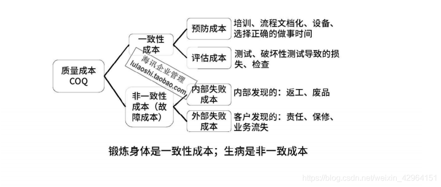

> [一致性成本和非一致性成本_南武的博客-CSDN博客_一致性成本和非一致性成本](https://blog.csdn.net/weixin_42964151/article/details/108214193)

# 信息系统生命周期

为了便于论述针对信息系统的项目管理，信息系统的生命周期还可以简化为立项（系统规划）、开发（系统分析、系统设计、系统实施）、运维及消亡四个阶段，在开发阶段不仅包括系统分析、系统设计、系统实施，还包括系统验收等工作。如果从项目管理的角度来看，项目的生命周期又划分为启动、计划、执行和收尾4个典型的阶段。

1．系统规划阶段

系统规划阶段的任务是对组织的环境、目标及现行系统的状况进行初步调查，根据组织目标和发展战略，确定信息系统的发展战略，对建设新系统的需求做出分析和预测，同时考虑建设新系统所受的各种约束，研究建设新系统的必要性和可能性。根据需要与可能，给出拟建系统的备选方案。对这些方案进行可行性研究，写出可行性研究报告。可行性研究报告审议通过后，将新系统建设方案及实施计划编写成系统设计任务书。

2．系统分析阶段

系统分析阶段的任务是根据系统设计任务书所确定的范围，对现行系统进行详细调查，描述现行系统的业务流程，指出现行系统的局限性和不足之处，确定新系统的基本目标和逻辑功能要求，即提出新系统的逻辑模型。系统分析阶段又称为逻辑设计阶段。这个阶段是整个系统建设的关键阶段，也是信息系统建设与一般工程项目的重要区别所在。系统分析阶段的工作成果体现在系统说明书中，这是系统建设的必备文件。它既是给用户看的，也是下一个阶段的工作依据。因此，系统说明书既要通俗，又要准确。用户通过系统说明书可以了解未来系统的功能，判断是不是所要求的系统。系统说明书一旦讨论通过，就是系统设计的依据，也是将来验收系统的依据。

3．系统设计阶段

简单地说，系统分析阶段的任务是回答系统“做什么”的问题，而系统设计阶段要回答的问题是“怎么做”。该阶段的任务是根据系统说明书中规定的功能要求，考虑实际条件，具体设计实现逻辑模型的技术方案，也就是设计新系统的物理模型。这个阶段又称为物理设计阶段，可分为总体设计（概要设计）和详细设计两个子阶段。这个阶段的技术文档是系统设计说明书。

4．系统实施阶段

系统实施阶段是将设计的系统付诸实施的阶段。这一阶段的任务包括计算机等设备的购置、安装和调试、程序的编写和调试、人员培训、数据文件转换、系统调试与转换等。这个阶段的特点是几个互相联系、互相制约的任务同时展开，必须精心安排、合理组织。系统实施是按实施计划分阶段完成的，每个阶段应写出实施进展报告。系统测试之后写出系统测试分析报告。

5．系统运行和维护阶段

系统投入运行后，需要经常进行维护和评价，记录系统运行的情况，根据一定的规则对系统进行必要的修改，评价系统的工作质量和经济效益。

> [信息系统生命周期5阶段生命周期 - 综合知识 - 信管网](https://www.cnitpm.com/pm1/49496.html)

# 信息系统规划流程

抽象来说，企业实施信息系统规划主要包括以下步骤。

1. 分析企业信息化现状。

首先要明确并理解企业的发展战略，明确企业各个部门、各个分支机构为实现企业战略需要承担的工作以及各个部门的协作关系（业务流程）。

其次要分析企业目前的信息化程度和现有的信息资源，包括：正在应用的信息系统、信息化基础设施（如通信平台、存储平台等）、数据库、信息化制度、信息化相关人员现状、员工的信息化技能、信息系统的应用绩效等等。并对现有信息系统组织策略和运行情况进行评估。

再次，分析、研究信息技术在行业发展中起的作用，掌握信息技术本身的发展现状。

了解同行企业信息技术的应用情况等。信息技术的现状与未来的发展都会影响信息系统的规划。新一代信息技术的发展与应用，系统设计方法的改变，甚至法律法规和有关政策，竞争者行为等环境因素对规划的影响，都应认真分析，有关结论或者应对措施要纳入规划。

2. 制定企业信息化战略。

根据本企业的战略目标提出的信息化需求，明确企业信息化的总目标和相关任务，定义企业信息化的发展方向和企业信息化在实现企业战略过程中应起的作用，并制定信息技术部门在管理和实施信息化工作制度和办法。

3. 信息系统规划方案拟定和总体构架设计。包括技术路线、实施方案、运行维护方案等。

详细的流程或者步骤可以参考企业系统规划方法。

> [信息系统规划流程真题习题与考点信息系统项目管理师教程第3版 - 综合知识 - 信管网](https://www.cnitpm.com/pm1/52670.html)

# 信息系统的规划工具

1. 在制订计划时，可以利用PERT图和甘特图。

2. 访谈时，可以应用各种调查表和调查提纲。

3. 在确定各部门、各层管理人员的需求，梳理流程时，可以采用会谈和正式会议的方法。

4.
为把企业组织结构与企业过程联系起来，说明每个过程与组织的联系，指出过程决策人，可以采用建立过程／组织（Process/Organization，P/O）矩阵的方法。例如，表1-5是一个简单的P/O矩阵示例，其中“√”代表负责和决策，“+”代表过程主要涉及，“+”代表过程有涉及，空白表示过程不涉及。

5. 为定义数据类，在调查研究和访谈的基础上，可以采用实体法归纳出数据类。实体法首先列出企业资源，再列出一个资源／数据( Resource/Data，R/D)矩阵。

6. 功能法也称为过程法，它利用所识别的企业过程，分析每个过程的输入数据类和输出数据类，与RD矩阵进行比较并调整，最后归纳出系统的数据类。功能法可以用IPO（Input-Process-Output，输入-处理-输出）图表示。

7. CU矩阵。企业过程和数据类定义好后，可以企业过程为行，以数据类为列，按照企业过程生成数据类关系填写c (Create)，使用数据类关系填写u(User)，形成CU矩阵。

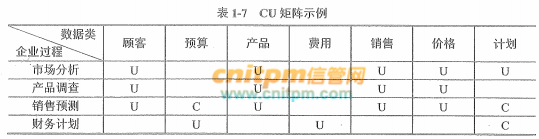

> [信息系统的规划工具真题习题与考点信息系统项目管理师教程第3版 - 综合知识 - 信管网](https://www.cnitpm.com/pm1/52730.html)
> 
> [信息系统规划的工具 - 综合知识 - 信管网](https://www.cnitpm.com/pm1/71114.html)

# 项目质量管理

项目质量管理分为三个部分：

- 规划质量管理：识别项目及其可交付成果的质量要求和/或标准。并书面描述项目将如何证明符合质量要求和/或标准的过程。关注工作要达到的质量。
- 管理质量：把组织的质量政策应用于项目，并将质量管理计划转化为可执行的质量活动的过程。关注整个项目期间的质量过程。在管理质量过程期间。把在规划质量管理过程中识别的质量要求转化成测试与评估工具，将用于控制质量过程。
- 控制质量：为了评估绩效。确保项目输出完整、正确，并满足客户期望，而监督和记录质量管理活动执行结果的过程。关注工作成果与质量要求的比较，确保结果可接受。

> [项目质量管理 - 知乎](https://zhuanlan.zhihu.com/p/50209379)

# 项目评估与论证

项目论证的概念，“先论证，后决策”是现代项目管理的基本原则。项目论证是指对拟实施项目技术上的先进性、适用性，经济上的合理性、盈利性，实施上的可能性、风险性进行全面科学的综合分析，为项目决策提供客观依据的一-种技术经济研究活动。

项目评估指在项目可行性研究的基础上，由第三方(国家、银行或有关机构)根据国家颁布的政策、法规、方法、参数和条例等，从项目(或企业)
、国民经济、社会角度出发，对拟建项目建设的必要性、建设条件、生产条件、产品市场需求、工程技术、经济效益和社会效益等进行评价、分析和论证，进而判断其是否可行的一个评估过程。项目评估是项目投资前期进行决策管理的重要环节，其目的是审查项目可行性研究的可靠性、真实性和客观性，为银行的贷款决策或行政主管部门的审批决策提供科学依据。政府主管部门对某些大型信息化建设项目的项目建议书也要进行评估，其程序和内容与对项目可行性研究的评估基本相同，只是重点对项目建设的必要性进行评估。

项目评估的最终成果是项目评估报告。项目评估的依据包括如下项目。

1. 项目建议书及其批准文件。
2. 项目可行性研究报告。
3. 报送单位的申请报告及主管部门的初审意见。
4. 有关资源、配件、燃料、水、电、交通、通信、资金（包括外汇）等方面的协议文件。
5. 必需的其他文件和资料。

> [项目评估与论证 - 综合知识 - 信管网](https://www.cnitpm.com/pm1/71133.html)

# 项目管理过程组

按项目管理过程在项目管理中的职能可以将组成项目的各个过程归纳为5组，叫作项目管理过程组：①启动过程组；②计划过程组；③执行过程组；④监督与控制过程组；⑤收尾过程组。

1. 启动过程组定义并批准项目或项目阶段。包括“制定项目章程”和“识别项目干系人”两个过程。

2. 计划过程组定义和细化目标．并为实现项目而要达到的目标和完成项目要解决的问题范围而规划必要的行动路线。包括项目整体管理中的“制订项目管理计划”过程，项目范围管理中的“收集需求”“定义范围”“创建工作分解结构”过程，项目时间管理中的“定义活动”“排列活动顺序”“估算活动资源”“估算活动历时”“制订进度计划”过程，项目成本管理中的“估算成本”“制订预算”过程，项目质量管理中的“规划质量”过程，项目人力资源管理中的“制订人力资源计划”过程，项目沟通管理中的“规划沟通”过程，项目风险管理中的“规划风险管理”“识别风险”“实施定性风险分析”“实施定量风险分析”“规划风险应对”过程，项目采购管理中的“规划采购”等过程。

3. 执行过程组整合人员和其他资源，在项目的生命期或某个阶段执行项目管理计划。包括项目整体管理中的“指导和管理项目执行”过程，项目质量管理中的“执行质量保证”过程，项目人力资源管理中的“组建项目团队”“建设项目团队”“管理项目团队”过程，项目沟通管理中的管理沟通过程，项目采购管理中的“实施采购”等过程。

4. 监督与控制过程组要求定期测量和监控项目绩效情况，识别与项目管理计划的偏差，以便在必要时采取纠正措施，确保项目或阶段目标达成。包括项目整体管理中的“监督和控制项目工作”“实施整体变更控制”过程，项目范围管理中的“核实范围”“控制范围”过程，项目时间管理中的“控制进度”过程，项目成本管理中的“控制成本”过程，项目质量管理中的“执行质量控制”过程，项目沟通管理中的“控制沟通”过程，项目风险管理中的“监督与控制风险”过程，项目采购管理中的“控制采购”等过程。

5. 收尾过程组正式验收产品、服务或工作成果，有序的结束项目或项目阶段。包括项目箍体管理中的“结束项目或阶段”过程，项目采购管理中的“结束采购”过程。

任何一个项目所必需的这5个项目管理过程组之间的依赖关系很清楚，对于每一个项目都是按照同样的顺序进行的。它们与应用领域或行业关心的重点无关。各个过程组及其过程在项目完成之前经常被多次反复。过程在过程组内或过程组之间也相互作用和影响。

一个过程组包括以各自的依据和成果相互联系的项目管理过程，也就是说，一个过程的结果或成果变成了另一个过程的依据。例如，监控过程组不仅监视和控制某一过程组正在进行的工作，而且还监视和控制整个项目的成果。监控过程组还必须提供反馈，以便决定是否需要为了使项目符合项目管理计划而实施纠正或预防措施，或者适当地修改项目管理计划。过程组之间也有可能增添许多其他相互关系或相互影响。但是，过程组不是项目阶段，当大项目或复杂项目有可能分解为不同的阶段或者不同的子项目时，如可行性研究、概念推敲、设计、原型开发、建造、实验等，每一个阶段或子项目都要重复过程组的所有过程。

PDCA是英语单词Plan(计划)、Do(执行)、Check(检查)和Act(处理)的第一个字母，PDCA循环就是按照这样的顺序进行质量管理，并且循环不止地进行下去的科学程序。

1. P (Plan) 计划，包括方针和目标的确定，以及活动规划的制定。
2. D (Do) 执行，根据已知的信息，设计具体的方法、方案和计划布局；再根据设计和布局，进行具体运作，实现计划中的内容。
3. C (Check) 检查，总结执行计划的结果，分清哪些对了，哪些错了，明确效果，找出问题。
4. A (Act）处理，对总结检查的结果进行处理，对成功的经验加以肯定，并予以标准化；对于失败的教训也要总结，引起重视。对于没有解决的问题，应提交给下一个PDCA循环中去解决。

以上四个过程不是运行一次就结束，而是周而复始的进行，一个循环完了，解决一些问题，未解决的问题进入下一个循环，这样阶梯式上升的。PDCA循环是全面质量管理所应遵循的科学程序。全面质量管理活动的全部过程，就是质量计划的制订和组织实现的过程，这个过程就是按照PDCA循环，不停顿地周而复始地运转的。

> [项目管理过程组真题习题与考点信息系统项目管理师教程第3版 - 综合知识 - 信管网](https://www.cnitpm.com/pm1/54185.html)
> 
> [PDCA循环_百度百科](https://baike.baidu.com/item/PDCA%E5%BE%AA%E7%8E%AF/5091521?fromtitle=%E6%88%B4%E6%98%8E%E7%8E%AF&fromid=9497097&fr=aladdin)

# 组织过程资产

在制定项目章程及以后的项目文件时，任何一种以及所有用于影响项目成功的资产都可以作为组织过程资产。任何一种以及所有参与项目的组织都可能有正式或非正式的方针、程序、计划和原则，所有这些的影响都必须考虑。组织过程资产还反映了组织从以前项目中吸取的教训和学习到的知识，如完成的进度表、风险数据和实现价值数据。组织过程资产的组织方式因行业、组织和应用领域的类型而异。例如，组织过程资产可以归纳为如下两类。

1. 组织进行工作的过程与程序

- 组织标准过程，如标准、方针（安全健康方针，项目管理方针）；软件生命周期与项目生命期，以及质量方针与裎序（过程审计、目标改进、核对表，以及供组织内部使用的标准过程定义）。
- 标准指导原则、工作指令、建议评价标准与实施效果评价准则。
- 模板（如风险模板、工作分解结构模板与项目进度网络图模板）。
- 根据项目的具体需要修改组织标准过程的指导原则与准则。
- 组织沟通要求（如可利用的特定沟通技术，允许使用的沟通媒介、记录的保留，以及安全要求）。
- 项目收尾指导原则或要求（如最后项目审计、项目评价、产品确认，以及验收标准）。
- 财务控制程序（如进度报告、必要的开支与支付审查、会计编码，以及标准合同条文）。
- 确定问题与缺陷控制、问题与缺陷识别和解决，以及行动追踪的问题与缺陷管理程序。
- 变更控制程序，包括修改公司正式标准、方针、计划与程序，或者任何项目文件，以及批准与确认任何变更时应遵循的步骤。
- 风险控制程序，包括风险类型、概率的确定与后果，以及概率与后果矩阵。
- 批准与签发工作授权的程序。

2. 组织整体信息存储检索知识库

- 过程测量数据库，用于搜集与提供过程与产品实测数据。
- 项目档案（如范围、费用、进度，以及质量基准、实施效果测量基准、项目日历、项目进度网络图、风险登记册、计划的应对行动，以及确定的风险后果）。
- 历史信息与教训知识库（如项目记录与文件，所有的项目收尾资料与文件记录，以前项目选择决策结果与绩效的信息；以及风险管理努力的信息）。
- 问题与缺陷管理数据库，包括问题与缺陷状态，控制信息，问题与缺陷解决和行动结果。
- 配置管理知识库，包括公司所有正式标准、方针、程序和任何项目文件的各种版本与基准。
- 财务数据库，包括如工时、发生的费用、预算以及任何项目费用超支等信息。

> [项目章程的依据（组织过程资产）真题习题与考点信息系统项目管理师教程第3版 - 综合知识 - 信管网](https://www.cnitpm.com/pm1/55763.html)

# 确认范围与核实产品、质量控制、项目收尾的比较

为了帮助读者理解，本节将确认范围与核实产品、质量控制、项目收尾进行比较分析。

1．确认范围与核实产品

核实产品是针对产品是否完成，在项目（或阶段）结束时由发起人或客户来验证，强调产品是否完整；确认范围是针对项目可交付成果，由客户或发起人在阶段末确认验收的过程。

2．确认范围与质量控制

确认范围与质量控制的不同之处在于：

- 确认范围主要强调可交付成果获得客户或发起人的接受；质量控制强调可交付成果的正确性，并符合为其制定的具体质量要求（质量标准）。

- 质量控制一般在确认范围前进行，也可同时进行；确认范围一般在阶段末尾进行，而质量控制并不一定在阶段未进行。

- 质量控制属内部检查，由执行组织的相应质量部门实施；确认范围则是由外部于系人（客户或发起入）对项目可交付成果进行检查验收。

从检查的详细程度来说，核实产品、确认范围和质量控制是递进的、越来越细的检查过程。

3．确认范围与项目收尾

确认范围与项目收尾的不同之处在于：

- 虽然确认范围与项目收尾工作都在阶段未进行，但确认范围强调的是核实与接受可交付成果，而项目收尾强调的是结束项目（或阶段）所要做的流程性工作。

- 确认范围与项目收尾都有验收工作，确认范围强调验收项目可交付成果，项目收尾强调验收产品。

> [几个术语的比较-信息系统项目管理师知识点 - 综合知识 - 信管网](http://www.cnitpm.com/pm1/58813.html)

# 资源平衡与资源平滑

项目进度计划一般需要用进度网络分析技术这个工具来编制，常用的进度网络分析技术包括关键路径法、资源优化技术以及进度压缩等。一般第一步先用关键路径法编制出理论可行的进度计划；第二步运用资源优化技术根据项目实际的资源制约因素，把理论可行的进度计划变为实际可行的进度计划；最后用进度压缩法来进一步优化项目进度计划。本文主要通过举例详细讲述第二步资源优化技术下的两种子技术资源平衡和资源平滑。

先来熟悉一下二者的概念：

- 资源平衡(Resource Leveling)，是根据资源制约因素对活动的开始日期与完成日期进行调整的一项技术。这儿的资源制约因素可以是关键资源只在特定时间可用，或者数量有限，或者被过度分配等等情况。资源平衡往往会改变关键路径（通常是延长）。

- 资源平滑(Resource Smoothing)，是为了让项目资源需求不超过预定的资源限制而对进度活动进行调整的一种技术。资源平滑不会改变项目关键路径，也可以把资源平滑看做一种特殊的资源平衡。

> [资源平衡与资源平滑 - 简书](https://www.jianshu.com/p/3113147038ef)

# 风险管理

## 风险的分类

为了深入、全面地认识项目风险，并有针对性地进行管理，有必要将风险分类。分类可以从不同的角度、根据不同的标准进行。

### 按风险后果划分

按照后果的不同，风险可划分为纯粹风险和投机风险。

- 纯粹风险：不能带来机会、无获得利益可能的风险，叫纯粹风险。纯粹风险只有两种可能的后果：造成损失和不造成损失。纯粹风险造成的损失是绝对的损失。活动主体蒙受了损失，全社会也有可能跟着受损失。如：某建设项目空气压缩机房在施工过程中失火，蒙受了损失。该损失不但是这个工程的，也是全社会的。没有人从中获得好处。纯粹风险总是和威胁、损失、不幸相联系。
- 投机风险：既可能带来机会、获得利益，又隐含威胁、造成损失的风险，叫投机风险。投机风险有三种可能的后果：造成损失、不造成损失和获得利益。投机风险如果使活动主体蒙受了损失，但全社会不一定也跟着受损失。反之，其他人有可能因此而获得利益。例如私人投资的房地产开发项目如果失败，投资者要蒙受损失。但是发放贷款的银行却可将抵押的土地和房屋收回，等待时机转手高价卖出，不但可收回贷款，而且还有可能获得高额利润。

纯粹风险和投机风险在一定条件下可以相互转化。项目管理人员必须避免投机风险转化为纯粹风险。

风险不是零和游戏。在许多情况下，涉及风险的各有关方面都要蒙受损失，无一幸免。

### 按风险来源划分

按风险来源或损失产生的原因可将风险划分为自然风险和人为风险。

- 自然风险：由于自然力的作用，造成财产毁损或人员伤亡的风险属于自然风险。例如，水利工程施工过程中因发生洪水或地震而造成的工程损害，材料和器材损失。
- 人为风险：人为风险是指由于人的活动而带来的风险。人为风险又可以细分为行为、经济、技术、政治和组织风险等。

### 按风险是否可管理划分

可管理的风险是指可以预测，并可采取相应措施加以控制的风险，反之，则为不可管理的风险。风险能否管理，取决于风险不确定性是否可以消除以及活动主体的管理水平。要消除风险的不确定性，就必须掌握有关的数据、资料和其他信息。随着数据、资料和其他信息的增加以及管理水平的提高，有些不可管理的风险可以变为可管理的风险。

### 按风险影响范围划分

按风险影响范围划分，可以有局部风险和总体风险。局部风险影响的范围小，而总体风险影响范围大。局部风险和总体风险也是相对的。项目管理团队特别要注意总体风险。例如，项目所有的活动都有拖延的风险，但是处在关键路线上的活动一旦延误，就要推迟整个项目的完成日期，形成总体风险。而非关键路线上活动的延误在许多情况下是局部风险。

### 按风险后果的承担者划分

项目风险，若按其后果的承担者来划分，则有项目业主风险、政府风险、承包商风险、投资方风险、设计单位风险、监理单位风险、供应商风险，担保方风险和保险公司风险等。这样划分有助于合理分配风险，提高项目对风险的承受能力。

### 按风险的可预测性划分

按这种方法，风险可以分为己知风险、可预测风险和不可预测风险。

- 己知风险就是在认真、严格地分析项目及其计划之后就能够明确的那些经常发生的，而且其后果亦可预见的风险。己知风险发生概率高，但一般后果轻微，不严重。项目管理中已知风险的例子有：项目目标不明确，过分乐观的进度计划，设计或施工变更，材料价格波动等。
- 可预测风险就是根据经验，可以预见其发生，但不可预见其后果的风险。这类风险的后果有时可能相当严重。项目管理中的例子有：业主不能及时审查批准，分包商不能及时交工，施工机械出现故障，不可预见的地质条件等。
- 不可预测风险就是有可能发生，但其发生的可能性即使最有经验的人亦不能预见的风险。不可预测风险有时也称未知风险或未识别的风险。它们是新的、以前未观察到或很晚才显现出来的风险。这些风险一般是外部因素作用的结果，例如地震、百年不遇的暴雨、通货膨胀、政策变化等。

> [信息系统项目管理师教程：风险的分类 - 综合知识 - 信管网](https://www.cnitpm.com/pm1/38890.html)

### 控制风险的工具与技术

1. 风险再评估

在控制风险中，经常需要识别新风险，对现有风险进行再评估，以及删去已过时的风险。应该定期进行项目风险再评估。反复进行再评估的次数和详细程度，应该根据相对于项目目标的项目进展情况而定。

2. 风险审计

风险审计是检查并记录风险应对措施在处理已识别风险及其根源方面的有效性，以及风险管理过程的有效性。项目经理要确保按项目风险管理计划所规定的频率实施风险审计。既可以在日常的项目审查会中进行风险审计，也可单独召开风险审计会议。在实施审计前。要明确定义审计的格式和目标。

3. 偏差和趋势分析

很多控制过程都会借助偏差分析来比较计划结果与实际结果。为了控制风险，应该利用绩效信息对项目执行的趋势进行审查。可使用挣值分析，以及项目偏差与趋势分析的其他方法，对项目总体绩效进行监控。这些分析的结果可以揭示项目在完成时可能偏离成本和进度目标的程度。与基准计划的偏差可能表明威胁或机会的潜在影响。

4. 技术绩效测量

技术绩效测量是把项目执行期间所取得的技术成果与计划取得的技术成果进行比较。它要求定义关于技术绩效的客观的、量化的测量指标，以便据此比较实际结果与计划要求。这些技术绩效测量指标可包括重量、处理时间、缺陷数量和存储容量等。偏差值（如在某里程碑实现了比计划更多或更少的功能）有助于预测项目范围方面的成功程度。

5. 储备分析

在项目实施过程中，可能发生一些对预算或进度应急储备有积极或消极影响的风险。储备分析是指在项目的任何时间点比较剩余应急储备与剩余风险量，从而确定剩余储备是否仍然合理。

6. 会议

项目风险管理应该是定期状态审查会中的一项议程。该议程所占用的会议时间长短取决于已识别的风险以及优先级和应对难度。越经常开展风险管理，风险管理就会变得越容易。经常讨论风险，可以促使人们识别风险和机会。

> [控制风险的工具与技术及历年真题 - 综合知识 - 信管网](http://www.cnitpm.com/pm1/40331.html)

## 控制风险的工具与技术

1. 风险再评估

在控制风险中，经常需要识别新风险，对现有风险进行再评估，以及删去已过时的风险。应该定期进行项目风险再评估。反复进行再评估的次数和详细程度，应该根据相对于项目目标的项目进展情况而定。

2. 风险审计

风险审计是检查并记录风险应对措施在处理已识别风险及其根源方面的有效性，以及风险管理过程的有效性。项目经理要确保按项目风险管理计划所规定的频率实施风险审计。既可以在日常的项目审查会中进行风险审计，也可单独召开风险审计会议。在实施审计前。要明确定义审计的格式和目标。

3. 偏差和趋势分析

很多控制过程都会借助偏差分析来比较计划结果与实际结果。为了控制风险，应该利用绩效信息对项目执行的趋势进行审查。可使用挣值分析，以及项目偏差与趋势分析的其他方法，对项目总体绩效进行监控。这些分析的结果可以揭示项目在完成时可能偏离成本和进度目标的程度。与基准计划的偏差可能表明威胁或机会的潜在影响。

4. 技术绩效测量

技术绩效测量是把项目执行期间所取得的技术成果与计划取得的技术成果进行比较。它要求定义关于技术绩效的客观的、量化的测量指标，以便据此比较实际结果与计划要求。这些技术绩效测量指标可包括重量、处理时间、缺陷数量和存储容量等。偏差值（如在某里程碑实现了比计划更多或更少的功能）有助于预测项目范围方面的成功程度。

5. 储备分析

在项目实施过程中，可能发生一些对预算或进度应急储备有积极或消极影响的风险。储备分析是指在项目的任何时间点比较剩余应急储备与剩余风险量，从而确定剩余储备是否仍然合理。

6. 会议

项目风险管理应该是定期状态审查会中的一项议程。该议程所占用的会议时间长短取决于已识别的风险以及优先级和应对难度。越经常开展风险管理，风险管理就会变得越容易。经常讨论风险，可以促使人们识别风险和机会。

> [控制风险的工具与技术及历年真题 - 综合知识 - 信管网](http://www.cnitpm.com/pm1/40331.html)

## 规划风险的工具与技术

有若干种风险应对策略可供使用。应该为每个风险选择最可能有效的策略或策略组合。可利用风险分析工具（如决策树分析）来选择最适当的应对策略。然后，应制定具体行动去实施该策略，包括主要策略和备用策略（如果必要的话）。可以制定弹回计划，以便在所选策略无效或发生已接受的风险时加以实施。还应该对次生风险进行审查。次生风险是实施风险应对措施的直接结果。经常要为时间或成本分配应急储备，并可能需要说明动用应急储备的条件。

### 消极风险或威胁的应对策略

通常用规避、转移、减轻这三种策略来应对威胁或可能给项目目标带来消极影响的风险。第四种策略，即接受，既可用来应对消极风险或威胁，也可用来应对积极风险或机会。每种风险应对策略对风险状况都有不同且独特的影响。要根据风险的发生概率和对项目总体目标的影响选择不同的策略。规避和减轻策略通常适用于高影响的严重风险，而转移和接受则更适用于低影响的不太严重威胁。

1. 规避。风险规避是指项目团队采取行动来消除威胁，或保护项目免受风险影响的风险应对策略。通常包括改变项目管理计划，以完全消除威胁。项目经理也可以把项目目标从风险的影响中分离出来，或者改变受到威胁的睡标，如延长进度、改变策略或缩小范围等。最极端的规避策略是关闭整个项目。在项目早期出现的某些风险，可以通过澄清需求、获取信息、改善沟通或取得专有技能来加以规避。
2. 转移。风险转移是指项目团队把威胁造成的影响连同应对责任一起转移给第三方的风险应对策略。转移风险是把风险管理责任简单地推给另一方，而并非消除风险。转移并不是把风险推给后续的项目，也不是未经他人知晓或同意就把风险推给他人。采用风险转移策略，几乎总是需要向风险承担者支付风险费用。风险转移策略对处理风险的财务后果最有效。风险转移可采用多种工具，包括（但不限于）保险、履约保函、担保书和保证书等。可以利用合同或协议把某些具体风险转移给另一方。例如，如果买方具备卖方所不具备的某种能力，为谨慎起见，可通过合同规定把部分工作及其风险再转移给买方。在许多情况下，成本补偿合同可把成本风险转移给买方，而总价合同可把风险转移给卖方。
3. 减轻。风险减轻是指项目团队采取行动降低风险发生的概率或造成的影响的风险应对策略。它意味着把不利风险的概率和影响降低到可接受的临界值范围内。提前采取行动来降低风险发生的概率和可能给项目造成的影响，比风险发生后再设法补救会更加有效。减轻措施的例子包括采用不太复杂的流程，进行更多的测试，或者选用更可靠的供应商。它可能需要开发原型，以降低从实验台模型放大到实际工艺或产品过程中的风险。如果无法降低风险概率，也许可以从决定风险严重性的关联点入手，针对风险影响来采取减轻措施。例如，在一个系统中加入冗余部件，可以减轻主部件故障所造成的影响。
4. 接受。风险接受是指项目团队决定接受风险的存在，该策略可以是被动或主动的。

被动接受策略不采取任何措施，只需要记录本策略，而无需任何其他行动，待风险发生时再由项目团队处理。不过，需要定期复查，以确保威胁没有太大的变化。

如果采取主动接受的策略，则要在风险发生前制定应急计划。最常见的主动接受策略是建立应急储备，安排一定的时间、资金或资源来应对风险。

无论被动接受还是主动接受，风险的接受策略在不可能采取其他方法时使用，或者在其他方法不具经济有效性时使用。该策略表明，项目团队已决定不为处理某风险而变更项目管理计划，或者无法找到任何其他的合理应对策略。

### 积极风险或机会的应对策略

以下四种策略中，前三种是专为对项目目标有潜在积极影响的风险而设计的。第四种策略，即接受，既可用来应对消极风险或威胁，也可用来应对积极风险或机会。

1. 开拓。如果组织想要确保机会得以实现，就可对具有积极影响的风险采取本策略。本策略旨在消除与某个特定积极风险相关的不确定性，确保机会肯定出现。直接开拓包括把组织中最有能力的资源分配给项目来缩短完成时间，或者采用全新或改进的技术来节约成本，缩短实现项目目标的持续时间。
2. 提高。本策略旨在提高机会的发生概率和积极影响。识别那些会影响积极风险发生的关键因素，并使这些因素最大化，以提高机会发生的概率。提高机会的例子包括为尽早完成活动而增加资源。
3. 分享。分享积极风险是指把应对机会的部分或全部责任分配给最能为项目利益抓住该机会的第三方。分享的例子包括建立风险共担的合作关系和团队，以及为特殊目的成立公司或联营体，以便充分利用机会，使各方都从中受益。
4. 接受。接受机会是指当机会发生时乐于利用，但不主动追求机会。

### 应急应对策略

可以针对某些特定事件，专门设计一些应对措施。对于有些风险，项目团队可以制定应急应对策略，即只有在某些预定条件发生时才能实施的应对计划。如果确信风险的发生会有充分的预警信号，就应该制定应急应对策略。应该对触发应急策略的事件进行定义和跟踪，例如，未实现阶段性里程碑，或者获得供应商更高程度的重视。采用这一技术制定的风险应对方案，通常称为应急计划或弹回计划，其中包括已识别的、用于启动计划的触发事件。

### 专家判断

由具有相关知识者为每个具体的、已定义的风险的应对措施做出专家判断。专家判断可以来自具有特定教育、知识、技能、经验或培训背景的任何小组或个人。

> [规划风险应对的工具与技术及历年真题 - 综合知识 - 信管网](https://www.cnitpm.com/pm1/40309.html)

# CMMI中的项目管理

CMMI的全称为：Capability Maturity Model Integration，即能力成熟度模型集成。

CMMI SM-SE/SW/IPPD/SS 1.1版本有四个集成成分，即：系统工程(SE)和软件工程(SW)是基本的科目，对于有些组织还可以应用集成产品和过程开发方面(IPPD)的内容，如果涉及到供应商外包管理可以相应地应用SS(
Supplier Sourcing)部分。

CMMI有两种表示方法，一种是大家很熟悉的，和软件CMM一样的阶段式表现方法，另一种是连续式的表现方法。这两种表现方法的区别是：阶段式表现方法仍然把CMMI中的若干个过程区域分成了5个成熟度级别，帮助实施CMMI的组织建议一条比较容易实现的过程改进发展道路。而连续式表现方法则通过将CMMI中过程区域分为四大类：过程管理、项目管理、工程以及支持。对于每个大类中的过程区域，又进一步分为基本的和高级的。这样，在按照连续式表示方法实施CMMI的时候，一个组织可以把项目管理或者其他某类的实践一直做到最好，而其他方面的过程区域可以完全不必考虑。

## 实施CMMI的意义

实施CMMI的意义在于项目工程走向世界，可以在西方国家接到订单；CMMI的实施能够提高我国企业的管理水平，降低企业的工程成本。事实表明，企业实施CMMI技术的投入都会得到丰厚的回报。据SEI统计，用于软件项目上的CMMI的投资，其回报率在5:
1到8:1之间。由此可见，为什么这么多的企业纷纷实施CMMI项目管理技术。

近年来，很多软件企业纷纷实施CMMI管理模式，不少企业如：东软、托普、华为等企业通过了三级或四级评估，这一方面反映了我国企业在进入WTO后的危机意识，以及与世界接轨的迫切愿望。另一方面则反映出我国软件企业在改进管理方法上所作的努力。但是CMMI到底能够为我们做什么呢？实际上这个问题对不同的人有不同的答案。对采购部门的人员来说，掌握了CMMI技术可以有目的地考察项目实施人员或公司的实施能力，从而保证所采购的项目能够顺利完成。对于项目经理来说，掌握CMMI技术能够提高自己的管理能力，从而能够使项目高质量，低成本，按期限地完成。对于企业老总来说，CMMI还能够引入科学的管理理念，提升企业的整体管理水平。

在美国，很多企业通过CMMI评估，一方面为了满足承包国防工程或一些大企业的工程的要求，另一方面也是为了提高企业自身的管理能力。美国政府的工程项目，绝大多数都要求承包商有一定的CMMI级别作为参加投标的资格。越来越多的大型企业开始要求其工程承包商具有一定的CMMI级别。级别高的企业在赢得项目的竞标中具有一定的优势。因此，如果没有CMMI的等级评估，企业就会失去很多商机。

## CMMI的基本表述

如果一家企业对外宣称自己通过了CMMI三级评估，外行的人会觉得还不错，因为三级比二级要高。内行的人则要问通过了三级什么？因为，CMMI有两种不同的表述方式，不同的表述方式，其级别表示不同的内容。CMMI的一种表述方式为连续表述，主要是衡量一个企业的项目能力。企业在接受评估时可以选择自己希望评估的项目来进行评估。因为是企业自己挑选项目，其评估通过的可能性就较大一点。但是，它反映的内容也比较窄一点。它仅仅表示企业在该项目或类似项目的实施能力达到了某一等级。而另一种表述方式为阶段性。它主要是衡量一个企业的成熟度，也即是企业在项目实施上的综合实力。企业在进行评估时，一定要由评估师来挑选企业内部的任何项目，甚至于任何项目的任何部分。一般地讲，一个企业要想在阶段性评估中得到三级，其企业内部的大部分项目要达到三级，小部分项目可以在二级，但绝不能够有一级。阶段性表述的难度要大一些。

虽然，CMMI的表述方式不同，但其实质内容是完全一样的，是同一种方法的两种不同的表达方式。企业在准备评估时要做的准备工作也是完全一样的。这些工作对企业的管理上的帮助也是一样的。因此，不能企业需要做什么样的评估，企业所获取的实惠应该是差别不大。具体要做连续性评估，还是做阶段性评估则是看企业对等级评估证书的具体要求。

## CMMI的分级表示

CMMI一级，初始级。在初始级水平上，企业对项目的目标与要做的努力很清晰，项目的目标得以实现。但是由于任务的完成带有很大的偶然性，企业无法保证在实施同类项目的时候仍然能够完成任务。企业在一级上的项目实施对实施人员有很大的依赖性。

CMMI二级，已管理级。在已管理级水平上，企业在项目实施上能够遵守既定的计划与流程，有资源准备，权责到人，对相关的项目实施人员有相应的培训，对整个流程有监测与控制，并与上级单位对项目与流程进行审查。企业在二级水平上体现了对项目的一系列的管理程序。这一系列的管理手段排除了企业在一级时完成任务的随机性，保证了企业的所有项目实施都会得到成功。

CMMI三级，已定义级。在已定义级水平上，企业不仅能够对项目的实施有一整套的管理措施，并保障项目的完成；而且，企业能够根据自身的特殊情况以及自己的标准流程，将这套管理体系与流程予以制度化。这样，企业不仅能够在同类的项目上生到成功的实施，在不同类的项目上一样能够得到成功的实施。科学的管理成为企业的一种文化，企业的组织财富。

CMMI四级，量化管理级。在量化管理级水平上，企业的项目管理不仅形成了一种制度，而且要实现数字化的管理。对管理流程要做到量化与数字化。通过量化技术来实现流程的稳定性，实现管理的精度，降低项目实施在质量上的波动。

CMMI五级，优化级。在优化级水平上，企业的项目管理达到了最高的境界。企业不仅能够通过信息手段与数字化手段来实现对项目的管理，而且能够充分利用信息资料，对企业在项目实施的过程中可能出现的次品予以预防。能够主动地改善流程，运用新技术，实现流程的优化。

由上述的五个不同级别我们可以看出，每一个级别都是上面一个级别的基石。要上高层级别必须首先达到较低一层级别。企业在实施CMMI的时候，路要一步一步地走。一般地讲，应该先从二级入手。在管理上下功夫。争取最终实现CMMI的第五级。

CMMI的最新版本是1.2版，其中分级模型表示中第二级有7个过程域：需求管理、项目计划、项目监督与控制、供应合同管理、度量和分析、过程和产品质量保证、配置管理；第三级有11个过程域：需求开发、技术解决方案、产品集成、验证、确认、组织过程焦点、组织过程定义+集成的产品和过程开发、组织培训、集成项目管理+集成的产品和过程开发、风险管理、决策分析与决议；第四级有2个过程域：组织过程绩效、量化项目管理；第五级有2个过程域：组织创新和部署、原因分析与决议。

1.2版的22个过程域也可以按四个类别来划分：过程管理、项目管理、工程和支持，过程管理包括5个过程域：组织过程焦点、组织过程定义+集成的产品和过程开发、组织培训、组织过程绩效、组织创新和部署；项目管理包括6个过程域：项目计划、项目监督与控制、供应合同管理、集成项目管理+集成的产品和过程开发、风险管理、量化项目管理；工程组包括6个过程域：需求开发、需求管理、技术解决方案、产品集成、验证和确认；支持组包括5个过程域：配置管理、过程和产品质量保证、度量和分析、决策分析与决议、原因分析与决议。

在本书的写作过程中，以PMBOK最新版本（第三版，即2004版）为主要的线索，将CMMI的内容融合到项目管理的各个环节中。

| CMMI等级          | 过程域中文名称     | 过程域英文名称                              | 过程类型 |
|:----------------:|:----------------:|:-----------------------------------------:|:------:|
| 第2级 - 已管理级   | 需求管理          | Requirements Management                   | 工程    |
|                  | 项目规划          | Project Planning                          | 项目管理 |
|                  | 项目监控          | Project Monitoring and Control            | 项目管理 |
|                  | 供应商协议管理     | Supplier Agreement Management             | 项目管理 |
|                  | 度量分析          | Measurement and Analysis                  | 支持    |
|                  | 过程和产品质量保证  | Process and Product Quality Assurance     | 支持    |
|                  | 配置管理          | Configuration Management                  | 支持    |
| 第3级 - 已定义级   | 需求开发          | Requirements Development                  | 工程    |
|                  | 技术方案          | Technical Solution                        | 工程    |
|                  | 产品集成          | Product Integration                       | 工程    |
|                  | 验证              | Verification                             | 工程    |
|                  | 确认              | Validation                               | 工程    |
|                  | 组织过程焦点       | Organizational Process Focus             | 过程管理 |
|                  | 组织过程定义       | Organizational Process Definition        | 过程管理 |
|                  | 组织培训          | Organizational Training                  | 过程管理 |
|                  | 集成化项目管理     | Integrated Project Management            | 项目管理 |
|                  | 风险管理          | Risk Management                          | 项目管理 |
|                  | 决策分析与解决方案  | Decision Analysis and Resolution         | 支持    |
| 第4级 - 量化管理级 | 组织过程绩效       | Organizational Process Performance       | 过程管理 |
|                  | 定量项目管理       | Quantitative Project Management          | 项目管理 |
| 第5级 - 优化级     | 组织革新与推广     | Organizational Innovation and Deployment | 过程管理 |
|                  | 原因分析与解决方案  | Causal Analysis and Resolution           | 支持    |

> [项目管理课程：CMMI中的项目管理 - 综合知识 - 信管网](https://www.cnitpm.com/pm/31069.html)
> 
> [CMMI的5个等级和22个过程域_yy19890521的博客-CSDN博客](https://blog.csdn.net/yy19890521/article/details/80624559)

# 成本

## 产品的全生命周期成本

产品的全生命周期成本为我们认识和管理项目成本提供一个更为开阔的视野，即我们不仅考虑项目全生命周期成本，也要考虑项目的最终产品的全生命周期成本，这有助于我们更精确地制订项目财务收益计划。产品的全生命周期成本就是在产品或系统的整个使用生命期内，在获得阶段（设计、生产、安装和测试等活动，即项目存续期间）、运营与维护及生命周期结束时对产品的处置所发生的全部成本。要求在项目过程中不只关心完成项目活动所需资源的成本，也应该考虑项目决策对项目最终产品使用和维护成本的影响，对于一个项目而言，产品的全生命期成本考虑的是效益总成本，即开发成本加上维护成本。例如，一个公司可能一到两年内完成一个项目，该项目是要建立和实现新的客户服务系统。但是新系统可以使用10年，项目经理应当估计整个生命期内（上面例子中即10年）的成本和收益。在项目净现值分析时要参考整个10年的成本和收益，高级管理人员和项目经理在进行财务决策时，需要考虑产品整个生命期的成本。

## 成本的类型

1. 可变成本：随着生产量、工作量或时间而变的成本为可变成本。可变成本又称变动成本。
2. 固定成本：不随生产量、工作量或时间的变化而变化的非重复成本为固定成本。
3. 直接成本：直接可以归属项目工作的成本为直接成本。如项目团队差旅费、工资、项目使用的物料及设备使用费等。
4. 间接成本：来自一般管理费用科目或几个项目共同担负的项目成本所分摊给本项目的费用，就形成了项目的间接成本，如税金、额外福利和保卫费用等。
5. 机会成本：是利用一定的时间或资源生产一种商品时，而失去的利用这些资源生产其他最佳替代品的机会就是机会成本，泛指一切在做出选择后其中一个最大的损失。
6. 沉没成本：是指由于过去的决策已经发生了的，而不能由现在或将来的任何决策改变的成本。沉没成本是一种历史成本，对现有决策而言是不可控成本，会很大程度上影响人们的行为方式与决策，在投资决策时应排除沉没成本的干扰。

## 应急储备和管理储备

应急储备是包含在成本基准内的一部分预算，用来应对已经接受的已识别风险，以及已经制订应急或减轻措施的已识别风险。应急储备通常是预算的一部分，用来应对那些会影响项目的“已知—未知”风险。例如，可以预知有些项目可交付成果需要返工，却不知道返工的工作量是多少，可以预留应急储备来应对这些未知数量的返工工作。可以为某个具体活动建立应急储备，也可以为整个项目建立应急储备，还可以同时建立。应急储备可取成本估算值的某一百分比、某个固定值，或者通过定量分析来确定。

管理储备是为了管理控制的目的而特别留出的项目预算，用来应对项目范围中不可预见的工作。管理储备用来应对会影响项目的“未知—未知”风险。管理储备不包括在成本基准中，但属于项目总预算和资金需求的一部分，使用前需要得到高层管理者审批。当动用管理储备资助不可预见的工作时，就要把动用的管理储备增加到成本基准中，从而导致成本基准变更。 

## 成本基准

成本基准是经批准的按时间安排的成本支出计划，并随时反映了经批准的项目成本变更（所增加或减少的资金数目），被用于度量和监督项目的实际执行成本。

> [系统集成项目管理工程师第2版：成本相关术语 - 综合知识 - 信管网](https://www.cnitpm.com/pm1/40303.html)

# 挣值分析详解

## 基本概念PV，EV，AC和BAC

首先是四个基本概念：

- 计划价值（Planned Value, PV），截止到某时间点计划要完成工作量的价值，也就是计划要做多少事；
- 挣值（Earned Value, EV），截止到某时间点实际已经完成工作量的价值，也就是实际做了多少事；
- 实际成本（Actual Cost, AC），截止到某时间点实际已经发生的成本，也就是实际花了多少钱；
- 完工预算（Budget At Completion, BAC），对完成该项目的计划预算，也就是完成整个项目计划多少预算；

举个例子来更通俗地说明一下以上的几个概念。假设我们现在要做一个项目，就是砌一堵长度为100米的围墙，为了方便计算我们假设总的预算是100元每米，共100*100=10000元，我们还计划项目工时10天（每天砌墙10米）来完成这个项目。

为了顺利完成该项目在项目中途我们需要对项目绩效做监控，于是我们在第四天工作结束的时候对该项目进行绩效评估。本来第四天工作结束的时候我们计划是要完成40米的任务的（因为每天计划是10米），这个40米的工作量的价值是40米*100元/米=4000元，这个4000元就是我们的计划价值PV（计划做多少事）；实际完成了多少呢？我们发现第四天工作结束实际才完成了30米砌墙任务，这个30米围墙对应的价值是30米*100元/米=3000元，这个3000元就是我们的挣值EV（实际做了多少事），也就是我们在第四天结束就完成了3000元的工作量；到第四天结束这个时间点我们实际却花了5000元，这个5000元就是我们的实际成本AC（实际花了多少钱）；总的预算10000元就是我们的完工预算BAC；总结一下就是一共计划10000元10天完成这个项目，在第四天结束的时候去检查项目绩效，发现到这个时间点为止本来应该完成4000元的项目工作量（PV），结果只完成了3000元的工作（EV），却花了5000元的成本（AC）。为了更直观表示这几个概念，可以用图表示这几个概念如下：

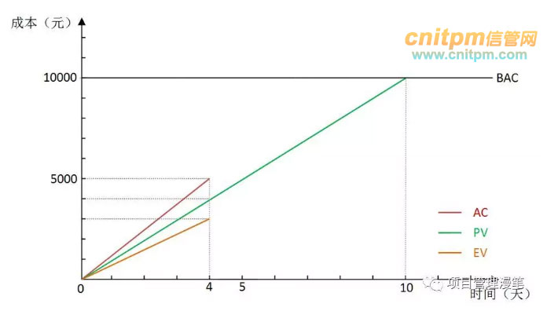

图中红、绿、橘黄色线分别表示AC、PV和EV，红线AC表示截止到某个时点花了多少钱（成本），斜率表示花钱的速度；绿线PV表示截止某个时点项目计划花的钱和做的项目量；橘黄色线EV表示截止到某个时点做了多少事（多少钱的工作），斜率表示做事的速度；上图我们可以看出花钱的速度比计划的要快（红线比绿线更陡，斜率更大），而做事的速度却比计划的要慢（橘黄色线比绿线更缓，斜率更小），项目绩效很不好。

## 绩效指标CV，SV，CPI和SPI

好了，大致理解了上面PV, EV, AC, BAC等几个基本概念之后，接着我们来了解CV，SV，CPI，SPI这几个成本和进度绩效指标。

- 成本偏差（Cost Variance, CV），截止到某时点发生的实际成本与计划成本的偏差，CV=EV-AC
- 进度偏差（Schedule Variance, SV），截止到某时点的实际进度与计划进度的偏差，SV=EV-PV
- 成本绩效指数（Cost Performance Index, CPI），截止到某时点衡量成本绩效的一种指标，也就是实际每花一元钱，完成做了多少钱的事（花钱的效率），CPI=EV/AC
- 进度绩效指数（Schedule Performance Index, SPI），截止到某时点衡量进度绩效的一种指标，也就是实际完成的工作量与计划完成工作量之比，SPI=EV/PV

以前面砌墙的项目为例子，第四天结束去评估项目绩效的时候，本来计划完成40米4000元的工作量（PV），结果只砌了30米只完成了3000元的工作量（EV），那么：

进度偏差SV=EV-PV=3000-4000=-1000元，意思是相比计划我们的进度落后1000元的工作量；（负值表示进度落后，正值表示进度超前）

进度绩效指数SPI=EV/PV=3000/4000=0.75，说明当前只完成了计划任务量的75%的工作；

成本绩效的检查结果是：只完成3000元的工作量（EV）实际却花了5000元（AC）。这个时候：

成本偏差CV=EV-AC=3000-5000=-2000元，说明现在成本超支了2000元（负值表示超支，正值表示节约）；

成本绩效指数CPI=EV/AC=3000/5000=0.6，意思是前面4天我们实际花了5000元，但是只做了3000元的工作，相当于前面4天我们每花1元钱，只做了0.6元的事；在这儿要强调一下这个成本绩效指数CPI值，因为后面很多指标都和这个CPI息息相关。对于CPI的计算方法和意义一定要非常熟悉，CPI的意义是每花1元钱做了多少钱的事（花钱的效率），CPI为0.6的意思就是每花1元钱只做了0.6元的事，所以CPI的计算方法是做了的事（EV）除了花了的钱（AC）。不光会算CPI，大家还要能举一反三，比如知道CPI和做了多少事，也要会算花了多少钱，那就是花了多少钱=做了多少事/CPI，后面相关指标的计算会经常用到这个公式。

成本偏差CV和进度偏差SV在图中的直观表示如下：

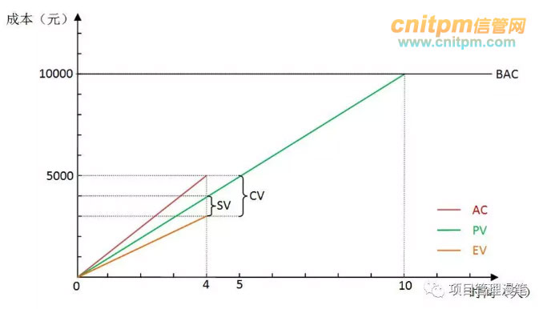

图中可以看到，实际上成本偏差CV就是AC与EV的差值，而进度偏差SV是PV与EV的差值，请注意都是和挣值EV进行对比，而且做减法的时候EV都要放在前面。SPI和CPI没法很直观在图中表示，实际上就是斜率的比值，SPI是EV与PV斜率的比值，CPI是EV与AC斜率的比值。

## 预测指标ETC，EAC，TCPI和VAC

这个时候大家应该基本了解CV, SV, CPI, SPI这几个绩效指标的含义了。在这个基础上，最后我们再来了解剩下的4个略显晦涩的预测指标：

- 完工尚需估算（Estimate To Completion, ETC），在某个时点，预测完成剩余的工作还需要多少成本；这个时候算预测数据的时候就要分情况了，主要取决于我们以后的工作花钱的效率跟以前比是否会发生变化？也就是考察以后工作的CPI的值会不会发生变化。根据剩余部分工作CPI的变化情况，有几种计算方法：

如果还是以当前的成本绩效完成剩余的工作，则ETC=(BAC-EV)/CPI，也就是剩余的工作量除以成本绩效指数；

如果以计划的成本绩效（其实就是1）完成剩余的工作，则ETC=BAC-EV，也就是剩余的工作量，实际上也是用第一种情况那个公式；

如果进度绩效指标SPI也会影响完成剩余工作的成本，意思是如果严格规定我们必须要在计划的截止时间之前完成项目，那么可能就还需要额外的成本来赶工进度，这个时候就需要同时考虑CPI和SPI对于剩余工作的影响，一般计算公式则为ETC=(BAC-EV)/(CPI*SPI)，也就是剩余的工作量除以成本绩效指数与进度绩效指数的乘积；其中CPI*SPI又叫“关键比率”(Critical Ratio, CR);

- 完工估算（Estimate At Completion, EAC），在某个时点，预测完成整个项目需要的成本，当然就是实际已经花掉的成本加上前面那个完工尚需估算ETC，EAC=AC+ETC；如果剩余工作还是以当前成本绩效指数来完成，那么也可以这么计算EAC=BAC/CPI，这个公式也好理解，其实就是整个项目工作量除以成本绩效指数；完工估算EAC实际上就是预测项目完工时候的实际成本AC。

- 完工尚需绩效指数（To-Complete Performance Index, TCPI），在某个时点，预测如果要在计划的预算内完成项目，则未来的工作必须要达到的绩效水平。计算公式TCPI=(BAC-EV)/(BAC-AC)，也就是剩余的工作量除以剩余的钱的数量；

- 完工偏差（Variance At Completion, VAC），在某个时点，预测项目在完工的时候将会出现的总的项目的成本偏差。计算公式VAC=BAC-EAC，也就是项目开始时原计划的预算减去现在预测的总个项目将会花的成本。完工偏差VAC实际上就是预测项目完工时的成本偏差CV。

上面光说概念有点抽象可能有点难懂，所以我们回到例子里面的情景下来理解一下上面的几个预测指标。在第4天结束的时候，我们在前面考察计算了SV=-1000， CV=-2000， SPI=0.75，CPI=0.6， 结论是进度落后1000元的工作量，成本超支2000元，怎么办得想办法啊，不然整个项目估计不能按时按预算完成。这时候有必要先预测一下项目完工的一些指标以便我们更好地采取措施。

上面说到过，要预测项目完工时候的绩效情况，需要根据后面剩余部分的项目工作的CPI的不同情况分情况分析，我们在剩余部分项目的CPI能做到什么程度，很明显不同程度的CPI将会导致不同的预测指标。回到砌墙的这个例子，项目经理发现了前面之所以CPI低至0.6花钱效率低是因为前面4天天气不好，导致砌墙的时候有一些额外的支出。这个时候估算这几个预测指标就要分下面这几种情况了：

### 第一种情况：后续部分工作CPI和前面4天工作的CPI保持一致

项目经理在看了天气预报后，发现后面的天气也跟前面几天一样的也不好。这种情况下预计后面的工作还是按照前面的花钱的效率来办事（前面4天是花5000元干了3000元的事，花钱效率也就是CPI是0.6），后面工作的CPI和前面4天工作的CPI保持一致将会保持0.6。

这种情况下我们来先算完工尚需估算ETC，现在的情况，本来计划完成40米4000元的工作量（PV），结果只砌了30米只完成了3000元的工作量（EV），实际还花了5000元（AC），那么我们剩余的工作估计还要花多少钱呢？这个就是ETC。整个项目要砌墙100米，现在只完成了30米，那么剩下当然就是还需要砌70米了，转化成钱的数量70*100=7000元这就是剩余的工作量，也就是还剩7000块钱的工作。前面提到过剩余的工作量CPI保持不变还是0.6，花1元钱只能干0.6元的事，现在有7000元的事还需要干，那么干这7000元的事需要花的钱就是7000/0.6=11667元，也就是如果这个工作方式不变的话，估计未来这个项目还需要花11667元。

完工尚需估算ETC算出来了，完工估算EAC就好算了，因为完工估算就是目前实际已经花了的钱加上完工尚需估算EAC=AC+ETC。如果是按照这种情况算出来的剩余工作估计还要花11667元(ETC)，实际前面4天已经花了5000元，那么整个项目的完工成本估算就是5000+11667元=16667 元，也就是整个项目做完估计要花16667元。这种情况其实也可以用另外一种计算方式，因为我们的CPI一直保持稳定不管前面4天还是后面工作一直都是0.6，所以也可以用总的项目预算（总的工作量）除以CPI得出，也就是10000/0.6=16667元（这儿就是已知工作量和CPI求需要花的钱），算出来的结果是一样的。当然要注意如果要用这个方式计算EAC一定要确认前后的CPI是一致的才可以这么算。

完工尚需估算ETC和完工估算EAC都算出来了，再来算完工尚需绩效指数TCPI。项目经理评估完目前的项目绩效后，如果要想要整个项目在规定的预算内完工，那么后面工作的成本绩效必须得是多少才行，这个就是TCPI。第四天结束后总共10000元的工作量，完成了3000元剩余7000元的工作量，实际花了5000元（预算就还剩10000-5000=5000元），也就是未来如果预算不增加我们需要以剩下5000元的预算来完成剩下7000元的工作，那么需要的成本绩效指数就是7000/5000=1.4（工作量除以钱数等于CPI），也就是我们每花一元钱，必须要完成1.4元钱的工作，才有可能在预算内完成这个项目。通过公式计算就是TCPI=(BAC-EV)/(BAC-AC)=(10000-3000)/(10000-5000)=1.4。

最后算完工偏差VAC，这个就好算了，就是预测完工的时候的成本偏差CV。因为后续的工作还是按以前的CPI（0.6）来执行，我们前面已经算出来ETC=11667元，EAC=16667元，这个情况下完工偏差VAC=BAC-EAC=10000-16667=-6667元，也就是预测项目最终完工的时候将超支6667元（同理负值表示成本超支，正值表示成本节约）。

这种时候用图更直观地表示ETC、EAC、VAC等预测指标就是如下图所示：

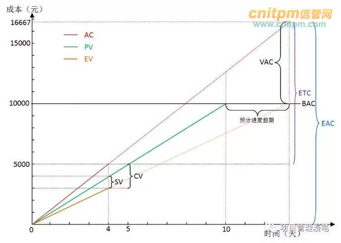

从图中可以看到，AC线是在4天内实线的基础上延伸的虚线（实线表示实际值，虚线表示预测值），直接延伸表示花钱的速度不变（因为斜率没变）跟以前保持一致。这种情况下可以看到当EV达到BAC的时候（表示做了10000元的事项目做完了），AC的值是16667元，这个就是预测的最终项目完工的时候将会一共花这么多钱，也就是EAC，其与BAC的差额就是完工偏差VAC。

如果以后的工作我们不是以以前的CPI（0.6）而是以完工尚需绩效指数TCPI作为后续工作的CPI呢？比如我们从第五天开始CPI变为了1.4（上面算TCPI算出来的），这个时候完工偏差会是多少呢？其实如果通透理解了概念的同学应该就会很快知道这个时候算出来的的完工偏差将会是0，因为TCPI的定义就是在预算内完工的后续工作的成本绩效指数，所以在这个指数下完成剩余的工作，我们的预算肯定是刚刚好的，完工偏差就会0。不嫌麻烦我们也可以简单计算一下，前面4天花了5000元完成了3000元的工作量，剩下7000元的工作以1.4的CPI去做，那么剩下的工作将只需花ETC=7000/1.4=5000元，加上前面已经花了的5000元，刚好就等于我们的项目预算10000元，这个时候完工偏差就刚好是0。从这个角度我们也可以说完工尚需绩效指数TCPI就是要使完工偏差VAC为0，完成后续剩余工作所需的的成本绩效指数CPI。也就是第4天后检查项目发现进度落后预算超支，客户说进度我先不管，最后完工时预算一分也不能超，这个时候后面部分工作的CPI肯定就要更高才能达到这个预算内完工这个目标了，这个更高的CPI就是我们的完工尚需绩效指数TCPI。

这种情况下用图更直观地表示ETC、EAC等就是如下图所示（此时VAC为0无法表示出来）：

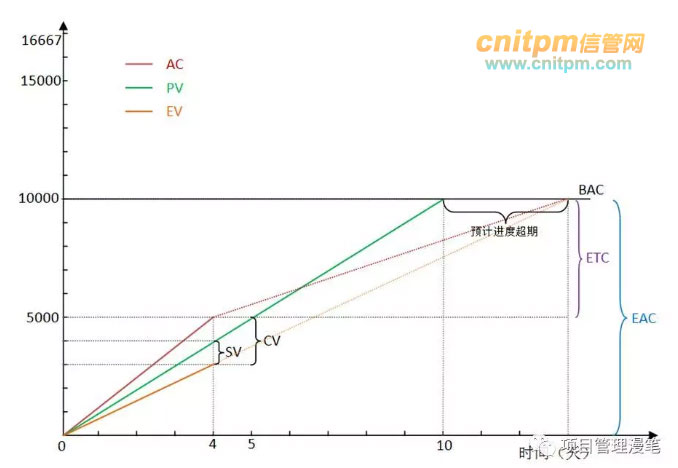

从图中可以看到后期预测的AC线突然一下变缓了，花钱速度下降了从而CPI提高了（CPI是EV的斜率比上AC的斜率，AC斜率变小，EV斜率不变的情况下CPI变大）。这种情况概括一下就是前面4天用5000元做了3000元的事，评估之后采取措施发奋图强，后面的时间用5000元做了7000元的事，从而实现了预算内（10000元）完工的目标。

### 第二种情况：后续部分工作CPI和前面4天工作的CPI不一致，与计划CPI一致

第二种情况就是：项目经理看后面几天的天气预报天气，发现前面4天天气不好只是偶然现象不具有代表性，后面的天气都是好的。这个时候预测以后花钱效率CPI会正常变为1，也就是不在额外花钱那么就每花1元钱就能做1元钱的事。如果真的做到了这个花钱效率，因为剩余7000元的工作量（前面已经算出来），那么剩余的工作需要花的钱就是7000/1=7000元，也就是完工尚需估算ETC就是7000元；

同理继续算完工估算EAC，就是ETC加上AC，也就是7000元加上5000元就等于12000元；

再同样的计算方法计算这种情况下的完工偏差VAC就是BAC-EAC=10000-12000=-2000元，表示预测项目最终完工的时候成本将超支2000元。

这种情况下的这几个指标用图直观地表示出来就是这个样子：

图中可以看到，红线AC第4天后改变了方向，变得更缓代表花钱更慢从而花钱效率更高，与橘黄色的EV线平行表示花钱速度和做事速度保持一致（花多少钱就办多少钱的事），这个时段的CPI就是1（因为CPI等于EV线与AC线斜率之比，平行表示斜率相等）。但是要注意，如果计算截止某时点整个项目的CPI不会是1，因为前面4天花5000元只做了3000元的事，多花了2000元，就算后面的工作每花1000元就做1000元的事不再多花钱，总的加起来计算的话还是花的钱比做的事要多这2000元，这样CPI就还是会小于1。

### 第三种情况：后续部分工作CPI和前面4天工作的CPI不一致，甚至更糟

第三种情况就是：项目经理在看了天气预报后，发现后面的天气也跟前面几天一样的也不好，不但如此这个项目还对进度要求非常高，规定必须按照原定的完工日期完工不得进度超期（我们看前面的图进度都是超期的）。这个时候进度的落后就会进一步影响我们的成本，因为我们以后需要赶工来赶进度，而赶工是需要额外的成本的。这样我们计算剩余工作需要花的成本也就是完工尚需估算ETC的时候就要综合考虑CPI和SPI，计算方法就是7000/(0.6*0.75)=15556元，也就是如果不但差天气持续，同时还要确保项目进度的话，我们预计完成剩余的工作还需要花15556元的成本，跟第一种情况相比多出来的钱就是为了赶进度额外花的钱。

同理这种情况下再计算完工估算EAC就是ETC+AC=15556+5000=20556元，也就是项目完工的时候估计整个项目一共要花20556元；

同理这种情况下计算完工偏差VAC就是BAC-EAC=10000-20556=-10556元，表示估计项目完工时将会超支10556元，这样就超支很多了，因为是预算的2倍还有多了。

这种情况下的这几个指标用图直观地表示出来就是这个样子：

从图中我们可以看出，第4天过后，橘黄线EV跟以前相比变陡峭，表示做事速度加快，因为我们在用额外的成本赶工，终于在计划的第10天与绿线计划价值PV汇合，表示此时按计划截止时间准时完成了项目；再看红线AC（花的钱），第4天后变得陡峭，表示花钱速度相比以前加快，因为要花额外的钱来赶工追赶进度，在第10天项目完工的时候共花了多达20556元，这个就是完工估算EAC，与BAC的差值就是VAC。

这三种情况下ETC、EAC和VAC的计算我们就都讨论完了。至此我们通过砌墙这个例子就为大家介绍完了关于挣值管理的12个概念（PV, EV, CV, BAC, SV, SPI, CV, CPI, ETC, EAC, TCPI, VAC）的一些基本情况，希望能通过本文对大家学习和理解这些概念和公式有所助益。

> [挣值分析详解：基本概念、绩效指标、预测指标 - 综合知识 - 信管网](http://www.cnitpm.com/pm1/77408.html)
