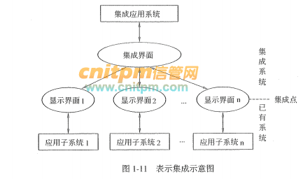
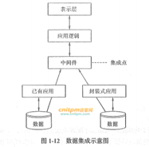
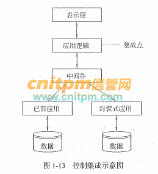

# 软件中间件

中间件（Middleware）是位于硬件、操作系统等平台和应用之间的通用服务。借由中间件，解决了分布系统的异构问题。

中间件服务具有标准的程序接口和协议。不同的应用、硬件及操作系统平台，可以提供符合接口和协议规范的多种实现，其主要目的是实现应用与平台的无关性。借助中间件，屏蔽操作系统和网络协议的差异，为应用程序提供多种通讯机制，满足不同领域的应用需要。

中间件包括的范围十分广泛，针对不同的应用需求有各种不同的中间件产品。从不同角度对中间件的分类也会有所不同。通常将中间件分为数据库访问中间件、远程过程调用中间件、面向消息中间件、事务中间件、分布式对象中间件等。

1. 数据库访问中间件：通过一个抽象层访问数据库，从而允许使用相同或相似的代码访问不同的数据库资源。典型技术如Windows平台的ODBC和Java平台的JDBC等。

2. 远程过程调用中间件（Remote Procedure
Call，RPC）：是一种分布式应用程序的处理方法。一个应用程序可以使用RPC来“远程”执行一个位于不同地址空间内的过程，从效果上看和执行本地调用相同。一个RPC应用分为服务器和客户两个部分。服务器提供一个或多个远程操作过程；客户向服务器发出远程调用。服务器和客户可以位于同一台计算机，也可以位于不同的计算机，甚至可以运行在不同的操作系统之上。客户和服务器之间的网络通讯和数据转换通过代理程序（Stub与Skeleton）完成，从而屏蔽了不同的操作系统和网络协议。

3. 面向消息中间件（Message-Oriented
Middleware，MOM）：利用高效可靠的消息传递机制进行平台无关的数据传递，并可基于数据通信进行分布系统的集成。通过提供消息传递和消息队列模型，可在分布环境下扩展进程间的通信，并支持多种通讯协议、语言、应用程序、硬件和软件平台。典型产品如IBM的MQSeries。

4. 分布式对象中间件：是建立对象之间客户/服务器关系的中间件，结合了对象技术与分布式计算技术。该技术提供了一个通信框架，可以在异构分布计算环境中透明地传递对象请求。典型产品如OMG的CORBA、Java的RMI/EJB、Microsoft的DCOM等。

5. 事务中间件：也称事务处理监控器（Transaction Processing
Monitor，TPM），提供支持大规模事务处理的可靠运行环境。TPM位于客户和服务器之间，完成事务管理与协调、负载平衡、失效恢复等任务，以提高系统的整体性能。典型产品如IBM/BEA的Tuxedo。结合对象技术的对象事务监控器（Object
Transaction Monitor，OTM）如支持EJB的JavaEE应用服务器等。

> [软件中间件 - 综合知识 - 信管网](https://www.cnitpm.com/pm1/71276.html)

# 软件架构风格

软件架构设计的一个核心问题是能否达到架构级的软件复用，也就是说，能否在不同的系统中，使用同一个软件架构。软件架构风格是描述某一特定应用领域中系统组织方式的惯用模式(idiomatic paradigm)。架构风格定义了一个系统“家族”，即一个架构定义、一个词汇表和一组约束。词汇表中包含一些构件和连接件类型，而约束指出系统是如何将这些构件和连接件组合起来的。架构风格反映了领域中众多系统所共有的结构和语义特性，并指导如何将各个构件有效地组织成一个完整的系统。

Garlan和Shaw对通用软件架构风格进行了分类，他们将软件架构分为数据流风格、调用，返回风格、独立构件风格、虚拟机风格和仓库风格。

1. 数据流风格：数据流风格包括批处理序列和管道／过滤器两种风格。
2. 调用／返回风格：调用／返回风格包插主程序／子程序、数据抽象和面向对象，以及层次结构。
3. 独立构件风格：独立构件风格包括进程通信和事件驱动的系统。
4. 虚拟机风格：虚拟机风格包括解释器和基于规则的系统。
5. 仓库风格：仓库风格包括数据库系统、黑板系统和超文本系统。

> [信息系统项目管理师教程第3版软件架构风格真题习题与考点 - 综合知识 - 信管网](https://www.cnitpm.com/pm1/49062.html)

# 软件测试

软件测试方法可分为静态测试和动态测试。静态测试是指被测试程序不在机器上运行，而采用人工检测和计算机辅助静态分析的手段对程序进行检测。静态测试包括对文档的静态测试和对代码的静态测试。对文档的静态测试主要以检查单的形式进行，而对代码的静态测试一般采用桌前检查(Desk Checking)、代码走查和代码审查。经验表明，使用这种方法能够有效地发现30%～70%的逻辑设计和编码错误。

动态测试是指在计算机上实际运行程序进行软件测试，一般采用白盒测试和黑盒测试方法。白盒测试也称为结构测试，主要用于软件单元测试中。它的主要思想是，将程序看作是一个透明的白盒，测试人员完全清楚程序的结构和处理算法，按照程序内部逻辑结构设计测试用例，检测程序中的主要执行通路是否都能按预定要求正确工作。白盒测试方法主要有控制流测试、数据流测试和程序变异测试等。另外，使用静态测试的方法也可以实现白盒测试。例如，使用人工检查代码的方法来检查代码的逻辑问题，也属于白盒测试的范畴。白盒测试方法中，最常用的技术是逻辑覆盖，即使用测试数据运行被测程序，考察对程序逻辑的覆盖程度。主要的覆盖标准有语句覆盖、判定覆盖、条件覆盖、条件／判定覆盖、条件组合覆盖、修正的条件／判定覆盖和路径覆盖等。

黑盒测试也称为功能测试，主要用于集成测试、确认测试和系统测试中。黑盒测试将程序看作是一个不透明的黑盒，完全不考虑（或不了解）程序的内部结构和处理算法，而只检查程序功能是否能按照SRS的要求正常使用，程序是否能适当地接收输入数据并产生正确的输出信息，程序运行过程中能否保持外部信息（例如，文件和数据库等）的完整性等。黑盒测试根据SRS所规定的功能来设计测试用例，一般包括等价类划分、边界值分析、判定表、因果图、状态图、随机测试、猜错法和正交试验法等。

- 黑盒测试：黑盒测试也称功能测试，它是通过而是来检测每个功能私服都能正常使用。完全不考虑程序内部结构和特性，着眼于程序外部结构，主要针对软件界面和软件功能进行测试。
- 白盒测试：白盒测试又称结构测试，检测是否所有的结构及路径都是正确的，检查软件内部动作是否按照设计说明书的规定正常进行。其目的是通过检查软件内部的逻辑架构，对软中逻辑路径进行覆盖的测试，可以覆盖全部代码、分支、路径和条件。
- 灰盒测试：介于白盒测试与黑盒测试之间的测试。灰盒测试关注输出对于输入的正确性，同时也关注内部表现，但这种关注不像盒测试详细完整，只是通过一些表征的现象、事件、标志来判断内部的运行状态。灰盒测试是基于程序运行时的外部表现同时又结合程序内部逻辑结构来设计用例，执行程序并采集程序路径执行信息和外部用户接口结构的测试技术。

> [信息系统项目管理师教程第3版软件测试及其管理真题习题与考点 - 综合知识 - 信管网](https://www.cnitpm.com/pm1/49182.html)
> 
> [黑盒测试、白盒测试、灰盒测试 - 综合知识 - 信管网](https://www.cnitpm.com/pm1/63483.html)

# 软件集成技术

在企业信息化建设的过程中，由于缺乏统一规划和总体布局，往往形成多个信息孤岛。信息孤岛使数据的一致性无法得到保证，信息无法共享和反馈，需要重复多次的采集和输入。信息孤岛是企业信息化一个重要的负面因素，其主要原因既有技术因素也有管理因素，还有业务流程和标准方面的因素。如何将众多的信息孤岛联系起来，以便让不同的系统乏间交互信息，是当前很多企业都面临的一个问题。

此时集成技术应运而生，集成包括软硬件以及网络的集成，在本节我们主要介绍软件层次的集成技术——企业应用集成( Enterprise Application Integration，EAI)。

企业应用集成技术可以消除信息孤岛，它将多个企业信息系统连接起来，实现无缝集成，使它们就像一个整体一样。EAI是伴随着企业信息系统的发展而产生和演变的，企业的价值取向是推动EAI技术发展的原动力，而EAI的实现反过来也驱动企业竞争优势的提升。

EAI所连接的应用包括各种电子商务系统、ERP、CRM、SCM、OA、数据库系统和数据仓库等。从单个企业的角度来说，EAI可以包括表示集成、数据集成、控制集成和业务流程集成等多个层次和方面。当然，也可以在多个企业之间进行应用集成。

## 表示集成

表示集成也称为界面集成，这是比较原始和最浅层次的集成，但又是常用的集成。这种方法将用户界面作为公共的集成点，把原有零散的系统界面集中在一个新的界面中。表示集成是黑盒集成，无须了解程序与数据库的内部构造。常用的集成技术主要有屏幕截取和输入模拟技术。表示集成通常应用于默下几种情况。

1. 在现有的基于终端的应用系统上配置基于PC的用户界面。
2. 为用户提供一个看上去统一，但是由多个系统组成的应用系统。
3. 当只有可能在显示界面上实现集成时。

表示集成的实现是很简单的，也是很不彻底的，只是做了一层“外装修”，而额外多出来的集成界面也将可能成为系统的性能瓶颈。

## 数据集成

为了完成控制集成和业务流程集成，必须首先解决数据和数据库的集成问题。在集成之前，必须首先对数据进行标识并编成目录，另外还要确定元数据模型，保证数据在数据库系统中分布和共享。因此，数据集成是白盒集成。

有很多不同的中间件工具可以用于数据集成。例如，批量文件传输，即以特定的或是预定的方式在原有系统和新开发的应用系统之间进行文件传输；用于访问不同类型数据库系统的ODBC（Open DataBase
Connectivity，开放数据库互连）标准接口：向分布式数据库提供连接的数据库访问中间件技术等。通常在以下情况下，将会使用数据集成：

1. 需要对多种信息源产生的数据进行综合分析和决策。
2. 要处理一些多个应用需要访问的公用信息库。
3. 当需要从某数据源获得数据来更新另一个数据源时，特别是它们之间的数据格式不相同时。

相对而言，数据集成比表示集成要更加灵活。但是，当业务逻辑经常发生变化时，数据集成就会面临困难。

## 控制集成

控制集成也称为功能集成或应用集成，是在业务逻辑层上对应用系统进行集成的。控制集成的集成点存于程序代码中，集成处可能只需简单使用公开的API(Application Programming Interface，应用程序编程接口)
就可以访问，当然也可能需要添加附加的代码来实现。控制集成是黑盒集成。

实现控制篥成时，可以借助于远程过程调用或远程方法调用、面向消息的中间件、分布式对象技术和事务处理监控器来实现。控制集成与表示集成、数据集成相比，灵活性更高。表示集成和数据集成适用的环境下，都适用于控制集成。但是，由于控制集成是在业务逻辑层进行的，其复杂度更高一些。而且，很多系统的业务逻辑部分并没有提供API，这样，集成难度就会更大。

> [软件集成技术（企业应用集成EAI）-信息系统项目管理师教程第3版 - 综合知识 - 信管网](https://www.cnitpm.com/pm1/49365.html)
> 
> [信息系统项目管理师教程第3版表示集成真题习题与考点 - 综合知识 - 信管网](http://www.cnitpm.com/pm1/49390.html)
> 
> [信息系统项目管理师教程第3版数据集成真题习题与考点 - 综合知识 - 信管网](http://www.cnitpm.com/pm1/49425.html)
> 
> [信息系统项目管理师教程第3版控制集成真题习题与考点 - 综合知识 - 信管网](http://www.cnitpm.com/pm1/49452.html)

# 大型信息系统

大型信息系统是指以信息技术和通信技术为支撑，规模庞大，分布广阔，采用多级网络结构，跨越多个安全域，处理海量的，复杂且形式多样的数据，提供多种类型应用的大系统。例如，全球范围的B2C电子商务系统，媒体社交系统，企业内部生产管理系统等等。

大型信息系统作为一种典型的大系统，除具有大系统的一些共性特点，同时具备以下独有的特点。

1．规模庞大：大型信息系统包含的独立运行和管理的子系统甚多。例如，大型赛事的安全保障系统，包括分散在全国各地的数百个指挥中心、上百个场馆，核心指挥中心之间通过双链路互联，分指挥中心和核心指挥中心之间建立万兆连接，各场馆通过交换设备和千兆链路接入，所属的分指挥中心。
2．跨地域性：大型信息系统分布广阔，部署不集中。例如某银行系统，有上万个网点分布在全国各个省市，上百个网点分布在海外；在物流系统中，通常订货方和接收订货方不在同一场所，发货人和收货人不在同一个区域等，这种在场所上相分离的企业或人之间的信息传送需要通过所处不同地域的系统来完成。
3．网络结构复杂：大型信息系统一般采用多级网络结构、跨域多个安全域、网络关系复杂、接口众多。例如，大型企业的内网包括总部、研究院、研究所三级网络，鉴于业务和管理的需要，各研究所划分为独立的安全域，接受研究院的管理，研究院作为独立的安全域接受总部的管理。同时大型企业内网通常涉及对敏感信息或涉密信息的传输、访问、存储等，通常在企业内部网络划分多个不同级别的安全域，保障对信息资源的访问控制。
4．业务种类多：大型信息系统提供的应用种类繁多，业务的处理逻辑复杂，各种业务之间的关联关系复杂。例如大型企业内网，每一家单位的科研生产网除了部署门户网站、ERP系统、OA系统、物资采购系统、财务系统、科研管理系统等自行独立管理和使用的业务系统外，还部署了各类管理系统，例如公文流转系统、网络会议系统、电子邮件系统等，各类业务系统之间存在着信息流转。
5．数据量大：大型信息系统处理的业务和信息量大，存储的数据复杂、内容多且形式多样。例如，政府、银行、证券等行业，平均每家企业存储数据总量已经超过了1PB，存储数据量最高的证券领域的大型信息系统，平均存储数据量已经近4PB。
6．用户多：大型信息系统的使用者多，角色多，对系统的访问、操作多。例如银行系统，每天包括分散在总行、分行、支行的银行工作人员，以及分布在全国各地的用户等使用者访问系统，完成各种交易、操作。

> [大型信息系统 - 综合知识 - 信管网](https://www.cnitpm.com/pm1/71120.html)

# 软件生存周期

GB/T 8566-2007《信息技术软件生存周期过程》标准把软件生存周期中可能执行的活动分为5个基本过程、9个支持过程和7个组织过程，每一生存周期过程划分为一组活动，每一活动进一步划分为任务。

## 5个基本过程：

1. 获取过程：为需方而定义的活动，启动，招标，合同，对供方监督，验收等

2. 供应过程：为供方而定义的活动，启动，准备投标，签订合同，编制计划，执行，交付和完成

3. 开发过程：为开发方而定义的活动：需求、设计、编码、测试、安装、验收

4. 运作过程：为操作方而定义的活动：运行测试，系统运行，用户支持

5. 维护过程：为维护方而定义的活动：问题和修改分析，修改实现，维护评审/验收，迁移，软件退役

## 9个支持过程：

1. 文档编制过程

2. 配置管理过程

3. 质量保证过程

4. 验证过程：确定软件产品是否满足在以前的活动中施加于它们的要求和条件的过程。合同验证，过程验证，需求验证，设计验证，编码验证，集成验证，文档验证

5. 确认过程：确定需求和最终的、已建成的系统或软件产品是否满足特定的预期用途的过程。该过程包括下列任务：

    1. 为分析测试结果准备选择的测试需求、测试用例和测试规格说明

    2. 确保这些测试需求、测试用例和测试规格说明反映特定的预期用途的特殊要求

    3. 测试包括强度、边界和异常输入测试

6. 联合评审过程：评价某个项目的一项活动的状态和产品，项目管理评审，技术评审

7. 审核过程：在适当时确定与需求、计划和合同的符合性

8. 问题解决过程

9. 易用性过程

## 7个组织过程

1. 管理过程：为生存周期过程中的管理包括项目管理而定义的基本活动

2. 基础设施过程：为建立生存周期过程基础结构而定义的基本活动

3. 改进过程

4. 人力资源过程

5. 资产管理过程

6. 重用大纲管理过程：为组织的重用大纲主管而定义的活动，启动，领域评估，重用评估，策划，执行和控制，评审和评价

7. 领域工程过程：领域工程师的活动和任务，领域分析，领域设计，资产供应，资产维护

> [软件生存周期5个基本过程、9个支持过程和7个组织过程 - 综合知识 - 信管网](http://www.cnitpm.com/pm1/49682.html)

# 权限管理模型

- 自主访问控制（DAC: Discretionary Access Control）

系统会识别用户，然后根据被操作对象（Subject）的权限控制列表（ACL: Access Control List）或者权限控制矩阵（ACL: Access Control Matrix）的信息来决定用户的是否能对其进行哪些操作，例如读取或修改。

而拥有对象权限的用户，又可以将该对象的权限分配给其他用户，所以称之为“自主（Discretionary）”控制。

这种设计最常见的应用就是文件系统的权限设计，如微软的NTFS。

DAC最大缺陷就是对权限控制比较分散，不便于管理，比如无法简单地将一组文件设置统一的权限开放给指定的一群用户。

- 强制访问控制（MAC: Mandatory Access Control）

MAC是为了弥补DAC权限控制过于分散的问题而诞生的。在MAC的设计中，每一个对象都都有一些权限标识，每个用户同样也会有一些权限标识，而用户能否对该对象进行操作取决于双方的权限标识的关系，这个限制判断通常是由系统硬性限制的。比如在影视作品中我们经常能看到特工在查询机密文件时，屏幕提示需要“无法访问，需要一级安全许可”，这个例子中，文件上就有“一级安全许可”的权限标识，而用户并不具有。

MAC非常适合机密机构或者其他等级观念强烈的行业，但对于类似商业服务系统，则因为不够灵活而不能适用。

- 基于角色的访问控制（RBAC: Role-Based Access Control)

因为DAC和MAC的诸多限制，于是诞生了RBAC，并且成为了迄今为止最为普及的权限设计模型。RBAC在用户和权限之间引入了“角色（Role）”的概念（暂时忽略Session这个概念）：每个用户关联一个或多个角色，每个角色关联一个或多个权限，从而可以实现了非常灵活的权限管理。角色可以根据实际业务需求灵活创建，这样就省去了每新增一个用户就要关联一遍所有权限的麻烦。简单来说RBAC就是：用户关联角色，角色关联权限。另外，RBAC是可以模拟出DAC和MAC的效果的。

- 基于属性的权限验证（ABAC: Attribute-Based Access Control）

ABAC被一些人称为是权限系统设计的未来。

不同于常见的将用户通过某种方式关联到权限的方式，ABAC则是通过动态计算一个或一组属性来是否满足某种条件来进行授权判断（可以编写简单的逻辑）。属性通常来说分为四类：用户属性（如用户年龄），环境属性（如当前时间），操作属性（如读取）和对象属性（如一篇文章，又称资源属性），所以理论上能够实现非常灵活的权限控制，几乎能满足所有类型的需求。

例如规则：“允许所有班主任在上课时间自由进出校门”这条规则，其中，“班主任”是用户的角色属性，“上课时间”是环境属性，“进出”是操作属性，而“校门”就是对象属性了。为了实现便捷的规则设置和规则判断执行，ABAC通常有配置文件（XML、YAML等）或DSL配合规则解析引擎使用。XACML（eXtensible Access Control Markup Language）是ABAC的一个实现，但是该设计过于复杂，我还没有完全理解，故不做介绍。

总结一下，ABAC有如下特点：

- 集中化管理
- 可以按需实现不同颗粒度的权限控制
- 不需要预定义判断逻辑，减轻了权限系统的维护成本，特别是在需求经常变化的系统中
- 定义权限时，不能直观看出用户和对象间的关系
- 规则如果稍微复杂一点，或者设计混乱，会给管理者维护和追查带来麻烦
- 权限判断需要实时执行，规则过多会导致性能问题

> [权限系统设计模型分析（DAC，MAC，RBAC，ABAC） - 简书](https://www.jianshu.com/p/ce0944b4a903)
