# 面向对象的基本概念

面向对象的基本概念包括对象、类、抽象、封装、继承、多态、接口、消息、组件、复用和模式等。

（1）对象：由数据及其操作所构成的封装体，是系统中用来描述客观事物的一个模块，是构成系统的基本单位。用计算机语言来描述，对象是由一组属性和对这组属性进行的操作构成的。对象包含三个基本要素，分别是对象标识、对象状态和对象行为。例如，对于姓名（标识）为Joe的教师而言，其包含性别、年龄、职位等个人状态信息，同时还具有授课等行为特征，Joe就是封装后的一个典型对象。

（2）类：现实世界中实体的形式化描述，类将该实体的属性（数据）和操作（函数）封装在一起。例如，Joe是一名教师，也就拥有了教师的特征，这些特征就是教师这个类所具有的。类和对象的关系可理解为，对象是类的实例，类是对象的模板。如果将对象比作房子，那么类就是房子的设计图纸。

（3）抽象：通过特定的实例抽取共同特征以后形成概念的过程。抽象是一种单一化的描述，强调给出与应用相关的特性，抛弃不相关的特性。对象是现实世界中某个实体的抽象，类是一组对象的抽象。

（4）封装：将相关的概念组成一个单元模块，并通过一个名称来引用它。面向对象封装是将数据和基于数据的操作封装成一个整体对象，对数据的访问或修改只能通过对象对外提供的接口进行。

（5）继承：表示类之间的层次关系（父类与子类），这种关系使得某类对象可以继承另外一类对象的特征，继承又可分为单继承和多继承。

（6）多态：使得在多个类中可以定义同一个操作或属性名，并在每个类中可以有不同的实现。多态使得某个属性或操作在不同的时期可以表示不同类的对象特性。

（7）接口：描述对操作规范的说明，其只说明操作应该做什么，并没有定义操作如何做。可以将接口理解成为类的一个特例，它规定了实现此接口的类的操作方法，把真正的实现细节交由实现该接口的类去完成。

（8）消息：体现对象间的交互，通过它向目标对象发送操作请求。

（9）组件：表示软件系统可替换的、物理的组成部分，封装了模块功能的实现。组件应当是内聚的，并具有相对稳定的公开接口。

（10）复用：指将已有的软件及其有效成分用于构造新的软件或系统。组件技术是软件复用实现的关键。

（11）模式：描述了一个不断重复发生的问题，以及该问题的解决方案。其包括特定环境、问题和解决方案三个组成部分。应用设计模式可以更加简单和方便地去复用成功的软件设计和架构，从而帮助设计者更快更好地完成系统设计。

> [面向对象的基本概念 - 综合知识 - 信管网](https://www.cnitpm.com/pm1/71269.html)

# 软件中间件

中间件（Middleware）是位于硬件、操作系统等平台和应用之间的通用服务。借由中间件，解决了分布系统的异构问题。

中间件服务具有标准的程序接口和协议。不同的应用、硬件及操作系统平台，可以提供符合接口和协议规范的多种实现，其主要目的是实现应用与平台的无关性。借助中间件，屏蔽操作系统和网络协议的差异，为应用程序提供多种通讯机制，满足不同领域的应用需要。

中间件包括的范围十分广泛，针对不同的应用需求有各种不同的中间件产品。从不同角度对中间件的分类也会有所不同。通常将中间件分为数据库访问中间件、远程过程调用中间件、面向消息中间件、事务中间件、分布式对象中间件等。

（1）数据库访问中间件：通过一个抽象层访问数据库，从而允许使用相同或相似的代码访问不同的数据库资源。典型技术如Windows平台的ODBC和Java平台的JDBC等。

（2）远程过程调用中间件（Remote Procedure
Call，RPC）：是一种分布式应用程序的处理方法。一个应用程序可以使用RPC来“远程”执行一个位于不同地址空间内的过程，从效果上看和执行本地调用相同。一个RPC应用分为服务器和客户两个部分。服务器提供一个或多个远程操作过程；客户向服务器发出远程调用。服务器和客户可以位于同一台计算机，也可以位于不同的计算机，甚至可以运行在不同的操作系统之上。客户和服务器之间的网络通讯和数据转换通过代理程序（Stub与Skeleton）完成，从而屏蔽了不同的操作系统和网络协议。

（3）面向消息中间件（Message-Oriented
Middleware，MOM）：利用高效可靠的消息传递机制进行平台无关的数据传递，并可基于数据通信进行分布系统的集成。通过提供消息传递和消息队列模型，可在分布环境下扩展进程间的通信，并支持多种通讯协议、语言、应用程序、硬件和软件平台。典型产品如IBM的MQSeries。

（4）分布式对象中间件：是建立对象之间客户/服务器关系的中间件，结合了对象技术与分布式计算技术。该技术提供了一个通信框架，可以在异构分布计算环境中透明地传递对象请求。典型产品如OMG的CORBA、Java的RMI/EJB、Microsoft的DCOM等。

（5）事务中间件：也称事务处理监控器（Transaction Processing
Monitor，TPM），提供支持大规模事务处理的可靠运行环境。TPM位于客户和服务器之间，完成事务管理与协调、负载平衡、失效恢复等任务，以提高系统的整体性能。典型产品如IBM/BEA的Tuxedo。结合对象技术的对象事务监控器（Object
Transaction Monitor，OTM）如支持EJB的JavaEE应用服务器等。

> [软件中间件 - 综合知识 - 信管网](https://www.cnitpm.com/pm1/71276.html)

# 大数据

数据是国家基础性战略资源，是21世纪的“钻石矿”。“十三五”时期是我国全面建成小康社会的决胜阶段，是新旧动能接续转换的关键时期，全球新一代信息产业处于加速变革期，犬数据技术和应用处于创新突破期，国内市场需求处于爆发期，我国大数据产业面临重要的发展机遇。抢抓机遇，推动大数据产业发展，对提升政府治理能力、优化民生公共服务、促进经济转型和创新发展有重大意义。

大数据(big data)，指无法在一定时间范围内用常规软件工具进行捕捉、管理和处理的数据集合，是需要新处理模式才能具有更强的决策力、洞察发现力和流程优化能力的海量、高增长率和多样化的信息资产。

1．大数据的特点

业界通常用5个V-Volume（大量）、Variety（多样）、Value（价值）、Velocity（高速）和Veracity（真实性）来概括大数据的特征。

(1)Volume:指的是数据体量巨大，从TB级别跃升到PB级别(1PB=1024TB)、EB级别(1EB=1024PB)，甚至于达到ZB级别(1ZB=1024EB)
。截至目前，人类生产的所有印刷材料的数据量是200PB，而历史上全人类说过的所有的话的数据量大约是5EB。当前，典型个人计算机硬盘的容量为TB量级，而一些大企业的数据量已经接近EB量级。例如，在交通领域，某市交通智能化分析平台数据来自路网摄像头／传感器、公交、轨道交通、出租车以及省际客运、旅游、化危运输、停车、租车等运输行业，还有问卷调查和地理信息系统数据。4万辆车每天产生2000万条记录，交通卡刷卡记录每天1900万条，手机定位数据每天1800万条，出租车运营数据每天100万条，电子停车收费系统数据每天50万条，定期调查覆盖8万户家庭等，这些数据在体量上就达到了大数据的规模。

(2)Variety:
指的是数据类型繁多。这种类型的多样性也让数据被分为结构化数据和非结构化数据。相对于以往便于存储的以文本为主的结构化数据，非结构化数据越来越多，包括网络日志、音频、视频、图片、地理位鼹信息等，这些多类型的数据对数据的处理能力提出了更高要求。

(3)Value:
指的是价值密度低。价值密度的高低与数据总量的大小成反比。以视频为例，一部1小时的视频，在连续不间断的监控中，有用数据可能仅有一二秒。如何通过强大的机器算法更迅速地完成数据的价值“提纯”成为目前大数据背景下亟待解决的难题。当然把数据集成在一起，并完成“提纯”是能达到1+1大于2的效果，这也正是大数据技术的核心价值之一。

(4)Velocity:指的是处理速度快。这是大数据区分于传统数据挖掘的最显著特征。根据IDC的“数字宇宙”的报告，预计到2020年，全球数据使用量将达到35.2ZB。在如此海量的数据面前，处理数据的效率就是企业的生命。

(5)Veracity:指的是数据来自于各种、各类信息系统网络以及网络终端的行为或痕迹。

大数据是具有体量大、结构多样、时效性强等特征的数据，处埋大数据需要采用新型计算架构和智能算法等新技术。大数据从数据源经过分析挖掘到最终获得价值一般需要经过5个主要环节，包括数据准备、数据存储与管理、计算处理、数据分析和知识展现。大数据技术涉及到的数据模型、处理模型、计算理论，与之相关的分布计算、分布存储平台技术、数据清洗和挖掘技术，流式计算、增量处理技术，数据质量控制等方面的研究和开发成果丰硕，大数据技术产品也已经进入商用阶段。

2．大数据的价值与应用

大数据像水、矿石、石油一样，正在成为新的自然资源，能不能挖掘资源中潜在的价值，成为这个时代能不能走向创富的重要条件。

大数据是以容量大、类型多、存取速度快、应用价值高为主要特征的数据集合，正快速发展为对数量巨大、来源分散、格式多样的数据进行采集、存储和关联分析，从中发现新知识、创造新价值、提升新能力的新一代信息技术和服务业态。坚持创新驱动发展，加快大数据部署，深化大数据应用，已成为稳增长、促改革、调结构、惠民生和推动政府治理能力现代化的内在需要和必然选择。

大数据产业指以数据生产、采集、存储、加工、分析、服务为主的相关经济活动，包括数据资源建设、大数据软硬件产品的开发、销售和租赁活动，以及相关信息投术服务。

前文提到，预计到2020年，全球拥有的数据量是35.2ZB，在如此庞大的数据量面前，它所带来的信息以及反馈出来的事实，对于人们来说具有巨大的潜在价值。所以目前大数据的应用已一步步广泛深入我们生活的方方面面，涵盖电商、社交、金融、医疗、交通、教育、体育等各行备业。基于现有电子信息产业统计数据及行业抽样估计，2015年我国大数据产业业务收入2800亿元左右。

下面将列举一些数据应用实例。

(1)
大数据征信：个人信用数据的缺失目前是金融行业面临的最大问题之一。基于用户在互联网上的消费行为、社交行为、搜索行为等产生的海量数据，利用大数据技术进行分析与挖掘能得到个人信用数据，为金融业务提供有效支撑。在这个方面，阿里的芝麻信用是做得最好的。芝麻信用几乎打通了用户的身份特质，行为偏好，人脉关系，信用历史，履约能力等各类信息。这使得阿里在金融方面审批小额贷款的成本变得极低，据统计，传统银行平均审批一笔贷款的费用高达2000元，而阿里金融的蚂蚁微贷仅为0.3元。

(2)
大数据风控：大数据风控目前应该是前沿技术在金融领域的最成熟应用，相对于智能投顾、区块链等还在初期的金融科技应用，大数据风控目前已经在业界逐步普及。目前，美国基本上都用三大征信局的信息，最传统的评分基本上都是用FICO来做的。各家平台会尝试着用机器学习、神经网络等大数据处理方法。国内市场对于大数据风控的尝试还是比较积极。特别是大公司，可以将移动互联网的行为和贷款申请人联系到一起展开大数据风控。百度在风控层面上的进展还是比较突出，百度安全每天要处理数十亿网民搜索请求，保护数亿用户的终端安全，保护十万网站的安全，因此积累了大量的数据。一个很具体的案例就是，通过海量互联网行为数据，比如监测相关设各ID在哪些借贷网站上进行注册、同一设备是否下载多个借贷App，可以实时发现多头贷款的征兆，把风险控制到最低。

(3)
大数据消费金融：消费金融对大数据的依赖是天然形成的。比如说消费贷、工薪贷、学生贷，这些消费型的金融贷款很依赖对用户的了解。所以必须对用户画像进行分析提炼，通过相关模型展开风险评估，并根据模型及数据从多维度为用户描绘一个立体化的画像。百度金融通过基于大数据和人工智能技术为基础的合作商户管理平台，为合作商户提供涵盖营销和金融服务的全面管理方案，降低获客成本，解决细分行业的微小需求。一方面可以降低风险，另一方面也能提升金融的安全度。腾讯和阿里的优势很大程度上是在渠道层面上的。阿里以电商-支付-信用为三级跳板，针对性很强。而支付宝接入消费金融产品之后有较强的渠道作用。腾讯的“微粒贷”已经接入到了微信支付当中。在消费金融的发屣速度上，腾讯速度也不差。

(4)大数据财富管理：财富管理是近些年来在我国金融服务业中出现的一个新业务。主要为客户提供长期的投顾服务，实现客户资产的优化配置。这方面业务在传统金融机构中存在的比较多。不过因为技术能力不足，大数据财富管理在传统金融机构中相对弱势。

> [大数据 - 综合知识 - 信管网](https://www.cnitpm.com/pm1/71112.html)

# 人工智能

人工智能（Artificial Intelligence），英文缩写为AI。它是研究、开发用于模拟、延伸和扩展人的智能的理论、方法、技术及应用系统的一门新的技术科学。

人工智能是计算机科学的一个分支，它企图了解智能的实质，并生产出一种新的能以人类智能相似的方式做出反应的智能机器，该领域的研究包括机器人、语言识别、图像识别、自然语言处理和专家系统等。人工智能从诞生以来，理论和技术日益成熟，应用领域也不断扩大，可以设想，未来人工智能带来的科技产品，将会是人类智慧的“容器”。人工智能可以对人的意识、思维的信息过程的模拟。人工智能不是人的智能，但能像人那样思考、也可能超过人的智能。

人工智能是一门极富挑战性的科学，从事这项工作的人必须懂得计算机知识，心理学和哲学。人工智能是包括十分广泛的科学，它由不同的领域组成，如机器学习，计算机视觉等等，总的说来，人工智能研究的一个主要目标是使机器能够胜任一些通常需要人类智能才能完成的复杂工作。但不同的时代、不同的人对这种“复杂工作”的理解是不同的。2017年12月，人工智能入选“2017年度中国媒体十大流行语”。

> [人工智能是什么？ - 综合知识 - 信管网](https://www.cnitpm.com/pm1/75462.html)

# 需求分析

在需求获取阶段获得的需求是杂乱的，是用户对新系统的期望和要求，这些要求有重复的地方，也有矛盾的地方，这样的要求是不能作为软件设计的基础的。一个好的需求应该具有无二义性、完整性、一致性、可测试性、确定性、可跟踪性、正确性、必要性等特性，因此，需要分析人员把杂乱无章的用户要求和期望转化为用户需求，这就是需求分析的工作。

需求分析将提炼、分析和审查已经获取到的需求，以确保所有的项目干系人都明白其含义并找出其中的错误、遗漏或其他不足的地方。需求分析的关键在于对问题域的研究与理解。为了便于理解问题域，现代软件工程方法所推荐的做法是对问题域进行抽象，将其分解为若干个基本元素，然后对元素之间的关系进行建模。

使用SA方法进行需求分析，其建立的模型的核心是数据字典，围绕这个核心，有三个层次的模型，分别是数据模型、功能模型和行为模型（也称为状态模型）。在实际工作中，一般使用实体联系图(E-R图)表示数据模型，用数据流图(Data Flow
Diagram，DFD)表示功能模型，用状态转换图（State Transform
Diagram，STD）表示行为模型。E-R图主要描述实体、属性，以及实体之间的关系；DFD从数据传递和加工的角度，利用图形符号通过逐层细分描述系统内各个部件的功能和数据在它们之间传递的情况，来说明系统所完成的功能；STD通过描述系统的状态和引起系统状态转换的事件，来表示系统的行为，指出作为特定事件的结果将执行哪些动作（例如处理数据等）。

OOA的基本任务是运用OO方法，对问题域进行分析和理解，正确认识其中的事物及它们之间的关系，找出描述问题域和系统功能所需的类和对象，定义它们的属性和职责，以及它们之间所形成的各种联系。最终产生一个符合用户需求，并能直接反映问题域和系统功能的OOA模型及其详细说明。OOA模型包括用例模型和分析模型，用例是一种描述系统需求的方法，使用用例的方法来描述系统需求的过程就是用例建模；分析模型描述系统的基本逻辑结构，展示对象和类如何组成系绕（静态模型），以及它们如何保持通信，实现系统行为（动态模型）。

> [信息系统项目管理师教程第3版需求分析真题习题与考点 - 综合知识 - 信管网](https://www.cnitpm.com/pm1/48428.html)

# CMMI中的项目管理

CMMI的全称为：Capability Maturity Model Integration，即能力成熟度模型集成。

CMMI SM-SE/SW/IPPD/SS 1.1版本有四个集成成分，即：系统工程(SE)和软件工程(SW)是基本的科目，对于有些组织还可以应用集成产品和过程开发方面(IPPD)的内容，如果涉及到供应商外包管理可以相应地应用SS(
Supplier Sourcing)部分。

CMMI有两种表示方法，一种是大家很熟悉的，和软件CMM一样的阶段式表现方法，另一种是连续式的表现方法。这两种表现方法的区别是：阶段式表现方法仍然把CMMI中的若干个过程区域分成了5个成熟度级别，帮助实施CMMI的组织建议一条比较容易实现的过程改进发展道路。而连续式表现方法则通过将CMMI中过程区域分为四大类：过程管理、项目管理、工程以及支持。对于每个大类中的过程区域，又进一步分为基本的和高级的。这样，在按照连续式表示方法实施CMMI的时候，一个组织可以把项目管理或者其他某类的实践一直做到最好，而其他方面的过程区域可以完全不必考虑。

1、实施CMMI的意义

实施CMMI的意义在于项目工程走向世界，可以在西方国家接到订单；CMMI的实施能够提高我国企业的管理水平，降低企业的工程成本。事实表明，企业实施CMMI技术的投入都会得到丰厚的回报。据SEI统计，用于软件项目上的CMMI的投资，其回报率在5:
1到8:1之间。由此可见，为什么这么多的企业纷纷实施CMMI项目管理技术。

近年来，很多软件企业纷纷实施CMMI管理模式，不少企业如：东软、托普、华为等企业通过了三级或四级评估，这一方面反映了我国企业在进入WTO后的危机意识，以及与世界接轨的迫切愿望。另一方面则反映出我国软件企业在改进管理方法上所作的努力。但是CMMI到底能够为我们做什么呢？实际上这个问题对不同的人有不同的答案。对采购部门的人员来说，掌握了CMMI技术可以有目的地考察项目实施人员或公司的实施能力，从而保证所采购的项目能够顺利完成。对于项目经理来说，掌握CMMI技术能够提高自己的管理能力，从而能够使项目高质量，低成本，按期限地完成。对于企业老总来说，CMMI还能够引入科学的管理理念，提升企业的整体管理水平。

在美国，很多企业通过CMMI评估，一方面为了满足承包国防工程或一些大企业的工程的要求，另一方面也是为了提高企业自身的管理能力。美国政府的工程项目，绝大多数都要求承包商有一定的CMMI级别作为参加投标的资格。越来越多的大型企业开始要求其工程承包商具有一定的CMMI级别。级别高的企业在赢得项目的竞标中具有一定的优势。因此，如果没有CMMI的等级评估，企业就会失去很多商机。

2、CMMI的基本表述

如果一家企业对外宣称自己通过了CMMI三级评估，外行的人会觉得还不错，因为三级比二级要高。内行的人则要问通过了三级什么？因为，CMMI有两种不同的表述方式，不同的表述方式，其级别表示不同的内容。CMMI的一种表述方式为连续表述，主要是衡量一个企业的项目能力。企业在接受评估时可以选择自己希望评估的项目来进行评估。因为是企业自己挑选项目，其评估通过的可能性就较大一点。但是，它反映的内容也比较窄一点。它仅仅表示企业在该项目或类似项目的实施能力达到了某一等级。而另一种表述方式为阶段性。它主要是衡量一个企业的成熟度，也即是企业在项目实施上的综合实力。企业在进行评估时，一定要由评估师来挑选企业内部的任何项目，甚至于任何项目的任何部分。一般地讲，一个企业要想在阶段性评估中得到三级，其企业内部的大部分项目要达到三级，小部分项目可以在二级，但绝不能够有一级。阶段性表述的难度要大一些。

虽然，CMMI的表述方式不同，但其实质内容是完全一样的，是同一种方法的两种不同的表达方式。企业在准备评估时要做的准备工作也是完全一样的。这些工作对企业的管理上的帮助也是一样的。因此，不能企业需要做什么样的评估，企业所获取的实惠应该是差别不大。具体要做连续性评估，还是做阶段性评估则是看企业对等级评估证书的具体要求。

3、CMMI的分级表示

CMMI一级，初始级。在初始级水平上，企业对项目的目标与要做的努力很清晰，项目的目标得以实现。但是由于任务的完成带有很大的偶然性，企业无法保证在实施同类项目的时候仍然能够完成任务。企业在一级上的项目实施对实施人员有很大的依赖性。

CMMI二级，已管理级。在已管理级水平上，企业在项目实施上能够遵守既定的计划与流程，有资源准备，权责到人，对相关的项目实施人员有相应的培训，对整个流程有监测与控制，并与上级单位对项目与流程进行审查。企业在二级水平上体现了对项目的一系列的管理程序。这一系列的管理手段排除了企业在一级时完成任务的随机性，保证了企业的所有项目实施都会得到成功。

CMMI三级，已定义级。在已定义级水平上，企业不仅能够对项目的实施有一整套的管理措施，并保障项目的完成；而且，企业能够根据自身的特殊情况以及自己的标准流程，将这套管理体系与流程予以制度化。这样，企业不仅能够在同类的项目上生到成功的实施，在不同类的项目上一样能够得到成功的实施。科学的管理成为企业的一种文化，企业的组织财富。

CMMI四级，量化管理级。在量化管理级水平上，企业的项目管理不仅形成了一种制度，而且要实现数字化的管理。对管理流程要做到量化与数字化。通过量化技术来实现流程的稳定性，实现管理的精度，降低项目实施在质量上的波动。

CMMI五级，优化级。在优化级水平上，企业的项目管理达到了最高的境界。企业不仅能够通过信息手段与数字化手段来实现对项目的管理，而且能够充分利用信息资料，对企业在项目实施的过程中可能出现的次品予以预防。能够主动地改善流程，运用新技术，实现流程的优化。

由上述的五个不同级别我们可以看出，每一个级别都是上面一个级别的基石。要上高层级别必须首先达到较低一层级别。企业在实施CMMI的时候，路要一步一步地走。一般地讲，应该先从二级入手。在管理上下功夫。争取最终实现CMMI的第五级。

CMMI的最新版本是1.2版，其中分级模型表示中第二级有7个过程域：需求管理、项目计划、项目监督与控制、供应合同管理、度量和分析、过程和产品质量保证、配置管理；第三级有11个过程域：需求开发、技术解决方案、产品集成、验证、确认、组织过程焦点、组织过程定义+集成的产品和过程开发、组织培训、集成项目管理+集成的产品和过程开发、风险管理、决策分析与决议；第四级有2个过程域：组织过程绩效、量化项目管理；第五级有2个过程域：组织创新和部署、原因分析与决议。

CMMI
1.2版的22个过程域也可以按四个类别来划分：过程管理、项目管理、工程和支持，过程管理包括5个过程域：组织过程焦点、组织过程定义+集成的产品和过程开发、组织培训、组织过程绩效、组织创新和部署；项目管理包括6个过程域：项目计划、项目监督与控制、供应合同管理、集成项目管理+集成的产品和过程开发、风险管理、量化项目管理；工程组包括6个过程域：需求开发、需求管理、技术解决方案、产品集成、验证和确认；支持组包括5个过程域：配置管理、过程和产品质量保证、度量和分析、决策分析与决议、原因分析与决议。

在本书的写作过程中，以PMBOK最新版本（第三版，即2004版）为主要的线索，将CMMI的内容融合到项目管理的各个环节中。

| CMMI等级          | 过程域中文名称     | 过程域英文名称                              | 过程类型 |
|:----------------:|:----------------:|:-----------------------------------------:|:------:|
| 第2级 - 已管理级   | 需求管理          | Requirements Management                   | 工程    |
|                  | 项目规划          | Project Planning                          | 项目管理 |
|                  | 项目监控          | Project Monitoring and Control            | 项目管理 |
|                  | 供应商协议管理     | Supplier Agreement Management             | 项目管理 |
|                  | 度量分析          | Measurement and Analysis                  | 支持    |
|                  | 过程和产品质量保证  | Process and Product Quality Assurance     | 支持    |
|                  | 配置管理          | Configuration Management                  | 支持    |
| 第3级 - 已定义级   | 需求开发          | Requirements Development                  | 工程    |
|                  | 技术方案          | Technical Solution                        | 工程    |
|                  | 产品集成          | Product Integration                       | 工程    |
|                  | 验证              | Verification                             | 工程    |
|                  | 确认              | Validation                               | 工程    |
|                  | 组织过程焦点       | Organizational Process Focus             | 过程管理 |
|                  | 组织过程定义       | Organizational Process Definition        | 过程管理 |
|                  | 组织培训          | Organizational Training                  | 过程管理 |
|                  | 集成化项目管理     | Integrated Project Management            | 项目管理 |
|                  | 风险管理          | Risk Management                          | 项目管理 |
|                  | 决策分析与解决方案  | Decision Analysis and Resolution         | 支持    |
| 第4级 - 量化管理级 | 组织过程绩效       | Organizational Process Performance       | 过程管理 |
|                  | 定量项目管理       | Quantitative Project Management          | 项目管理 |
| 第5级 - 优化级     | 组织革新与推广     | Organizational Innovation and Deployment | 过程管理 |
|                  | 原因分析与解决方案  | Causal Analysis and Resolution           | 支持    |

> [项目管理课程：CMMI中的项目管理 - 综合知识 - 信管网](https://www.cnitpm.com/pm/31069.html)
> [CMMI的5个等级和22个过程域_yy19890521的博客-CSDN博客](https://blog.csdn.net/yy19890521/article/details/80624559)

# 黑盒测试、白盒测试、灰盒测试

- 黑盒测试：黑盒测试也称功能测试，它是通过而是来检测每个功能私服都能正常使用。完全不考虑程序内部结构和特性，着眼于程序外部结构，主要针对软件界面和软件功能进行测试。
- 白盒测试：白盒测试又称结构测试，检测是否所有的结构及路径都是正确的，检查软件内部动作是否按照设计说明书的规定正常进行。其目的是通过检查软件内部的逻辑架构，对软中逻辑路径进行覆盖的测试，可以覆盖全部代码、分支、路径和条件。
-
灰盒测试：介于白盒测试与黑盒测试之间的测试。灰盒测试关注输出对于输入的正确性，同时也关注内部表现，但这种关注不像盒测试详细完整，只是通过一些表征的现象、事件、标志来判断内部的运行状态。灰盒测试是基于程序运行时的外部表现同时又结合程序内部逻辑结构来设计用例，执行程序并采集程序路径执行信息和外部用户接口结构的测试技术。

> [黑盒测试、白盒测试、灰盒测试 - 综合知识 - 信管网](https://www.cnitpm.com/pm1/63483.html)

# 软件集成技术

在企业信息化建设的过程中，由于缺乏统一规划和总体布局，往往形成多个信息孤岛。信息孤岛使数据的一致性无法得到保证，信息无法共享和反馈，需要重复多次的采集和输入。信息孤岛是企业信息化一个重要的负面因素，其主要原因既有技术因素也有管理因素，还有业务流程和标准方面的因素。如何将众多的信息孤岛联系起来，以便让不同的系统乏间交互信息，是当前很多企业都面临的一个问题。

此时集成技术应运而生，集成包括软硬件以及网络的集成，在本节我们主要介绍软件层次的集成技术——企业应用集成( Enterprise Application Integration，EAI)。

企业应用集成技术可以消除信息孤岛，它将多个企业信息系统连接起来，实现无缝集成，使它们就像一个整体一样。EAI是伴随着企业信息系统的发展而产生和演变的，企业的价值取向是推动EAI技术发展的原动力，而EAI的实现反过来也驱动企业竞争优势的提升。

EAI所连接的应用包括各种电子商务系统、ERP、CRM、SCM、OA、数据库系统和数据仓库等。从单个企业的角度来说，EAI可以包括表示集成、数据集成、控制集成和业务流程集成等多个层次和方面。当然，也可以在多个企业之间进行应用集成。

## 表示集成

表示集成也称为界面集成，这是比较原始和最浅层次的集成，但又是常用的集成。这种方法将用户界面作为公共的集成点，把原有零散的系统界面集中在一个新的界面中。表示集成是黑盒集成，无须了解程序与数据库的内部构造。常用的集成技术主要有屏幕截取和输入模拟技术。表示集成通常应用于默下几种情况。

1. 在现有的基于终端的应用系统上配置基于PC的用户界面。
2. 为用户提供一个看上去统一，但是由多个系统组成的应用系统。
3. 当只有可能在显示界面上实现集成时。

表示集成的实现是很简单的，也是很不彻底的，只是做了一层“外装修”，而额外多出来的集成界面也将可能成为系统的性能瓶颈。

## 数据集成

为了完成控制集成和业务流程集成，必须首先解决数据和数据库的集成问题。在集成之前，必须首先对数据进行标识并编成目录，另外还要确定元数据模型，保证数据在数据库系统中分布和共享。因此，数据集成是白盒集成。

有很多不同的中间件工具可以用于数据集成。例如，批量文件传输，即以特定的或是预定的方式在原有系统和新开发的应用系统之间进行文件传输；用于访问不同类型数据库系统的ODBC（Open DataBase
Connectivity，开放数据库互连）标准接口：向分布式数据库提供连接的数据库访问中间件技术等。通常在以下情况下，将会使用数据集成：

1. 需要对多种信息源产生的数据进行综合分析和决策。
2. 要处理一些多个应用需要访问的公用信息库。
3. 当需要从某数据源获得数据来更新另一个数据源时，特别是它们之间的数据格式不相同时。

相对而言，数据集成比表示集成要更加灵活。但是，当业务逻辑经常发生变化时，数据集成就会面临困难。

## 控制集成

控制集成也称为功能集成或应用集成，是在业务逻辑层上对应用系统进行集成的。控制集成的集成点存于程序代码中，集成处可能只需简单使用公开的API(Application Programming Interface，应用程序编程接口)
就可以访问，当然也可能需要添加附加的代码来实现。控制集成是黑盒集成。

实现控制篥成时，可以借助于远程过程调用或远程方法调用、面向消息的中间件、分布式对象技术和事务处理监控器来实现。控制集成与表示集成、数据集成相比，灵活性更高。表示集成和数据集成适用的环境下，都适用于控制集成。但是，由于控制集成是在业务逻辑层进行的，其复杂度更高一些。而且，很多系统的业务逻辑部分并没有提供API，这样，集成难度就会更大。

> [软件集成技术（企业应用集成EAI）-信息系统项目管理师教程第3版 - 综合知识 - 信管网](https://www.cnitpm.com/pm1/49365.html)
> [信息系统项目管理师教程第3版表示集成真题习题与考点 - 综合知识 - 信管网](http://www.cnitpm.com/pm1/49390.html)
> [信息系统项目管理师教程第3版数据集成真题习题与考点 - 综合知识 - 信管网](http://www.cnitpm.com/pm1/49425.html)
> [信息系统项目管理师教程第3版控制集成真题习题与考点 - 综合知识 - 信管网](http://www.cnitpm.com/pm1/49452.html)

# 信息系统安全的四个层次

针对信息系统，安全可以划分为以下四个层次：设备安全、数据安全、内容安全、行为安全。其中数据安全即是传统的信息安全。

## 设备安全

信息系统设备的安全是信息系统安全的首要问题。这里主要包括三个方面：

(1)设备的稳定性：设备在一定时间内不出故障的概率。

(2)设备的可靠性：设备能在一定时问内正常执行任务的概率。

(3)设备的可用性：设备随时可以正常使用的概率。

信息系统的设备安全是信息系统安全的物质基础。除了硬件设备外，软件系统也是一种设备，也要确保软件设备的安全。

## 数据安全

其安全属性包括秘密性、完整性和可用性。很多情况下，即使信息系统设备没有受到损坏，但其数据安全也可能已经受到危害，如数据泄露、数据篡改等。由于危害数据安全的行为具有较高的隐蔽性，数据应用用户往往并不知情，因此，危害性很高。

## 内容安全

内容安全是信息安全在政治、法律、道德层次上的要求。

(1)信息内容在政治上是健康的。

(2)信息内容符合国家的法律法规。

(3)信息内容符合中华民族优良的道德规范。

除此之外，广义的内容安全还包括信息内容保密、知识产权保护、信息隐藏和隐私保护等诸多方面。

如果数据中充斥着不健康的、违法的、违背道德的内容，即使它是保密的、未被篡改的，也不能说是安全的。因为这会危害国家安全、危害社会稳定、危害精神文明。因此，必须在确保信息系统设备安全和数据安全的基础上，进一步确保信息内容的安全。

## 行为安全

数据安全本质上是一种静态的安全，而行为安全是一种动态安全。

(1)行为的秘密性：行为的过程和结果不能危害数据的秘密性。必要时，行为的过程和结果也应是秘密的。

(2)行为的完整性：行为的过程和结果不能危害数据的完整性，行为的过程和结果是预期的。

(3)行为的可控性：当行为的过程出现偏离预期时，能够发现、控制或纠正。

行为安全强调的是过程安全，体现在组成信息系统的硬件设备、软件设备和应用系统协调工作的程序（执行序列）符合系统设计的预期，这样才能保证信息系统的“安全可控”。

> [信息系统安全的四个层次：设备安全、数据安全、内容安全、行为安全 - 综合知识 - 信管网](https://www.cnitpm.com/pm1/49779.html)

# 网络安全防御技术

为了抵御上述网络威胁，并能及时发现网络攻击线索，修补有关漏洞，记录、审计网络访问日志，以尽可能地保护网络环境安全，可采取以下网络安全防御技术。

## 防火墙

防火墙是一种较早使用、实用性很强的网络安全防御技术，它阻挡对网络的非法访问和不安全数据的传递，使得本地系统和网络免于受到许多网络安全威胁。在网络安全中，防火墙主要用于逻辑隔离外部网络与受保护的内部网络。防火墙主要是实现网络安全的安全策略，而这种策略是预先定义好的，所以是一种静态安全技术。在策略中涉及的网络访问行为可以实施有效管理，而策略之外的网络访问行为则无法控制。防火墙的安全策略由安全规则表示。

## 入侵检测与防护

入侵检测与防护的技术主要有两种：入侵检测系统(lntrusion Detection System，IDS)和入侵防护系统( Intrusion Prevention System，IPS)。入侵检测系统(IDS)
注重的是网络安全状况的监管，通过监视网络或系统资源，寻找违反安全策略的行为或攻击迹缘，并发出报警。因此绝大多数IDS系统部是被动的。

入侵防护系统(IPS)
则倾向于提供主动防护，注重对入侵行为的控制。其设计宗旨是预先对入侵活动和攻击性网络流量进行拦截，避免其造成损失。IPS是通过直接嵌入到网络流量中实现这一功能的，即通过一个网络端口接收来自外部系统的流量，经过检查确认其中不包含异常活动或可疑内容后，再通过另外一个端口将它传送到内部系统中。这样一来，有问题的数据包，以及所有来自同一数据流的后续数据包，都能在IPS设备中被清除掉。

## VPN

VPN（Virtual Private
Network，虚拟专用网络），它是依靠ISP（Internet服务提供商）和其他NSP（网络服务提供商），在公用网络中建立专用的、安全的数据通信通道的技术。VPN可以认为是加密和认证技术在网络传输中的应用。

VPN网络连接由客户机、传输介质和服务器三部分组成，VPN的连接不是采用物理的传输介质，而是使用称之为“隧道”的技术作为传输介质，这个隧道是建立在公共网络或专用网络基础之上的。常见的隧道技术包括：点对点隧道协议(Point-to
PointTunneling Protocol，PPTP)、第2层隧道协议(Layer 2 Tunneling Protocol．L2TP)和IP安全协议(IPSec)。

## 安全扫描

安全扫描包括漏洞扫描、端口扫描、密码类扫描（发现弱口令密码）等。

安全扫描可以应用被称为扫描器的软件来完成，扫描器是最有效的网络安全检测工具之一，它可以自动检测远程或本地主机、网络系统的安全弱点以及所存在可能被利用的系统漏洞。

## 网络蜜罐技术

蜜罐(Honeypot)
技术是一种主动防御技术，是入侵检测技术的一个重要发展方向，也是一个“诱捕”攻击者的陷阱。蜜罐系统是一个包含漏洞的诱骗系统，它通过模拟一个或多个易受攻击的主机和服务，给攻击者提供一个容易攻击的目标。攻击者往往在蜜罐上浪费时间，延缓对真正目标的攻击。由于蜜罐技术的特性和原理，使得它可以对入侵的取证提供重要的信息和有用的线索，便于研究入侵者的攻击行为。

> [网络安全真题习题与考点信息系统项目管理师教程第3版 - 综合知识 - 信管网](https://www.cnitpm.com/pm1/50597.html)

# 互联网+

互联网+有六大特征：

- 跨界融合。+就是跨界，就是变革，就是开放，就是重塑融合。敢于跨界了，创新的基础就更坚实；融合协同了，群体智能才会实现，从研发到产业化的路径才会更垂直。融合本身也指代身份的融合，客户消费转化为投资，伙伴参与创新，等等，不一而足。
- 创新驱动。中国粗放的资源驱动型增长方式早就难以为继，必须转变到创新驱动发展这条正确的道路上来。这正是互联网的特质，用所谓的互联网思维来求变、自我革命，也更能发挥创新的力量。
- 重塑结构。信息革命、全球化、互联网业已打破了原有的社会结构、经济结构、地缘结构、文化结构。权力、议事规则、话语权不断在发生变化。互联网+社会治理、虚拟社会治理会是很大的不同。
- 尊重人性。人性的光辉是推动科技进步、经济增长、社会进步、文化繁荣的最根本的力量，互联网的力量之强大最根本地也来源于对人性的最大限度的尊重、对人体验的敬畏、对人的创造性发挥的重视。例如UGC，例如卷入式营销，例如分享经济。
- 开放生态。关于互联网+，生态是非常重要的特征，而生态的本身就是开放的。我们推进互联网+，其中一个重要的方向就是要把过去制约创新的环节化解掉，把孤岛式创新连接起来，让研发由人性决定的市场驱动，让创业并努力者有机会实现价值。
- 连接一切。连接是有层次的，可连接性是有差异的，连接的价值是相差很大的，但是连接一切是互联网+的目标。

> [互联网+_百度百科](https://baike.baidu.com/item/%E4%BA%92%E8%81%94%E7%BD%91+/12277003)

# 信息系统规划流程

抽象来说，企业实施信息系统规划主要包括以下步骤。

1. 分析企业信息化现状。

首先要明确并理解企业的发展战略，明确企业各个部门、各个分支机构为实现企业战略需要承担的工作以及各个部门的协作关系（业务流程）。

其次要分析企业目前的信息化程度和现有的信息资源，包括：正在应用的信息系统、信息化基础设施（如通信平台、存储平台等）、数据库、信息化制度、信息化相关人员现状、员工的信息化技能、信息系统的应用绩效等等。并对现有信息系统组织策略和运行情况进行评估。

再次，分析、研究信息技术在行业发展中起的作用，掌握信息技术本身的发展现状。

了解同行企业信息技术的应用情况等。信息技术的现状与未来的发展都会影响信息系统的规划。新一代信息技术的发展与应用，系统设计方法的改变，甚至法律法规和有关政策，竞争者行为等环境因素对规划的影响，都应认真分析，有关结论或者应对措施要纳入规划。

2. 制定企业信息化战略。

根据本企业的战略目标提出的信息化需求，明确企业信息化的总目标和相关任务，定义企业信息化的发展方向和企业信息化在实现企业战略过程中应起的作用，并制定信息技术部门在管理和实施信息化工作制度和办法。

3. 信息系统规划方案拟定和总体构架设计。包括技术路线、实施方案、运行维护方案等。

详细的流程或者步骤可以参考企业系统规划方法。

> [信息系统规划流程真题习题与考点信息系统项目管理师教程第3版 - 综合知识 - 信管网](https://www.cnitpm.com/pm1/52670.html)

# 信息系统的规划工具

1. 在制订计划时，可以利用PERT图和甘特图。

2. 访谈时，可以应用各种调查表和调查提纲。

3. 在确定各部门、各层管理人员的需求，梳理流程时，可以采用会谈和正式会议的方法。

4.
为把企业组织结构与企业过程联系起来，说明每个过程与组织的联系，指出过程决策人，可以采用建立过程／组织（Process/Organization，P/O）矩阵的方法。例如，表1-5是一个简单的P/O矩阵示例，其中“√”代表负责和决策，“+”代表过程主要涉及，“+”代表过程有涉及，空白表示过程不涉及。

5. 为定义数据类，在调查研究和访谈的基础上，可以采用实体法归纳出数据类。实体法首先列出企业资源，再列出一个资源／数据( Resource/Data，R/D)矩阵。

6. 功能法也称为过程法，它利用所识别的企业过程，分析每个过程的输入数据类和输出数据类，与RD矩阵进行比较并调整，最后归纳出系统的数据类。功能法可以用IPO（Input-Process-Output，输入-处理-输出）图表示。

7. CU矩阵。企业过程和数据类定义好后，可以企业过程为行，以数据类为列，按照企业过程生成数据类关系填写c (Create)，使用数据类关系填写u(User)，形成CU矩阵。

> [信息系统的规划工具真题习题与考点信息系统项目管理师教程第3版 - 综合知识 - 信管网](https://www.cnitpm.com/pm1/52730.html)

# 软件生存周期

GB/T 8566-2007《信息技术软件生存周期过程》标准把软件生存周期中可能执行的活动分为5个基本过程、9个支持过程和7个组织过程，每一生存周期过程划分为一组活动，每一活动进一步划分为任务。

## 5个基本过程：

1. 获取过程：为需方而定义的活动，启动，招标，合同，对供方监督，验收等

2. 供应过程：为供方而定义的活动，启动，准备投标，签订合同，编制计划，执行，交付和完成

3. 开发过程：为开发方而定义的活动：需求、设计、编码、测试、安装、验收

4. 运作过程：为操作方而定义的活动：运行测试，系统运行，用户支持

5. 维护过程：为维护方而定义的活动：问题和修改分析，修改实现，维护评审/验收，迁移，软件退役

## 9个支持过程：

1. 文档编制过程

2. 配置管理过程

3. 质量保证过程

4. 验证过程：确定软件产品是否满足在以前的活动中施加于它们的要求和条件的过程。合同验证，过程验证，需求验证，设计验证，编码验证，集成验证，文档验证

5. 确认过程：确定需求和最终的、已建成的系统或软件产品是否满足特定的预期用途的过程。该过程包括下列任务：

    1. 为分析测试结果准备选择的测试需求、测试用例和测试规格说明

    2. 确保这些测试需求、测试用例和测试规格说明反映特定的预期用途的特殊要求

    3. 测试包括强度、边界和异常输入测试

6. 联合评审过程：评价某个项目的一项活动的状态和产品，项目管理评审，技术评审

7. 审核过程：在适当时确定与需求、计划和合同的符合性

8. 问题解决过程

9. 易用性过程

## 7个组织过程

1. 管理过程：为生存周期过程中的管理包括项目管理而定义的基本活动

2. 基础设施过程：为建立生存周期过程基础结构而定义的基本活动

3. 改进过程

4. 人力资源过程

5. 资产管理过程

6. 重用大纲管理过程：为组织的重用大纲主管而定义的活动，启动，领域评估，重用评估，策划，执行和控制，评审和评价

7. 领域工程过程：领域工程师的活动和任务，领域分析，领域设计，资产供应，资产维护

> [软件生存周期5个基本过程、9个支持过程和7个组织过程 - 综合知识 - 信管网](http://www.cnitpm.com/pm1/49682.html)

# 项目评估与论证

项目论证的概念，“先论证，后决策”是现代项目管理的基本原则。项目论证是指对拟实施项目技术上的先进性、适用性，经济上的合理性、盈利性，实施上的可能性、风险性进行全面科学的综合分析，为项目决策提供客观依据的一-种技术经济研究活动。

项目评估指在项目可行性研究的基础上，由第三方(国家、银行或有关机构)根据国家颁布的政策、法规、方法、参数和条例等，从项目(或企业)
、国民经济、社会角度出发，对拟建项目建设的必要性、建设条件、生产条件、产品市场需求、工程技术、经济效益和社会效益等进行评价、分析和论证，进而判断其是否可行的一个评估过程。项目评估是项目投资前期进行决策管理的重要环节，其目的是审查项目可行性研究的可靠性、真实性和客观性，为银行的贷款决策或行政主管部门的审批决策提供科学依据。政府主管部门对某些大型信息化建设项目的项目建议书也要进行评估，其程序和内容与对项目可行性研究的评估基本相同，只是重点对项目建设的必要性进行评估。

项目评估的最终成果是项目评估报告。项目评估的依据包括如下项目。

1. 项目建议书及其批准文件。
2. 项目可行性研究报告。
3. 报送单位的申请报告及主管部门的初审意见。
4. 有关资源、配件、燃料、水、电、交通、通信、资金（包括外汇）等方面的协议文件。
5. 必需的其他文件和资料。

> [项目评估与论证 - 综合知识 - 信管网](https://www.cnitpm.com/pm1/71133.html)

# 组织结构

先谈职能型组织与项目型组织，什么叫职能型项目组织呢，就是完全按照职能型组织的模式去运行的项目组织模式，即项目信息与任务流要在职能经理层面沟通，再在职能部门内传递。

这在早期的项目管理模式中是普遍存在的，而项目型组织与职能型组织是完全颠覆的，没有实体组织机构，只有虚拟的项目组织。这在工程项目、咨询项目中是常见的。比如咨询项目，有一个项目负责人（项目经理），聘请几个咨询老师参与项目工作，项目结束后各位咨询老师回到各自的实体或当自由人，这种组织没有实体组织机构，是完全项目型组织形式的。

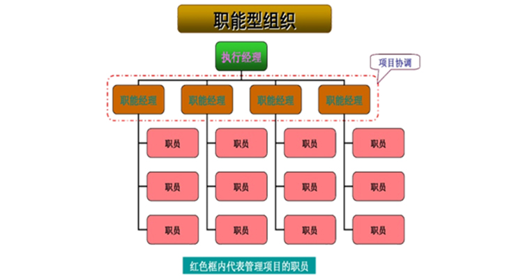
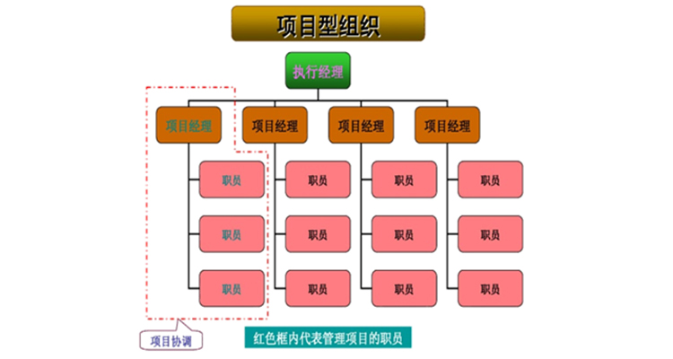

强矩阵模式在现在的企业组织模式中最为常见，即在职能部门的基础上有项目管理部门，任命项目经理，由项目经理对项目内的资源进行统一协调。这里要说明一点，要谨防虚假的强矩阵模式，很多企业的项目组织按照这个形式构建，实际上并不能调动项目内的资源，也就是说项目咨询受职能部门约束大于项目约束，这种就是虚假的强矩阵。

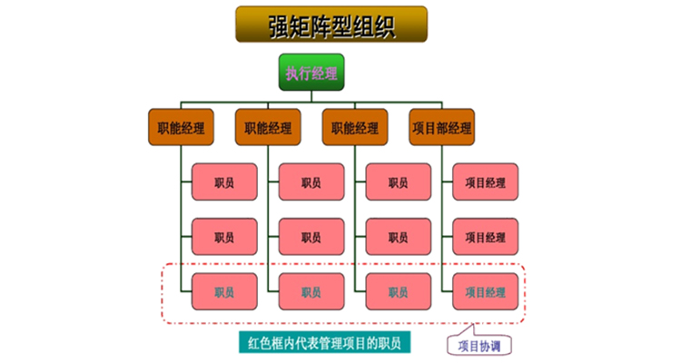

弱矩阵是与职能型组织基本一样，只是项目组内人员之间互相沟通与协调，没有项目经理，也没有项目管理部门，项目组成员还是向上职能经理负责，因为项目成员中没有决策权，所以这种模式基本上是会回到职能型组织上去。

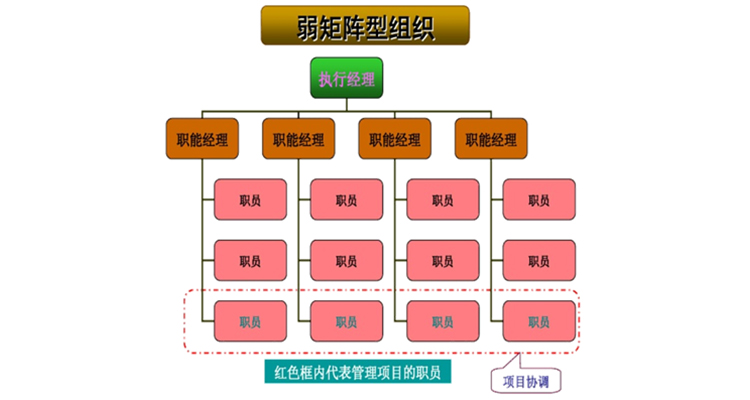

平衡矩阵比弱矩阵好很多，因为有项目经理统一负责协调与决策，虽然没有项目管理部门，但这基本上不太会影响项目经理开展工作，所以平衡矩阵是接近于强矩阵的一种管理模式。

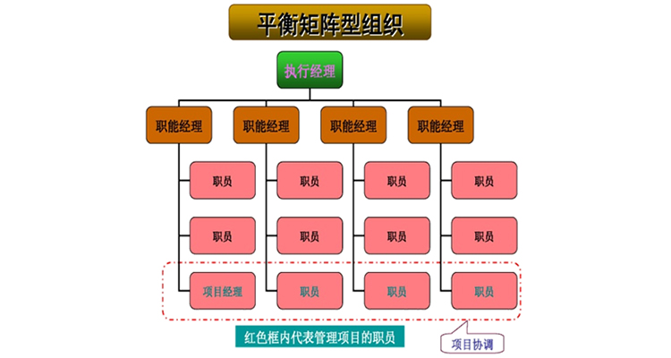

混合型矩阵是项目型组织+职能型组织的模式，表面上有项目管理部门，有项目经理，但是项目经理只能协调职能部门中的一个资源，二次协调由职能部门中的这个项目代表进行二次协调，这种管理模式会大大降低效率。从项目管理的角度我并不提倡。

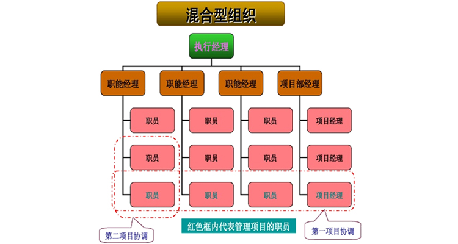

> [QualityIn质量学院-PM24 | 项目团队组织构建及优劣势分析（附量化标准）-QualityIn质量学院-质量管理-质量管理](http://www.quality-in.com/front/toArticle/111)

# 项目管理过程组

按项目管理过程在项目管理中的职能可以将组成项目的各个过程归纳为5组，叫作项目管理过程组：①启动过程组；②计划过程组；③执行过程组；④监督与控制过程组；⑤收尾过程组。

1. 启动过程组定义并批准项目或项目阶段。包括“制定项目章程”和“识别项目干系人”两个过程。

2. 计划过程组定义和细化目标．并为实现项目而要达到的目标和完成项目要解决的问题范围而规划必要的行动路线。包括项目整体管理中的“制订项目管理计划”过程，项目范围管理中的“收集需求”“定义范围”“创建工作分解结构”过程，项目时间管理中的“定义活动”“排列活动顺序”“估算活动资源”“估算活动历时”“制订进度计划”过程，项目成本管理中的“估算成本”“制订预算”过程，项目质量管理中的“规划质量”过程，项目人力资源管理中的“制订人力资源计划”过程，项目沟通管理中的“规划沟通”过程，项目风险管理中的“规划风险管理”“识别风险”“实施定性风险分析”“实施定量风险分析”“规划风险应对”过程，项目采购管理中的“规划采购”等过程。

3. 执行过程组整合人员和其他资源，在项目的生命期或某个阶段执行项目管理计划。包括项目整体管理中的“指导和管理项目执行”过程，项目质量管理中的“执行质量保证”过程，项目人力资源管理中的“组建项目团队”“建设项目团队”“管理项目团队”过程，项目沟通管理中的管理沟通过程，项目采购管理中的“实施采购”等过程。

4. 监督与控制过程组要求定期测量和监控项目绩效情况，识别与项目管理计划的偏差，以便在必要时采取纠正措施，确保项目或阶段目标达成。包括项目整体管理中的“监督和控制项目工作”“实施整体变更控制”过程，项目范围管理中的“核实范围”“控制范围”过程，项目时间管理中的“控制进度”过程，项目成本管理中的“控制成本”过程，项目质量管理中的“执行质量控制”过程，项目沟通管理中的“控制沟通”过程，项目风险管理中的“监督与控制风险”过程，项目采购管理中的“控制采购”等过程。

5. 收尾过程组正式验收产品、服务或工作成果，有序的结束项目或项目阶段。包括项目箍体管理中的“结束项目或阶段”过程，项目采购管理中的“结束采购”过程。

任何一个项目所必需的这5个项目管理过程组之间的依赖关系很清楚，对于每一个项目都是按照同样的顺序进行的。它们与应用领域或行业关心的重点无关。各个过程组及其过程在项目完成之前经常被多次反复。过程在过程组内或过程组之间也相互作用和影响。

一个过程组包括以各自的依据和成果相互联系的项目管理过程，也就是说，一个过程的结果或成果变成了另一个过程的依据。例如，监控过程组不仅监视和控制某一过程组正在进行的工作，而且还监视和控制整个项目的成果。监控过程组还必须提供反馈，以便决定是否需要为了使项目符合项目管理计划而实施纠正或预防措施，或者适当地修改项目管理计划。过程组之间也有可能增添许多其他相互关系或相互影响。但是，过程组不是项目阶段，当大项目或复杂项目有可能分解为不同的阶段或者不同的子项目时，如可行性研究、概念推敲、设计、原型开发、建造、实验等，每一个阶段或子项目都要重复过程组的所有过程。

PDCA是英语单词Plan(计划)、Do(执行)、Check(检查)和Act(处理)的第一个字母，PDCA循环就是按照这样的顺序进行质量管理，并且循环不止地进行下去的科学程序。
1. P (Plan) 计划，包括方针和目标的确定，以及活动规划的制定。
2. D (Do) 执行，根据已知的信息，设计具体的方法、方案和计划布局；再根据设计和布局，进行具体运作，实现计划中的内容。
3. C (Check) 检查，总结执行计划的结果，分清哪些对了，哪些错了，明确效果，找出问题。
4. A (Act）处理，对总结检查的结果进行处理，对成功的经验加以肯定，并予以标准化；对于失败的教训也要总结，引起重视。对于没有解决的问题，应提交给下一个PDCA循环中去解决。

以上四个过程不是运行一次就结束，而是周而复始的进行，一个循环完了，解决一些问题，未解决的问题进入下一个循环，这样阶梯式上升的。PDCA循环是全面质量管理所应遵循的科学程序。全面质量管理活动的全部过程，就是质量计划的制订和组织实现的过程，这个过程就是按照PDCA循环，不停顿地周而复始地运转的。

> [项目管理过程组真题习题与考点信息系统项目管理师教程第3版 - 综合知识 - 信管网](https://www.cnitpm.com/pm1/54185.html)
> [PDCA循环_百度百科](https://baike.baidu.com/item/PDCA%E5%BE%AA%E7%8E%AF/5091521?fromtitle=%E6%88%B4%E6%98%8E%E7%8E%AF&fromid=9497097&fr=aladdin)

# 组织过程资产

在制定项目章程及以后的项目文件时，任何一种以及所有用于影响项目成功的资产都可以作为组织过程资产。任何一种以及所有参与项目的组织都可能有正式或非正式的方针、程序、计划和原则，所有这些的影响都必须考虑。组织过程资产还反映了组织从以前项目中吸取的教训和学习到的知识，如完成的进度表、风险数据和实现价值数据。组织过程资产的组织方式因行业、组织和应用领域的类型而异。例如，组织过程资产可以归纳为如下两类。

1. 组织进行工作的过程与程序

- 组织标准过程，如标准、方针（安全健康方针，项目管理方针）；软件生命周期与项目生命期，以及质量方针与裎序（过程审计、目标改进、核对表，以及供组织内部使用的标准过程定义）。
- 标准指导原则、工作指令、建议评价标准与实施效果评价准则。
- 模板（如风险模板、工作分解结构模板与项目进度网络图模板）。
- 根据项目的具体需要修改组织标准过程的指导原则与准则。
- 组织沟通要求（如可利用的特定沟通技术，允许使用的沟通媒介、记录的保留，以及安全要求）。
- 项目收尾指导原则或要求（如最后项目审计、项目评价、产品确认，以及验收标准）。
- 财务控制程序（如进度报告、必要的开支与支付审查、会计编码，以及标准合同条文）。
- 确定问题与缺陷控制、问题与缺陷识别和解决，以及行动追踪的问题与缺陷管理程序。
- 变更控制程序，包括修改公司正式标准、方针、计划与程序，或者任何项目文件，以及批准与确认任何变更时应遵循的步骤。
- 风险控制程序，包括风险类型、概率的确定与后果，以及概率与后果矩阵。
- 批准与签发工作授权的程序。

2. 组织整体信息存储检索知识库

- 过程测量数据库，用于搜集与提供过程与产品实测数据。
- 项目档案（如范围、费用、进度，以及质量基准、实施效果测量基准、项目日历、项目进度网络图、风险登记册、计划的应对行动，以及确定的风险后果）。
- 历史信息与教训知识库（如项目记录与文件，所有的项目收尾资料与文件记录，以前项目选择决策结果与绩效的信息；以及风险管理努力的信息）。
- 问题与缺陷管理数据库，包括问题与缺陷状态，控制信息，问题与缺陷解决和行动结果。
- 配置管理知识库，包括公司所有正式标准、方针、程序和任何项目文件的各种版本与基准。
- 财务数据库，包括如工时、发生的费用、预算以及任何项目费用超支等信息。

> [项目章程的依据（组织过程资产）真题习题与考点信息系统项目管理师教程第3版 - 综合知识 - 信管网](https://www.cnitpm.com/pm1/55763.html)

# 确认范围与核实产品、质量控制、项目收尾的比较

为了帮助读者理解，本节将确认范围与核实产品、质量控制、项目收尾进行比较分析。

1．确认范围与核实产品

核实产品是针对产品是否完成，在项目（或阶段）结束时由发起人或客户来验证，强调产品是否完整；确认范围是针对项目可交付成果，由客户或发起人在阶段末确认验收的过程。

2．确认范围与质量控制

确认范围与质量控制的不同之处在于：

•确认范围主要强调可交付成果获得客户或发起人的接受；质量控制强调可交付成果的正确性，并符合为其制定的具体质量要求（质量标准）。

•质量控制一般在确认范围前进行，也可同时进行；确认范围一般在阶段末尾进行，而质量控制并不一定在阶段未进行。

•质量控制属内部检查，由执行组织的相应质量部门实施；确认范围则是由外部于系人（客户或发起入）对项目可交付成果进行检查验收。

从检查的详细程度来说，核实产品、确认范围和质量控制是递进的、越来越细的检查过程。

3．确认范围与项目收尾

确认范围与项目收尾的不同之处在于：

•虽然确认范围与项目收尾工作都在阶段未进行，但确认范围强调的是核实与接受可交付成果，而项目收尾强调的是结束项目（或阶段）所要做的流程性工作。

•确认范围与项目收尾都有验收工作，确认范围强调验收项目可交付成果，项目收尾强调验收产品。

> [几个术语的比较-信息系统项目管理师知识点 - 综合知识 - 信管网](http://www.cnitpm.com/pm1/58813.html)

# 资源平衡与资源平滑

项目进度计划一般需要用进度网络分析技术这个工具来编制，常用的进度网络分析技术包括关键路径法、资源优化技术以及进度压缩等。一般第一步先用关键路径法编制出理论可行的进度计划；第二步运用资源优化技术根据项目实际的资源制约因素，把理论可行的进度计划变为实际可行的进度计划；最后用进度压缩法来进一步优化项目进度计划。本文主要通过举例详细讲述第二步资源优化技术下的两种子技术资源平衡和资源平滑。

先来熟悉一下二者的概念：

- 资源平衡(Resource Leveling)，是根据资源制约因素对活动的开始日期与完成日期进行调整的一项技术。这儿的资源制约因素可以是关键资源只在特定时间可用，或者数量有限，或者被过度分配等等情况。资源平衡往往会改变关键路径（通常是延长）。

- 资源平滑(Resource Smoothing)，是为了让项目资源需求不超过预定的资源限制而对进度活动进行调整的一种技术。资源平滑不会改变项目关键路径，也可以把资源平滑看做一种特殊的资源平衡。

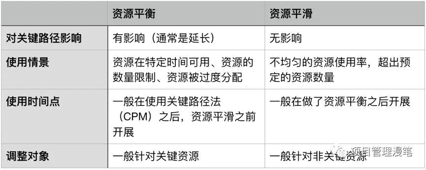

> [资源平衡与资源平滑 - 简书](https://www.jianshu.com/p/3113147038ef)

# 成本

## 产品的全生命周期成本

产品的全生命周期成本为我们认识和管理项目成本提供一个更为开阔的视野，即我们不仅考虑项目全生命周期成本，也要考虑项目的最终产品的全生命周期成本，这有助于我们更精确地制订项目财务收益计划。产品的全生命周期成本就是在产品或系统的整个使用生命期内，在获得阶段（设计、生产、安装和测试等活动，即项目存续期间）、运营与维护及生命周期结束时对产品的处置所发生的全部成本。要求在项目过程中不只关心完成项目活动所需资源的成本，也应该考虑项目决策对项目最终产品使用和维护成本的影响，对于一个项目而言，产品的全生命期成本考虑的是效益总成本，即开发成本加上维护成本。例如，一个公司可能一到两年内完成一个项目，该项目是要建立和实现新的客户服务系统。但是新系统可以使用10年，项目经理应当估计整个生命期内（上面例子中即10年）的成本和收益。在项目净现值分析时要参考整个10年的成本和收益，高级管理人员和项目经理在进行财务决策时，需要考虑产品整个生命期的成本。

## 成本的类型

1. 可变成本：随着生产量、工作量或时间而变的成本为可变成本。可变成本又称变动成本。
2. 固定成本：不随生产量、工作量或时间的变化而变化的非重复成本为固定成本。
3. 直接成本：直接可以归属项目工作的成本为直接成本。如项目团队差旅费、工资、项目使用的物料及设备使用费等。
4. 间接成本：来自一般管理费用科目或几个项目共同担负的项目成本所分摊给本项目的费用，就形成了项目的间接成本，如税金、额外福利和保卫费用等。
5. 机会成本：是利用一定的时间或资源生产一种商品时，而失去的利用这些资源生产其他最佳替代品的机会就是机会成本，泛指一切在做出选择后其中一个最大的损失。
6. 沉没成本：是指由于过去的决策已经发生了的，而不能由现在或将来的任何决策改变的成本。沉没成本是一种历史成本，对现有决策而言是不可控成本，会很大程度上影响人们的行为方式与决策，在投资决策时应排除沉没成本的干扰。

## 应急储备和管理储备

应急储备是包含在成本基准内的一部分预算，用来应对已经接受的已识别风险，以及已经制订应急或减轻措施的已识别风险。应急储备通常是预算的一部分，用来应对那些会影响项目的“已知—未知”风险。例如，可以预知有些项目可交付成果需要返工，却不知道返工的工作量是多少，可以预留应急储备来应对这些未知数量的返工工作。可以为某个具体活动建立应急储备，也可以为整个项目建立应急储备，还可以同时建立。应急储备可取成本估算值的某一百分比、某个固定值，或者通过定量分析来确定。

管理储备是为了管理控制的目的而特别留出的项目预算，用来应对项目范围中不可预见的工作。管理储备用来应对会影响项目的“未知—未知”风险。管理储备不包括在成本基准中，但属于项目总预算和资金需求的一部分，使用前需要得到高层管理者审批。当动用管理储备资助不可预见的工作时，就要把动用的管理储备增加到成本基准中，从而导致成本基准变更。 

## 成本基准

成本基准是经批准的按时间安排的成本支出计划，并随时反映了经批准的项目成本变更（所增加或减少的资金数目），被用于度量和监督项目的实际执行成本。

> [系统集成项目管理工程师第2版：成本相关术语 - 综合知识 - 信管网](https://www.cnitpm.com/pm1/40303.html)

# 挣值分析详解

## 基本概念PV，EV，AC和BAC

首先是四个基本概念：

- 计划价值（Planned Value, PV），截止到某时间点计划要完成工作量的价值，也就是计划要做多少事；
- 挣值（Earned Value, EV），截止到某时间点实际已经完成工作量的价值，也就是实际做了多少事；
- 实际成本（Actual Cost, AC），截止到某时间点实际已经发生的成本，也就是实际花了多少钱；
- 完工预算（Budget At Completion, BAC），对完成该项目的计划预算，也就是完成整个项目计划多少预算；

举个例子来更通俗地说明一下以上的几个概念。假设我们现在要做一个项目，就是砌一堵长度为100米的围墙，为了方便计算我们假设总的预算是100元每米，共100*100=10000元，我们还计划项目工时10天（每天砌墙10米）来完成这个项目。

为了顺利完成该项目在项目中途我们需要对项目绩效做监控，于是我们在第四天工作结束的时候对该项目进行绩效评估。本来第四天工作结束的时候我们计划是要完成40米的任务的（因为每天计划是10米），这个40米的工作量的价值是40米*100元/米=4000元，这个4000元就是我们的计划价值PV（计划做多少事）；实际完成了多少呢？我们发现第四天工作结束实际才完成了30米砌墙任务，这个30米围墙对应的价值是30米*100元/米=3000元，这个3000元就是我们的挣值EV（实际做了多少事），也就是我们在第四天结束就完成了3000元的工作量；到第四天结束这个时间点我们实际却花了5000元，这个5000元就是我们的实际成本AC（实际花了多少钱）；总的预算10000元就是我们的完工预算BAC；总结一下就是一共计划10000元10天完成这个项目，在第四天结束的时候去检查项目绩效，发现到这个时间点为止本来应该完成4000元的项目工作量（PV），结果只完成了3000元的工作（EV），却花了5000元的成本（AC）。为了更直观表示这几个概念，可以用图表示这几个概念如下：

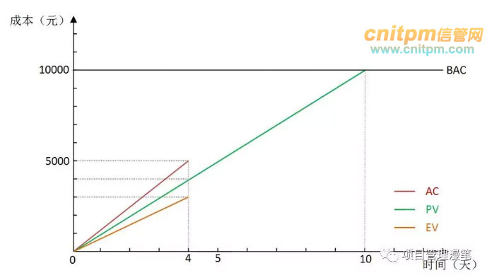

图中红、绿、橘黄色线分别表示AC、PV和EV，红线AC表示截止到某个时点花了多少钱（成本），斜率表示花钱的速度；绿线PV表示截止某个时点项目计划花的钱和做的项目量；橘黄色线EV表示截止到某个时点做了多少事（多少钱的工作），斜率表示做事的速度；上图我们可以看出花钱的速度比计划的要快（红线比绿线更陡，斜率更大），而做事的速度却比计划的要慢（橘黄色线比绿线更缓，斜率更小），项目绩效很不好。

## 绩效指标CV，SV，CPI和SPI

好了，大致理解了上面PV, EV, AC, BAC等几个基本概念之后，接着我们来了解CV，SV，CPI，SPI这几个成本和进度绩效指标。

- 成本偏差（Cost Variance, CV），截止到某时点发生的实际成本与计划成本的偏差，CV=EV-AC
- 进度偏差（Schedule Variance, SV），截止到某时点的实际进度与计划进度的偏差，SV=EV-PV
- 成本绩效指数（Cost Performance Index, CPI），截止到某时点衡量成本绩效的一种指标，也就是实际每花一元钱，完成做了多少钱的事（花钱的效率），CPI=EV/AC
- 进度绩效指数（Schedule Performance Index, SPI），截止到某时点衡量进度绩效的一种指标，也就是实际完成的工作量与计划完成工作量之比，SPI=EV/PV

以前面砌墙的项目为例子，第四天结束去评估项目绩效的时候，本来计划完成40米4000元的工作量（PV），结果只砌了30米只完成了3000元的工作量（EV），那么：

进度偏差SV=EV-PV=3000-4000=-1000元，意思是相比计划我们的进度落后1000元的工作量；（负值表示进度落后，正值表示进度超前）

进度绩效指数SPI=EV/PV=3000/4000=0.75，说明当前只完成了计划任务量的75%的工作；

成本绩效的检查结果是：只完成3000元的工作量（EV）实际却花了5000元（AC）。这个时候：

成本偏差CV=EV-AC=3000-5000=-2000元，说明现在成本超支了2000元（负值表示超支，正值表示节约）；

成本绩效指数CPI=EV/AC=3000/5000=0.6，意思是前面4天我们实际花了5000元，但是只做了3000元的工作，相当于前面4天我们每花1元钱，只做了0.6元的事；在这儿要强调一下这个成本绩效指数CPI值，因为后面很多指标都和这个CPI息息相关。对于CPI的计算方法和意义一定要非常熟悉，CPI的意义是每花1元钱做了多少钱的事（花钱的效率），CPI为0.6的意思就是每花1元钱只做了0.6元的事，所以CPI的计算方法是做了的事（EV）除了花了的钱（AC）。不光会算CPI，大家还要能举一反三，比如知道CPI和做了多少事，也要会算花了多少钱，那就是花了多少钱=做了多少事/CPI，后面相关指标的计算会经常用到这个公式。

成本偏差CV和进度偏差SV在图中的直观表示如下：

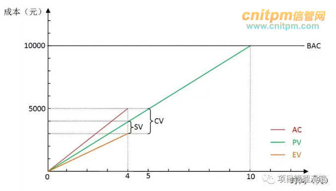

图中可以看到，实际上成本偏差CV就是AC与EV的差值，而进度偏差SV是PV与EV的差值，请注意都是和挣值EV进行对比，而且做减法的时候EV都要放在前面。SPI和CPI没法很直观在图中表示，实际上就是斜率的比值，SPI是EV与PV斜率的比值，CPI是EV与AC斜率的比值。

## 预测指标ETC，EAC，TCPI和VAC

这个时候大家应该基本了解CV, SV, CPI, SPI这几个绩效指标的含义了。在这个基础上，最后我们再来了解剩下的4个略显晦涩的预测指标：

- 完工尚需估算（Estimate To Completion, ETC），在某个时点，预测完成剩余的工作还需要多少成本；这个时候算预测数据的时候就要分情况了，主要取决于我们以后的工作花钱的效率跟以前比是否会发生变化？也就是考察以后工作的CPI的值会不会发生变化。根据剩余部分工作CPI的变化情况，有几种计算方法：

如果还是以当前的成本绩效完成剩余的工作，则ETC=(BAC-EV)/CPI，也就是剩余的工作量除以成本绩效指数；

如果以计划的成本绩效（其实就是1）完成剩余的工作，则ETC=BAC-EV，也就是剩余的工作量，实际上也是用第一种情况那个公式；

如果进度绩效指标SPI也会影响完成剩余工作的成本，意思是如果严格规定我们必须要在计划的截止时间之前完成项目，那么可能就还需要额外的成本来赶工进度，这个时候就需要同时考虑CPI和SPI对于剩余工作的影响，一般计算公式则为ETC=(BAC-EV)/(CPI*SPI)，也就是剩余的工作量除以成本绩效指数与进度绩效指数的乘积；其中CPI*SPI又叫“关键比率”(Critical Ratio, CR);

- 完工估算（Estimate At Completion, EAC），在某个时点，预测完成整个项目需要的成本，当然就是实际已经花掉的成本加上前面那个完工尚需估算ETC，EAC=AC+ETC；如果剩余工作还是以当前成本绩效指数来完成，那么也可以这么计算EAC=BAC/CPI，这个公式也好理解，其实就是整个项目工作量除以成本绩效指数；完工估算EAC实际上就是预测项目完工时候的实际成本AC。

- 完工尚需绩效指数（To-Complete Performance Index, TCPI），在某个时点，预测如果要在计划的预算内完成项目，则未来的工作必须要达到的绩效水平。计算公式TCPI=(BAC-EV)/(BAC-AC)，也就是剩余的工作量除以剩余的钱的数量；

- 完工偏差（Variance At Completion, VAC），在某个时点，预测项目在完工的时候将会出现的总的项目的成本偏差。计算公式VAC=BAC-EAC，也就是项目开始时原计划的预算减去现在预测的总个项目将会花的成本。完工偏差VAC实际上就是预测项目完工时的成本偏差CV。

上面光说概念有点抽象可能有点难懂，所以我们回到例子里面的情景下来理解一下上面的几个预测指标。在第4天结束的时候，我们在前面考察计算了SV=-1000， CV=-2000， SPI=0.75，CPI=0.6， 结论是进度落后1000元的工作量，成本超支2000元，怎么办得想办法啊，不然整个项目估计不能按时按预算完成。这时候有必要先预测一下项目完工的一些指标以便我们更好地采取措施。

上面说到过，要预测项目完工时候的绩效情况，需要根据后面剩余部分的项目工作的CPI的不同情况分情况分析，我们在剩余部分项目的CPI能做到什么程度，很明显不同程度的CPI将会导致不同的预测指标。回到砌墙的这个例子，项目经理发现了前面之所以CPI低至0.6花钱效率低是因为前面4天天气不好，导致砌墙的时候有一些额外的支出。这个时候估算这几个预测指标就要分下面这几种情况了：

### 第一种情况：后续部分工作CPI和前面4天工作的CPI保持一致

项目经理在看了天气预报后，发现后面的天气也跟前面几天一样的也不好。这种情况下预计后面的工作还是按照前面的花钱的效率来办事（前面4天是花5000元干了3000元的事，花钱效率也就是CPI是0.6），后面工作的CPI和前面4天工作的CPI保持一致将会保持0.6。

这种情况下我们来先算完工尚需估算ETC，现在的情况，本来计划完成40米4000元的工作量（PV），结果只砌了30米只完成了3000元的工作量（EV），实际还花了5000元（AC），那么我们剩余的工作估计还要花多少钱呢？这个就是ETC。整个项目要砌墙100米，现在只完成了30米，那么剩下当然就是还需要砌70米了，转化成钱的数量70*100=7000元这就是剩余的工作量，也就是还剩7000块钱的工作。前面提到过剩余的工作量CPI保持不变还是0.6，花1元钱只能干0.6元的事，现在有7000元的事还需要干，那么干这7000元的事需要花的钱就是7000/0.6=11667元，也就是如果这个工作方式不变的话，估计未来这个项目还需要花11667元。

完工尚需估算ETC算出来了，完工估算EAC就好算了，因为完工估算就是目前实际已经花了的钱加上完工尚需估算EAC=AC+ETC。如果是按照这种情况算出来的剩余工作估计还要花11667元(ETC)，实际前面4天已经花了5000元，那么整个项目的完工成本估算就是5000+11667元=16667 元，也就是整个项目做完估计要花16667元。这种情况其实也可以用另外一种计算方式，因为我们的CPI一直保持稳定不管前面4天还是后面工作一直都是0.6，所以也可以用总的项目预算（总的工作量）除以CPI得出，也就是10000/0.6=16667元（这儿就是已知工作量和CPI求需要花的钱），算出来的结果是一样的。当然要注意如果要用这个方式计算EAC一定要确认前后的CPI是一致的才可以这么算。

完工尚需估算ETC和完工估算EAC都算出来了，再来算完工尚需绩效指数TCPI。项目经理评估完目前的项目绩效后，如果要想要整个项目在规定的预算内完工，那么后面工作的成本绩效必须得是多少才行，这个就是TCPI。第四天结束后总共10000元的工作量，完成了3000元剩余7000元的工作量，实际花了5000元（预算就还剩10000-5000=5000元），也就是未来如果预算不增加我们需要以剩下5000元的预算来完成剩下7000元的工作，那么需要的成本绩效指数就是7000/5000=1.4（工作量除以钱数等于CPI），也就是我们每花一元钱，必须要完成1.4元钱的工作，才有可能在预算内完成这个项目。通过公式计算就是TCPI=(BAC-EV)/(BAC-AC)=(10000-3000)/(10000-5000)=1.4。

最后算完工偏差VAC，这个就好算了，就是预测完工的时候的成本偏差CV。因为后续的工作还是按以前的CPI（0.6）来执行，我们前面已经算出来ETC=11667元，EAC=16667元，这个情况下完工偏差VAC=BAC-EAC=10000-16667=-6667元，也就是预测项目最终完工的时候将超支6667元（同理负值表示成本超支，正值表示成本节约）。

这种时候用图更直观地表示ETC、EAC、VAC等预测指标就是如下图所示：

从图中可以看到，AC线是在4天内实线的基础上延伸的虚线（实线表示实际值，虚线表示预测值），直接延伸表示花钱的速度不变（因为斜率没变）跟以前保持一致。这种情况下可以看到当EV达到BAC的时候（表示做了10000元的事项目做完了），AC的值是16667元，这个就是预测的最终项目完工的时候将会一共花这么多钱，也就是EAC，其与BAC的差额就是完工偏差VAC。

如果以后的工作我们不是以以前的CPI（0.6）而是以完工尚需绩效指数TCPI作为后续工作的CPI呢？比如我们从第五天开始CPI变为了1.4（上面算TCPI算出来的），这个时候完工偏差会是多少呢？其实如果通透理解了概念的同学应该就会很快知道这个时候算出来的的完工偏差将会是0，因为TCPI的定义就是在预算内完工的后续工作的成本绩效指数，所以在这个指数下完成剩余的工作，我们的预算肯定是刚刚好的，完工偏差就会0。不嫌麻烦我们也可以简单计算一下，前面4天花了5000元完成了3000元的工作量，剩下7000元的工作以1.4的CPI去做，那么剩下的工作将只需花ETC=7000/1.4=5000元，加上前面已经花了的5000元，刚好就等于我们的项目预算10000元，这个时候完工偏差就刚好是0。从这个角度我们也可以说完工尚需绩效指数TCPI就是要使完工偏差VAC为0，完成后续剩余工作所需的的成本绩效指数CPI。也就是第4天后检查项目发现进度落后预算超支，客户说进度我先不管，最后完工时预算一分也不能超，这个时候后面部分工作的CPI肯定就要更高才能达到这个预算内完工这个目标了，这个更高的CPI就是我们的完工尚需绩效指数TCPI。

这种情况下用图更直观地表示ETC、EAC等就是如下图所示（此时VAC为0无法表示出来）：

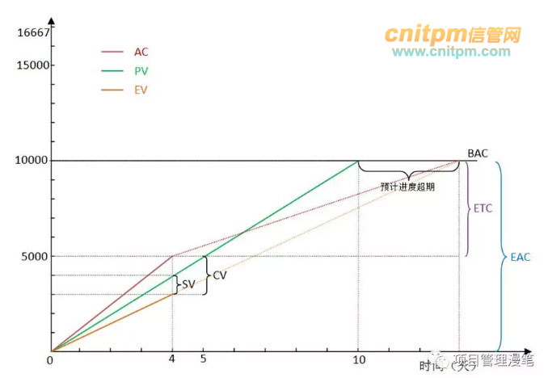

从图中可以看到后期预测的AC线突然一下变缓了，花钱速度下降了从而CPI提高了（CPI是EV的斜率比上AC的斜率，AC斜率变小，EV斜率不变的情况下CPI变大）。这种情况概括一下就是前面4天用5000元做了3000元的事，评估之后采取措施发奋图强，后面的时间用5000元做了7000元的事，从而实现了预算内（10000元）完工的目标。

### 第二种情况：后续部分工作CPI和前面4天工作的CPI不一致，与计划CPI一致

第二种情况就是：项目经理看后面几天的天气预报天气，发现前面4天天气不好只是偶然现象不具有代表性，后面的天气都是好的。这个时候预测以后花钱效率CPI会正常变为1，也就是不在额外花钱那么就每花1元钱就能做1元钱的事。如果真的做到了这个花钱效率，因为剩余7000元的工作量（前面已经算出来），那么剩余的工作需要花的钱就是7000/1=7000元，也就是完工尚需估算ETC就是7000元；

同理继续算完工估算EAC，就是ETC加上AC，也就是7000元加上5000元就等于12000元；

再同样的计算方法计算这种情况下的完工偏差VAC就是BAC-EAC=10000-12000=-2000元，表示预测项目最终完工的时候成本将超支2000元。

这种情况下的这几个指标用图直观地表示出来就是这个样子：

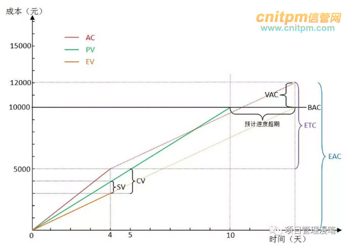

图中可以看到，红线AC第4天后改变了方向，变得更缓代表花钱更慢从而花钱效率更高，与橘黄色的EV线平行表示花钱速度和做事速度保持一致（花多少钱就办多少钱的事），这个时段的CPI就是1（因为CPI等于EV线与AC线斜率之比，平行表示斜率相等）。但是要注意，如果计算截止某时点整个项目的CPI不会是1，因为前面4天花5000元只做了3000元的事，多花了2000元，就算后面的工作每花1000元就做1000元的事不再多花钱，总的加起来计算的话还是花的钱比做的事要多这2000元，这样CPI就还是会小于1。

### 第三种情况：后续部分工作CPI和前面4天工作的CPI不一致，甚至更糟

第三种情况就是：项目经理在看了天气预报后，发现后面的天气也跟前面几天一样的也不好，不但如此这个项目还对进度要求非常高，规定必须按照原定的完工日期完工不得进度超期（我们看前面的图进度都是超期的）。这个时候进度的落后就会进一步影响我们的成本，因为我们以后需要赶工来赶进度，而赶工是需要额外的成本的。这样我们计算剩余工作需要花的成本也就是完工尚需估算ETC的时候就要综合考虑CPI和SPI，计算方法就是7000/(0.6*0.75)=15556元，也就是如果不但差天气持续，同时还要确保项目进度的话，我们预计完成剩余的工作还需要花15556元的成本，跟第一种情况相比多出来的钱就是为了赶进度额外花的钱。

同理这种情况下再计算完工估算EAC就是ETC+AC=15556+5000=20556元，也就是项目完工的时候估计整个项目一共要花20556元；

同理这种情况下计算完工偏差VAC就是BAC-EAC=10000-20556=-10556元，表示估计项目完工时将会超支10556元，这样就超支很多了，因为是预算的2倍还有多了。

这种情况下的这几个指标用图直观地表示出来就是这个样子：

从图中我们可以看出，第4天过后，橘黄线EV跟以前相比变陡峭，表示做事速度加快，因为我们在用额外的成本赶工，终于在计划的第10天与绿线计划价值PV汇合，表示此时按计划截止时间准时完成了项目；再看红线AC（花的钱），第4天后变得陡峭，表示花钱速度相比以前加快，因为要花额外的钱来赶工追赶进度，在第10天项目完工的时候共花了多达20556元，这个就是完工估算EAC，与BAC的差值就是VAC。

这三种情况下ETC、EAC和VAC的计算我们就都讨论完了。至此我们通过砌墙这个例子就为大家介绍完了关于挣值管理的12个概念（PV, EV, CV, BAC, SV, SPI, CV, CPI, ETC, EAC, TCPI, VAC）的一些基本情况，希望能通过本文对大家学习和理解这些概念和公式有所助益。

> [挣值分析详解：基本概念、绩效指标、预测指标 - 综合知识 - 信管网](http://www.cnitpm.com/pm1/77408.html)

# 新七工具

新七工具包含亲和图、过程决策程序图、关联图、树形图、优先矩阵、活动网络图和矩阵图。

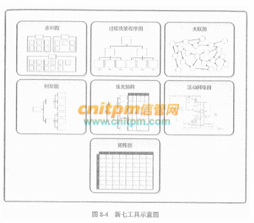

1. 亲和图。亲和图与心智图相似。针对某个问题，产生出可联成有组织的想法模式的各种创意。在项目管理中，使用亲和图确定范围分解的结构，有助于WBS的制订。
2. 过程决策程序图(PDPC)。用于理解一个目标与达成此目标的步骤之间的关系。PDPC有助予制订应急计划，因为它能帮助团队预测那些可能破坏目标实现的中间环节。
3. 关联图。关系图的变种，有助于在包含相互交叉逻辑关系（可有多达50个相关项）的中等复杂情形中创新性地解决问题。可以使用其他工具（诸如亲和图、树形图或鱼骨图）产生的数据，来绘制关联图。
4. 树形图。也称系统图，可用于表现诸如WBS、RBS（风险分解结构）和OBS（组织分解结构）的层次分解结构。在项目管理中，树形图依据定义嵌套关系的一套系统
5. 优先矩阵。用来识别关键事项和合适的备选方案，并通过一系列决策，排列出备选方案的优先顺序。先对标准排序和加权，再应用于所有备选方案，计算出数学得分，对备选方案排序。
6. 活动网络图。过去称为箭头图，包括两种格式的网络图：AOA（活动箭线图）和最常用的AON（活动节点图）。活动网络图连同项目进度计划编制方法一起使用，如计划评审技术(PERT)、关键路径法(CPM)和紧前关系绘图法(PDM)。
7. 矩阵图。一种质量管理和控制工具，使用矩阵结构对数据进行分析。在行列交叉的位置展示因素、原因和目标之间的关系强弱。

> [新七工具-信息系统项目管理师知识点 - 综合知识 - 信管网](https://www.cnitpm.com/pm1/65805.html)

# 项目质量管理

项目质量管理分为三个部分：

- 规划质量管理：识别项目及其可交付成果的质量要求和/或标准。并书面描述项目将如何证明符合质量要求和/或标准的过程。关注工作要达到的质量。
- 管理质量：把组织的质量政策应用于项目，并将质量管理计划转化为可执行的质量活动的过程。关注整个项目期间的质量过程。在管理质量过程期间。把在规划质量管理过程中识别的质量要求转化成测试与评估工具，将用于控制质量过程。
- 控制质量：为了评估绩效。确保项目输出完整、正确，并满足客户期望，而监督和记录质量管理活动执行结果的过程。关注工作成果与质量要求的比较，确保结果可接受。

> 

# 沟通方法

可以使用多种沟通方法在项目干系人之间共享信息。这些方法可以大致分为：

- 交互式沟通。在两方或多方之间进行多向信息交换。这是确保全体参与者对特定话题达成共识的最有效的方法，包括会议、电话、即时通信、视频会议等。
- 推式沟通。把信息发送给需要接收这些信息的特定接收方。这种方法可以确保信息的发送，但不能确保信息送达受众或被目标受众理解。推式沟通包括信件、备忘录、报告、电子邮件、传真、语音邮件、日志、新闻稿等。
- 拉式沟通。用于信息量很大或受众很多的情况。要求接收者自主自行地访问信息内容。这种方法包括企业内网、电子在线课程、经验教训数据库、知识库等。

项目干系人可能需要对沟通方法的选择展开讨论并取得一致意见。应该基于下列因素来选择沟通方法：沟通需求、成本和时间限制、相关工具和资源的可用性，以及对相关工具和资源的熟悉程度。

> 

# 权力/利益方格

权力/利益矩阵是根据干系人权力的大小，以及利益对其分类。这个矩阵指明了项目需要建立的与各干系人之间的关系的种类。

首先关注处于B区的干系人，他们对项目有很高的权力，也很关注项目的结果，项目经理应该“重点管理，及时报告”，应采取有力的行动让B区干系人满意。项目的客户和项目经理的主管领导，就是这样的项目干系人。

尽管C区干系人权力低，但关注项目的结果，因此项目经理要“随时告知”项目状况，以维持C区的干系人的满意程度。如果低估了C区干系人的利益，可能产生危险的后果，可能会引起C区干系人的反对。大多数情况下，要全面考虑到C区干系人对项目可能的、长期的以及特定事件的反应。

处于C区的干系人，项目经理应该“随时告知他们项目的状态，保持及时的沟通”，像杭州中泰乡九峰村群民及附近城区居民，就是这样的项目干系人。

方格区域A的关键干系人具有“权力大、对项目结果关注度低”的特点，因此争取A区于系人的支持，对项目的成功至关重要，项目经理对A区干系人的管理策略应该是“令其满意”。

最后，还需要正确地对待D区中的干系人的需要，D区干系人的特点是“权力低、对项目结果的关注度低”，因此项目经理主要是通过“花最少的精力来监督他们”即可。但有些D区的干系人可以影响更有权力的干系人，他们对项目发挥的是间接作用，因此对他们的态度也应该“要好一些”，以争取他们的支持、降低他们的敌意。

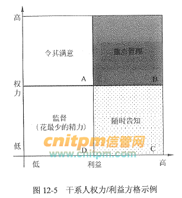

> 

# 风险的分类

为了深入、全面地认识项目风险，并有针对性地进行管理，有必要将风险分类。分类可以从不同的角度、根据不同的标准进行。

## 按风险后果划分

按照后果的不同，风险可划分为纯粹风险和投机风险。

- 纯粹风险：不能带来机会、无获得利益可能的风险，叫纯粹风险。纯粹风险只有两种可能的后果：造成损失和不造成损失。纯粹风险造成的损失是绝对的损失。活动主体蒙受了损失，全社会也有可能跟着受损失。如：某建设项目空气压缩机房在施工过程中失火，蒙受了损失。该损失不但是这个工程的，也是全社会的。没有人从中获得好处。纯粹风险总是和威胁、损失、不幸相联系。
- 投机风险 既可能带来机会、获得利益，又隐含威胁、造成损失的风险，叫投机风险。投机风险有三种可能的后果：造成损失、不造成损失和获得利益。投机风险如果使活动主体蒙受了损失，但全社会不一定也跟着受损失。反之，其他人有可能因此而获得利益。例如私人投资的房地产开发项目如果失败，投资者要蒙受损失。但是发放贷款的银行却可将抵押的土地和房屋收回，等待时机转手高价卖出，不但可收回贷款，而且还有可能获得高额利润。

纯粹风险和投机风险在一定条件下可以相互转化。项目管理人员必须避免投机风险转化为纯粹风险。

风险不是零和游戏。在许多情况下，涉及风险的各有关方面都要蒙受损失，无一幸免。

## 按风险来源划分

按风险来源或损失产生的原因可将风险划分为自然风险和人为风险。

- 自然风险：由于自然力的作用，造成财产毁损或人员伤亡的风险属于自然风险。例如，水利工程施工过程中因发生洪水或地震而造成的工程损害，材料和器材损失。
- 人为风险：人为风险是指由于人的活动而带来的风险。人为风险又可以细分为行为、经济、技术、政治和组织风险等。

## 按风险是否可管理划分

可管理的风险是指可以预测，并可采取相应措施加以控制的风险，反之，则为不可管理的风险。风险能否管理，取决于风险不确定性是否可以消除以及活动主体的管理水平。要消除风险的不确定性，就必须掌握有关的数据、资料和其他信息。随着数据、资料和其他信息的增加以及管理水平的提高，有些不可管理的风险可以变为可管理的风险。

## 按风险影响范围划分

按风险影响范围划分，可以有局部风险和总体风险。局部风险影响的范围小，而总体风险影响范围大。局部风险和总体风险也是相对的。项目管理团队特别要注意总体风险。例如，项目所有的活动都有拖延的风险，但是处在关键路线上的活动一旦延误，就要推迟整个项目的完成日期，形成总体风险。而非关键路线上活动的延误在许多情况下是局部风险。

## 按风险后果的承担者划分

项目风险，若按其后果的承担者来划分，则有项目业主风险、政府风险、承包商风险、投资方风险、设计单位风险、监理单位风险、供应商风险，担保方风险和保险公司风险等。这样划分有助于合理分配风险，提高项目对风险的承受能力。

## 按风险的可预测性划分

按这种方法，风险可以分为己知风险、可预测风险和不可预测风险。
- 己知风险就是在认真、严格地分析项目及其计划之后就能够明确的那些经常发生的，而且其后果亦可预见的风险。己知风险发生概率高，但一般后果轻微，不严重。项目管理中已知风险的例子有：项目目标不明确，过分乐观的进度计划，设计或施工变更，材料价格波动等。
- 可预测风险就是根据经验，可以预见其发生，但不可预见其后果的风险。这类风险的后果有时可能相当严重。项目管理中的例子有：业主不能及时审查批准，分包商不能及时交工，施工机械出现故障，不可预见的地质条件等。
- 不可预测风险就是有可能发生，但其发生的可能性即使最有经验的人亦不能预见的风险。不可预测风险有时也称未知风险或未识别的风险。它们是新的、以前未观察到或很晚才显现出来的风险。这些风险一般是外部因素作用的结果，例如地震、百年不遇的暴雨、通货膨胀、政策变化等。

> 

# 控制风险的工具与技术

1. 风险再评估

在控制风险中，经常需要识别新风险，对现有风险进行再评估，以及删去已过时的风险。应该定期进行项目风险再评估。反复进行再评估的次数和详细程度，应该根据相对于项目目标的项目进展情况而定。

2. 风险审计

风险审计是检查并记录风险应对措施在处理已识别风险及其根源方面的有效性，以及风险管理过程的有效性。项目经理要确保按项目风险管理计划所规定的频率实施风险审计。既可以在日常的项目审查会中进行风险审计，也可单独召开风险审计会议。在实施审计前。要明确定义审计的格式和目标。

3. 偏差和趋势分析

很多控制过程都会借助偏差分析来比较计划结果与实际结果。为了控制风险，应该利用绩效信息对项目执行的趋势进行审查。可使用挣值分析，以及项目偏差与趋势分析的其他方法，对项目总体绩效进行监控。这些分析的结果可以揭示项目在完成时可能偏离成本和进度目标的程度。与基准计划的偏差可能表明威胁或机会的潜在影响。

4. 技术绩效测量

技术绩效测量是把项目执行期间所取得的技术成果与计划取得的技术成果进行比较。它要求定义关于技术绩效的客观的、量化的测量指标，以便据此比较实际结果与计划要求。这些技术绩效测量指标可包括重量、处理时间、缺陷数量和存储容量等。偏差值（如在某里程碑实现了比计划更多或更少的功能）有助于预测项目范围方面的成功程度。

5. 储备分析

在项目实施过程中，可能发生一些对预算或进度应急储备有积极或消极影响的风险。储备分析是指在项目的任何时间点比较剩余应急储备与剩余风险量，从而确定剩余储备是否仍然合理。

6. 会议

项目风险管理应该是定期状态审查会中的一项议程。该议程所占用的会议时间长短取决于已识别的风险以及优先级和应对难度。越经常开展风险管理，风险管理就会变得越容易。经常讨论风险，可以促使人们识别风险和机会。

> 

# 项目、项目集、项目组合

项目组合管理是对一组或者多组项目组合进行管理，以达成组织的战略目标。组织为了实现自身的愿景、使命和价值目标，遵循一系列相互关联的过程，对项目组合中的模块进行评价、选择以及设定优先级，以便将内部有限的资源以最佳方式分配给项目组合。

项目组合在管理过程中，向组织提供相应的信息以支持或者改变组织的战略方向和投资决定。项目组合管理需要在项目集和项目对资源需求之间的冲突进行平衡，对资源的分配进行合理安排。项目集管理和项目管理的目标则与项目组合管理的目标不尽相同，表21-1描述了项目组合管理、项目集管理、项目管理在管理方面所存在的异同之处。

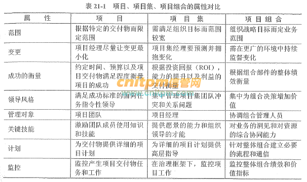

> 

# 安全保护等级

- 第一级：用户自主保护级，适用于普通内联网用户
- 第二级：系统审计保护级，适用于通过内联网或国际网进行商务活动、要保密的非重要单位；
- 第三级：为安全标记保护级，适用于地方各级国家机关、金融单位机构、邮电通信、能源与水源供给部门、交通运输、大型工商与信息技术企业、重点工程建设等单位
- 第四级：为结构化保护级，适用于中央级国家机关、广播电视部门、重要物资储备单位、社会应急服务部门、尖端科技企业集团、国家重点科研单位机构和国防建设等部门
- 第五级：为访问验证保护级，适用于国防关键部门和依法需要对计算机信息系统实施特殊隔离的单位。

> 

# 权限管理模型

- 自主访问控制（DAC: Discretionary Access Control）

系统会识别用户，然后根据被操作对象（Subject）的权限控制列表（ACL: Access Control List）或者权限控制矩阵（ACL: Access Control Matrix）的信息来决定用户的是否能对其进行哪些操作，例如读取或修改。

而拥有对象权限的用户，又可以将该对象的权限分配给其他用户，所以称之为“自主（Discretionary）”控制。

这种设计最常见的应用就是文件系统的权限设计，如微软的NTFS。

DAC最大缺陷就是对权限控制比较分散，不便于管理，比如无法简单地将一组文件设置统一的权限开放给指定的一群用户。

- 强制访问控制（MAC: Mandatory Access Control）

MAC是为了弥补DAC权限控制过于分散的问题而诞生的。在MAC的设计中，每一个对象都都有一些权限标识，每个用户同样也会有一些权限标识，而用户能否对该对象进行操作取决于双方的权限标识的关系，这个限制判断通常是由系统硬性限制的。比如在影视作品中我们经常能看到特工在查询机密文件时，屏幕提示需要“无法访问，需要一级安全许可”，这个例子中，文件上就有“一级安全许可”的权限标识，而用户并不具有。

MAC非常适合机密机构或者其他等级观念强烈的行业，但对于类似商业服务系统，则因为不够灵活而不能适用。

- 基于角色的访问控制（RBAC: Role-Based Access Control)

因为DAC和MAC的诸多限制，于是诞生了RBAC，并且成为了迄今为止最为普及的权限设计模型。RBAC在用户和权限之间引入了“角色（Role）”的概念（暂时忽略Session这个概念）：每个用户关联一个或多个角色，每个角色关联一个或多个权限，从而可以实现了非常灵活的权限管理。角色可以根据实际业务需求灵活创建，这样就省去了每新增一个用户就要关联一遍所有权限的麻烦。简单来说RBAC就是：用户关联角色，角色关联权限。另外，RBAC是可以模拟出DAC和MAC的效果的。

- 基于属性的权限验证（ABAC: Attribute-Based Access Control）

ABAC被一些人称为是权限系统设计的未来。

不同于常见的将用户通过某种方式关联到权限的方式，ABAC则是通过动态计算一个或一组属性来是否满足某种条件来进行授权判断（可以编写简单的逻辑）。属性通常来说分为四类：用户属性（如用户年龄），环境属性（如当前时间），操作属性（如读取）和对象属性（如一篇文章，又称资源属性），所以理论上能够实现非常灵活的权限控制，几乎能满足所有类型的需求。

例如规则：“允许所有班主任在上课时间自由进出校门”这条规则，其中，“班主任”是用户的角色属性，“上课时间”是环境属性，“进出”是操作属性，而“校门”就是对象属性了。为了实现便捷的规则设置和规则判断执行，ABAC通常有配置文件（XML、YAML等）或DSL配合规则解析引擎使用。XACML（eXtensible Access Control Markup Language）是ABAC的一个实现，但是该设计过于复杂，我还没有完全理解，故不做介绍。

总结一下，ABAC有如下特点：

- 集中化管理
- 可以按需实现不同颗粒度的权限控制
- 不需要预定义判断逻辑，减轻了权限系统的维护成本，特别是在需求经常变化的系统中
- 定义权限时，不能直观看出用户和对象间的关系
- 规则如果稍微复杂一点，或者设计混乱，会给管理者维护和追查带来麻烦
- 权限判断需要实时执行，规则过多会导致性能问题

> 

# 帕累托原理

帕累托分析（称为帕累托图或图表）是由意大利工程师Vilfredo Pareto设计的，他对经济理论做出了重要贡献。帕累托分析可帮助企业改善质量控制，突出显示数据集中最重要的因素。因此，它通过识别问题中最重要的元素来帮助降低项目的复杂性。因此，它还有助于管理层为业务改进计划确定任务和活动的优先级。

帕累托分析是具有垂直条和折线图的可视图表。作为条形图和折线图的组合，绘制，使用问题并与利益相关者交流仍然非常简单。条形图代表问题的各个值（按降序排列），线形曲线代表累积总和，条形图按降序从左到右分为几类。

## 帕累托原理（80/20条规则）

帕累托原理（也称为80/20规则）的思想是，通过完成20％的工作，您可以从完成整个工作中获得80％的收益。进行质量改进。例如，绝大多数问题（80％）是由一些关键原因（20％）引起的。此技术也称为“重要的少数”和“琐碎的许多”。

我们可以将80/20规则应用于几乎所有事物：

- 80％的客户投诉来自您20％的产品和服务。
- 计划中的80％的延迟是由20％的延迟原因造成的。
- 您20％的产品和服务占您利润的80％。
- 您20％的销售人员将产生80％的公司收入。
- 20％的系统缺陷会导致80％的问题。

## 帕累托分析的好处

帕累托分析（Pareto Analysis）有助于快速可视化问题，因此这也是一个出色的可视化交流工具。以下是帕累托分析的一些好处：

绘制帕累托图很容易。
此图可帮助您隔离问题及其原因。
它可以帮助您专注于解决产生最大数量问题的少数原因。
它向您展示了需要重点关注并获得最大改进的问题。

## 进行帕累托分析的六个步骤

使用帕累托分析，这里有6个步骤来确定您应关注的主要原因：

1. 创建一个垂直条形图，在x轴上显示原因，在y轴上计数（出现次数），然后按原因重要性的降序排列条形图，即，计数最高的原因排在第一位。
2. 以降序计算每个原因的累积计数，并以降序计算每个原因的累积计数百分比。百分比计算：{个人原因计数}/{总原因计数}*100
3. 创建第二个y轴，其百分比从100％到0％以10的增量递减。
4. 在x轴上绘制每个原因的累积计数百分比。
5. 连接点以形成曲线。
6. 在与x轴平行的y轴上以80％的比例绘制一条线。然后将线放在与x轴上的曲线的交点处。x轴上的此点将左侧的重要原因（很少）与右侧的次要原因（琐碎）分开。

## 帕累托分析示例–客户服务

下面是一个Pareto图表示例，其中绘制了IT服务台客户服务绩效不理想的原因。从图中可以清楚地看出，79％的绩效不佳是由两个因素造成的：缺乏培训和薪酬不足。前者似乎占表现不佳的55％，而后者则占24％。其他三个因素仅占问题的21％。鉴于帕累托80/20原则，最审慎的行动方针是为工作人员提供有意义的培训并修订薪酬结构。攻击这两个因素将提供最大的收益。

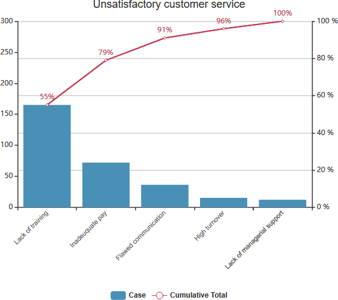

> [使用帕累托原理 (20 / 80规则)_Warren Lynch 的博客-CSDN博客_帕累托分析原理](https://blog.csdn.net/chktsang/article/details/113848935)

# 一致性成本和非一致性成本

- 一致性成本：指预防出错的所发生的成本。质量保证属于一致性成本。一致性成本又分为预防成本、评估成本。
- 非一致性成本：指用来修复解决问题所发生的成本。也叫故障成本。非一致性成本又分为内部失败成本、外部失败成本。

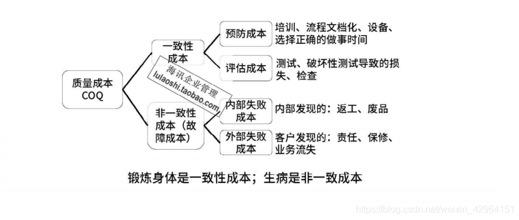

> [一致性成本和非一致性成本_南武的博客-CSDN博客_一致性成本和非一致性成本](https://blog.csdn.net/weixin_42964151/article/details/108214193)
